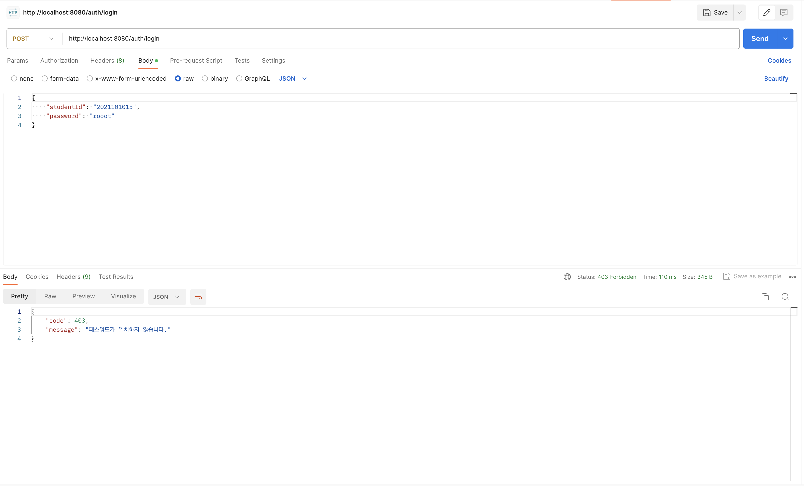

이번 사이드 프로젝트에서 Spring WebFlux 기반으로 백엔드를 개발하게 되었습니다.
여기서 저는 서비스에서 발생하는 HTTP 요청 및 응답을 모니터링 하기 위해 로깅을 설정하고 싶었습니다.
그래서 Spring WebFlux 환경에서 수동으로 로깅 및 로그 추적을 구현한 경험을 공유해 드리려고 합니다.

## 프로퍼티 설정을 통한 로깅

```yaml title="application.yml" showLineNumbers
logging:
  level:
    web: debug
```

사실 Spring Boot에서는 간단하게 프로퍼티만 설정해도 요청 및 응답을 로그로 확인할 수 있습니다.
하지만 이 방법은 원치 않는 로그들도 보여진다는 단점이 있습니다.

```console
2024-04-02 14:34:25.657 DEBUG [reactor-http-epoll-4] o.s.w.r.f.s.s.RouterFunctionMapping: [2b5e844f-985] Mapped to org.springframework.web.reactive.function.server.HandlerFilterFunction$$Lambda$2224/0x00007f8cf4aa21b0@43585181
```

하지만 위와 같이 라우터에서의 핸들러 매핑 등의 정보도 함께 로깅되는데 이러한 내용들은 로그로 수집할 필요가 없는 내용들이라고 생각했습니다.
또한 일반적으로 프로덕션 환경에서는 Info 레벨까지 로깅을 수행하는 것이 원칙입니다.
이러한 이유들로 인해 자체적으로 로깅을 구현하기로 결정했습니다.

## Spring AOP

보통 Spring에서 로깅을 자체적으로 구현한다면 AOP(Aspect Oriented Programming)를 사용하는 예시가 가장 대표적입니다.
Spring에서는 AOP를 지원하는 Spring AOP를 사용할 수 있습니다.

```kotlin title="PostRouter.kt" showLineNumbers
@Router
class PostRouter {
    @Bean
    fun postRoutes(handler: PostHandler): RouterFunction<ServerResponse> =
        router {
            "/post".nest {
                GET("/{id}", handler::getPostById)
            }
        }
}
```
```kotlin title="PostHandler.kt" showLineNumbers
@Handler
class PostHandler(
    private val postService: PostService
) {
    fun getPostById(request: ServerRequest): Mono<ServerResponse> =
        ServerResponse.ok()
            .body(postService.getPostById(request.pathVariable("id")))
}
```

저희는 Spring WebFlux의 함수형 엔드포인트 방식을 통해 API를 구현해왔습니다.

```java title="RouterFunctions.java" showLineNumbers
public abstract class RouterFunctions {
	public interface Builder {
        Builder GET(String pattern, HandlerFunction<ServerResponse> handlerFunction);

        Builder POST(String pattern, HandlerFunction<ServerResponse> handlerFunction);
	}
}
```

함수형 엔드포인트는 엔드포인트를 매핑하는 방식으로 `@GetMapping` 등의 어노테이션 방식이 아닌 라우터에 `HandlerFunction<ServerResponse>`을 등록하는 방식을 사용합니다.

```java title="HandlerFunction.java" showLineNumbers
@FunctionalInterface
public interface HandlerFunction<T extends ServerResponse> {
	Mono<T> handle(ServerRequest request);
}
```

실제 요청과 응답은 `HandlerFunction<ServerResponse>`의 인자와 리턴 값인 `ServerRequest`와 `Mono<ServerResponse>`가 됩니다.
그래서 AOP를 적용한다면 Pointcut을 핸들러의 메서드 실행 시점으로 지정하면 됩니다.

```kotlin title="LoggingAspect.kt" showLineNumbers
@Aspect
@Component
class LoggingAspect {
    private val logger = getLogger()

    @Around("@within(com.doyoumate.common.annotation.Handler)")
    fun around(joinPoint: ProceedingJoinPoint): Mono<*> =
        (joinPoint.args.first() as ServerRequest)
            .let { request ->
                request.bodyToMono<String>()
                    .defaultIfEmpty("")
                    .doOnNext {
                        logger.info {
                            "HTTP ${request.method()} ${request.uri().run { "$path${query?.let { "?$it" } ?: ""}" }} ${
                                it.replace(Regex("[ \\n]"), "")
                                    .replace(",", ", ")
                                    .trim()
                            }"
                        }
                    }
                    .flatMap {
                        (joinPoint.proceed(arrayOf(request)) as Mono<*>)
                            .doOnNext { logger.info { "HTTP ${(it as ServerResponse).statusCode()}" } }
                    }
            }
}
```

핸들러 계층에 로깅에 대한 AOP를 적용하는 Aspect는 위와 같이 구현할 수 있습니다.
우선 `joinPoint.args.first()`를 통해 인자로 주어진 `ServerRequest`를 가져와서 요청에 대한 로깅을 수행합니다.
그 다음, `joinPoint.proceed(arrayOf(it))`에서 반환된 `Mono<ServerResponse>`를 통해 응답에 대한 로깅을 수행하면 됩니다.

```console
2024-04-02 22:54:35.557 INFO [reactor-http-nio-3] c.d.c.a.LoggingAspect: HTTP POST /auth/login {"studentId":"2021101015", "password":"root"}
```

그렇게 로그를 확인하는데 API가 정상적으로 응답을 반환하지 않는 문제가 발생했었습니다.

## BodyToMono

문제의 원인은 Asepct에서 Request Body를 가져오는 과정에 있었습니다.

```java title="ServerRequest.java" showLineNumbers /Mono<T>/
public interface ServerRequest {
    <T> Mono<T> bodyToMono(Class<? extends T> elementClass);
}
```

`ServerRequest`에서 Request Body는 `bodyToMono()`를 통해 가져와야 합니다.
여기서 `bodyToMono()`는 단순히 Request Body를 반환하는 것이 아닌 Request Body를 발행하는 Publisher인 `Mono<T>`를 반환하게 됩니다.
`Mono<T>`는 1개의 데이터만 발행하는 Publisher이므로 한번 구독을 통해 값을 발행받으면 그 이후로는 더 이상 값을 받을 수 없습니다.

```kotlin title="LoggingAspect.kt" showLineNumbers /bodyToMono<String>()/
@Aspect
@Component
class LoggingAspect {
    private val logger = getLogger()

    @Around("@within(com.doyoumate.common.annotation.Handler)")
    fun around(joinPoint: ProceedingJoinPoint): Mono<*> =
        (joinPoint.args.first() as ServerRequest)
            .let { request ->
                request.bodyToMono<String>()
                    .defaultIfEmpty("")
                    .doOnNext {
                        logger.info {
                            "HTTP ${request.method()} ${request.uri().run { "$path${query?.let { "?$it" } ?: ""}" }} ${
                                it.replace(Regex("[ \\n]"), "")
                                    .replace(",", ", ")
                                    .trim()
                            }"
                        }
                    }
                    .flatMap {
                        (joinPoint.proceed(arrayOf(request)) as Mono<*>)
                            .doOnNext { logger.info { "HTTP ${(it as ServerResponse).statusCode()}" } }
                    }
            }
}
```
```kotlin title="AuthenticationHandler.kt" showLineNumbers /bodyToMono<LoginRequest>()/
@Handler
class AuthenticationHandler(
    private val authenticationService: AuthenticationService
) {
    fun login(request: ServerRequest): Mono<ServerResponse> =
        request.bodyToMono<LoginRequest>()
            .flatMap {
                ServerResponse.ok()
                    .body(authenticationService.login(it))
            }
}
```

앞서 `LoggingAspect`에서 `bodyToMono()`를 통해 Request Body를 읽었으니 그 다음 핸들러 계층에서 호출되는 `bodyToMono()`로 얻은 `Mono<T>`는 더 이상 값을 발행하지 못합니다.
그렇게 핸들러 계층에서 Request Body를 제대로 읽지 못해 응답이 정상적으로 반환되지 못했던 것입니다.

```java title="ServerRequest.java" showLineNumbers
public interface ServerRequest {
	static Builder from(ServerRequest other) {
		return new DefaultServerRequestBuilder(other);
	}
}
```

그래서 생각한 방법은 기존의 `ServerRequest`의 Request Body를 읽고 해당 Request Body를 가진 `ServerRequest`를 새로 만들어서 핸들러에게 전달하는 방법이었습니다.
당연히 `bodyToMono()`가 반환하는 `Mono<T>`도 새로운 `Mono<T>`이므로 핸들러 계층에서 Request Body를 다시 읽을 수 있게 됩니다.
새로운 `ServerRequest`는 `ServerRequest.Builder`를 통해 생성하면 됩니다.

```java title="DefaultServerRequestBuilder.java" showLineNumbers
class DefaultServerRequestBuilder implements ServerRequest.Builder {
	@Override
	public ServerRequest.Builder body(String body) {
		Assert.notNull(body, "Body must not be null");
		releaseBody();
		this.body = Flux.just(body).
				map(s -> {
					byte[] bytes = body.getBytes(StandardCharsets.UTF_8);
					return DefaultDataBufferFactory.sharedInstance.wrap(bytes);
				});
		return this;
	}
}
```

마침 기존의 `ServerRequest`에서 Request Body를 수정하는 `DefaultServerRequestBuilder`가 있었습니다.
새로운 Request Body는 위와 같이 String 타입의 JSON 문자열 형태로 받을 수 있습니다.

<br/><br/>

수정한 코드는 다음과 같습니다.

```kotlin title="LoggingAspect.kt" showLineNumbers {21-25}
@Aspect
@Component
class LoggingAspect {
    private val logger = getLogger()

    @Around("@within(com.quizit.quiz.global.annotation.Handler)")
    fun around(joinPoint: ProceedingJoinPoint): Mono<*> =
        (joinPoint.args.first() as ServerRequest)
            .let { request ->
                request.bodyToMono<String>()
                    .defaultIfEmpty("")
                    .doOnNext {
                        logger.info {
                            "HTTP ${request.method()} ${request.requestPath()} ${
                                it.replace(" ", "")
                                    .replace("\n", "")
                                    .replace(",", ", ").trim()
                            }"
                        }
                    }
                    .map {
                        ServerRequest.from(request)
                            .body(it)
                            .build()
                    }
                    .flatMap {
                        (joinPoint.proceed(arrayOf(it)) as Mono<*>)
                            .doOnNext { logger.info { "HTTP ${(it as ServerResponse).statusCode()}" } }
                    }
            }
}
```

`bodyToMono()`로부터 가져온 Request Body와 기존의 `ServerRequest`를 사용해 새로운 `ServerRequest`를 생성해줍니다.

```console
2024-04-04 15:44:24.594 INFO [reactor-http-nio-3] c.d.c.a.LoggingAspect: HTTP POST /auth/login {"studentId":"2021101015", "password":"root"}
2024-04-04 15:44:24.832 INFO [reactor-http-nio-3] c.d.c.a.LoggingAspect: HTTP 200 OK
```

그 결과, 정상적으로 로그가 출력되는 것을 확인 할 수 있었습니다.

```console
2024-04-04 15:46:29.444 INFO [reactor-http-nio-3] c.d.c.a.LoggingAspect: HTTP POST /auth/login {"studentId":"2021101015", "password":"rooot"}
2024-04-04 15:46:29.563 INFO [reactor-http-nio-3] c.d.c.a.LoggingAspect: HTTP 200 OK
2024-04-04 15:46:29.560 ERROR [nioEventLoopGroup-3-3] c.d.c.e.GlobalExceptionHandler: PasswordNotMatchedException at com.doyoumate.api.auth.service.AuthenticationService.login(AuthenticationService.kt:92)
```

하지만 예외가 발생할 때, 상태 코드가 반영되지 못하는 문제가 발생했습니다.

## 예외 처리

```kotlin title="PostHandler.kt" showLineNumbers {6}
@Handler
class PostHandler(
    private val postService: PostService
) {
    fun getPostById(request: ServerRequest): Mono<ServerResponse> =
        ServerResponse.ok()
            .body(postService.getPostById(request.pathVariable("id")))
}
```

저희는 핸들러 계층에서 `ServerResponse.ok()`를 통해 항상 `200 OK`를 반환하도록 구현했습니다.



그렇다고 예외가 발생했을 때도 `200 OK`를 반환하는 것은 아닙니다.
저희는 예외 처리를 핸들러 계층이 아닌 다른 계층에서 수행하도록 구현했기 때문입니다.

```kotlin title="GlobalExceptionHandler.kt" showLineNumbers
@Configuration
class GlobalExceptionHandler(
    private val objectMapper: ObjectMapper
) : ErrorWebExceptionHandler {
    private val logger = getLogger()

    override fun handle(exchange: ServerWebExchange, exception: Throwable): Mono<Void> =
        with(exchange.response) {
            val errorResponse = ErrorResponse(exception)

            logger.error { "${exception::class.simpleName} at ${exception.stackTrace[0]}" }

            statusCode = HttpStatusCode.valueOf(errorResponse.code)

            writeWith(
                bufferFactory()
                    .wrap(objectMapper.writeValueAsBytes(errorResponse))
                    .toMono()
            )
        }
}
```

예외 처리는 `ErrorWebExceptionHandler`의 구현체인 `GlobalExceptionHandler`를 통해 수행됩니다.
그래서 `200 OK`의 상태 코드를 가진 `ServerResponse`는 예외가 발생하면 `GlobalExceptionHandler`에 의해 해당 예외에 맞는 상태 코드와 Response Body를 가진 응답으로 변환됩니다.
문제는 이 예외 처리는 핸들러 계층 외부이므로 핸들러 계층에 적용한 로깅 AOP가 적용되지 않는다는 점입니다.
그래서 어떤 상황이든 로깅은 `200 OK`의 상태 코드를 가진 `ServerResponse`에 대해 수행됩니다.
그렇다고 핸들러 계층에서 예외 처리를 수행하도록 하는 것은 핸들러 계층의 책임이 너무 커지고 불필요하게 코드의 중복이 발생한다고 생각했습니다.

## WebFilter

이를 해결하기 위해 로깅 구현 방식을 바꾸기로 했습니다.
이번엔 추상화 된 `ServerResponse`가 아닌 저수준의 `ServerHttpResponse`를 사용하기로 했습니다.
그 방법으로는 Spring WebFlux의 `WebFilter`를 사용합니다.

```java title="WebFilter.java" showLineNumbers
public interface WebFilter {
	Mono<Void> filter(ServerWebExchange exchange, WebFilterChain chain);
}
```

`WebFilter`는 Spring Web의 `Filter`와 비슷한 역할을 가지고 있습니다.

```java title="DefaultWebFilterChain.java" showLineNumbers
public class DefaultWebFilterChain implements WebFilterChain {
	@Override
	public Mono<Void> filter(ServerWebExchange exchange) {
		return Mono.defer(() ->
				this.currentFilter != null && this.chain != null ?
						invokeFilter(this.currentFilter, this.chain, exchange) :
						this.handler.handle(exchange));
	}
}
```

`ApplicationContext`에 등록된 `WebFilter`들은 `DefaultWebFilterChain`의 `filter()`에 의해 호출됩니다.
중요한 점은 이 과정들이 `DispatcherHandler`가 엔드포인트에 맞는 핸들러를 매핑하기 전에 수행된다는 점입니다.
그래서 `WebFilter`에서는 `ServerHttpRequest`나 `ServerHttpResponse` 등의 저수준의 요청 및 응답을 다룰 수 있습니다.

```kotlin title="LoggingFilter.kt" showLineNumbers
class LoggingFilter : WebFilter {
    private val logger = getLogger()

    override fun filter(exchange: ServerWebExchange, chain: WebFilterChain): Mono<Void> =
        exchange.log()
            .flatMap {
                chain.filter(it)
            }

    private fun ServerWebExchange.log(): Mono<ServerWebExchange> =
        request.bodyToByteArray()
            .doOnNext { loggingRequest(request, it) }
            .map {
                mutate()
                    .request(object : ServerHttpRequestDecorator(request) {
                        override fun getBody(): Flux<DataBuffer> =
                            Flux.just(
                                response.bufferFactory()
                                    .wrap(it)
                            )
                    })
                    .response(response.apply {
                        beforeCommit {
                            loggingResponse(response)
                            Mono.empty()
                        }
                    })
                    .build()
            }

    private fun ServerHttpRequest.bodyToByteArray(): Mono<ByteArray> =
        DataBufferUtils
            .join(this.body)
            .map { buffer ->
                ByteArray(buffer.readableByteCount())
                    .also { DataBufferUtils.release(buffer.read(it)) }
            }
            .defaultIfEmpty(ByteArray(0))

    private fun loggingRequest(request: ServerHttpRequest, body: ByteArray) {
        request.apply {
            logger.info {
                "HTTP $method ${uri.run { "$path${query?.let { "?$it" } ?: ""}" }} ${
                    String(body)
                        .replace(Regex("[ \\n]"), "")
                        .replace(",", ", ")
                        .trim()
                }"
            }
        }
    }

    private fun loggingResponse(response: ServerHttpResponse) {
        response.apply {
            logger.info { "HTTP $statusCode" }
        }
    }
}
```

`WebFilter`에서 요청 로깅은 AOP 방식처럼 구현하고 응답 로깅을 저수준의 `ServerHttpResponse`를 통해 구현하기로 했습니다.

```kotlin showLineNumbers
private fun ServerHttpRequest.bodyToByteArray(): Mono<ByteArray> =
    DataBufferUtils
        .join(this.body)
        .map { buffer ->
            ByteArray(buffer.readableByteCount())
                .also { DataBufferUtils.release(buffer.read(it)) }
        }
        .defaultIfEmpty(ByteArray(0))
```

`ServerHttpRequest`의 경우, `ServerResponse`와 달리 Request Body를 버퍼를 통해 다루게 됩니다.
당연히 이전처럼 핸들러 계층에서 Request Body를 다시 읽을 수 있도록 `ServerWebExchange`의 `mutate()`를 통해 새로운 `ServerHttpRequest`를 전달해야 합니다.

```kotlin showLineNumbers {6-12}
private fun ServerWebExchange.log(): Mono<ServerWebExchange> =
    request.bodyToByteArray()
        .doOnNext { loggingRequest(request, it) }
        .map {
            mutate()
                .request(object : ServerHttpRequestDecorator(request) {
                    override fun getBody(): Flux<DataBuffer> =
                        Flux.just(
                            response.bufferFactory()
                                .wrap(it)
                        )
                })
                .response(response.apply {
                    beforeCommit {
                        loggingResponse(response)
                        Mono.empty()
                    }
                })
                .build()
        }
```

새로운 `ServerHttpRequest`는 `ServerHttpRequestDecorator`를 통해 생성할 수 있습니다.

```kotlin showLineNumbers {13-18}
private fun ServerWebExchange.log(): Mono<ServerWebExchange> =
    request.bodyToByteArray()
        .doOnNext { loggingRequest(request, it) }
        .map {
            mutate()
                .request(object : ServerHttpRequestDecorator(request) {
                    override fun getBody(): Flux<DataBuffer> =
                        Flux.just(
                            response.bufferFactory()
                                .wrap(it)
                        )
                })
                .response(response.apply {
                    beforeCommit {
                        loggingResponse(response)
                        Mono.empty()
                    }
                })
                .build()
        }
```
```java title="ReactiveHttpOutputMessage.java" showLineNumbers
public interface ReactiveHttpOutputMessage extends HttpMessage {
	void beforeCommit(Supplier<? extends Mono<Void>> action);
}
```

응답에 대해서는 `beforeCommit()`을 통해 `ServerHttpResponse`가 커밋되기 전에 로깅이 수행되도록 구현합니다.
커밋되는 시점은 예외 처리를 포함한 모든 작업이 수행된 후의 응답이 반환되는 시점이므로 최종적인 응답에 대해 로깅을 할 수 있게 됩니다.

```console
2024-04-04 17:32:31.313 INFO [reactor-http-nio-3] c.d.c.l.LoggingFilter: HTTP POST /auth/login {"studentId":"2021101015", "password":"rooot"}
2024-04-04 17:32:31.395 ERROR [nioEventLoopGroup-3-3] c.d.c.e.GlobalExceptionHandler: PasswordNotMatchedException at com.doyoumate.api.auth.service.AuthenticationService.login(AuthenticationService.kt:92)
2024-04-04 17:32:31.396 INFO [nioEventLoopGroup-3-3] c.d.c.l.LoggingFilter: HTTP 403 FORBIDDEN
```

이전과 달리 `GlobalExceptionHandler`에 의해 변환된 응답도 로그에 반영된 것을 볼 수 있습니다.

## 로그 추적

```console
2024-04-04 17:36:29.568 INFO [reactor-http-nio-3] c.d.c.l.LoggingFilter: HTTP POST /auth/login {"studentId":"2021101015", "password":"rooot"}
2024-04-04 17:36:29.676 ERROR [nioEventLoopGroup-3-3] c.d.c.e.GlobalExceptionHandler: PasswordNotMatchedException at com.doyoumate.api.auth.service.AuthenticationService.login(AuthenticationService.kt:92)
2024-04-04 17:36:29.677 INFO [nioEventLoopGroup-3-3] c.d.c.l.LoggingFilter: HTTP 403 FORBIDDEN
2024-04-04 17:36:33.086 INFO [reactor-http-nio-3] c.d.c.l.LoggingFilter: HTTP POST /auth/login {"studentId":"2021101015", "password":"root"}
2024-04-04 17:36:33.194 INFO [nioEventLoopGroup-3-3] c.d.c.l.LoggingFilter: HTTP 200 OK
```

제가 구현한 로그에서 아쉬운 점이 하나 있었습니다.
많은 로그가 뒤섞이면서 어떤 요청과 응답이 하나의 HTTP 통신인지 알기 어렵다는 것입니다.
그래서 로그를 추적하기 쉽게 요청마다 임의의 식별자를 부여해주는 것을 생각했습니다.

<br/><br/>

이렇게 식별자를 이용한 로그 추적에 사용되는 것 중에서는 MDC(Mapped Diagnostic Context)가 있습니다.

## MDC

MDC(Mapped Diagnostic Context)는 스레드를 통해 특정 메타 정보를 저장하는 공간입니다.
스레드 내부의 `Map`을 통해 값을 관리하는데, 이 과정에서 `ThreadLocal`을 사용합니다.
Slf4j 구현체들은 기본적으로 MDC를 사용할 수 있도록 구현되어 있습니다.
당연히 Slf4j 구현체 중 하나인 Log4j2를 사용하는 저희 서버에서도 MDC를 사용할 수 있습니다.

## Spring WebFlux에서의 MDC

이 MDC를 Spring WebFlux 환경에서 그냥 사용하기에는 문제가 있습니다.
Spring WebFlux에서는 하나의 리액티브 시퀀스(Reactive Sequence)가 여러 스레드에서 수행될 수 있습니다.
이로 인해 `ThreadLocal`을 사용하기 어려우므로 MDC를 통한 로그 추적도 어렵습니다.

<br/><br/>

그래서 하나의 리액티브 시퀀스에서 공유되는 저장 공간인 Reactor Context를 활용하기로 했습니다.

## MDC with Reactor Context

Reactor Context도 `Map`처럼 Key-Value 형태를 가지고 있습니다.
Slf4j 구현체가 MDC를 사용하므로 결국은 MDC에 요청 식별자를 저장해야 합니다.
그러므로 Reactor Context는 MDC로 로그를 추적하기 어려운 부분인 컨텍스트 스위칭 부분에서 MDC 내의 요청 식별자를 스위칭되는 스레드로 복사해주는 역할을 수행하면 됩니다.

```kotlin title="MdcFilter.kt" showLineNumbers {4}
class MdcFilter : WebFilter {
    override fun filter(exchange: ServerWebExchange, chain: WebFilterChain): Mono<Void> =
        chain.filter(exchange)
            .contextWrite { it.put("traceId", UUID.randomUUID().toString().substring(0..7)) }
}
```

`WebFliter`를 통해 요청이 들어오면 `contextWriter()`로 Reactor Context에 `tracdId`로 사용할 임의의 문자열을 저장합니다.

```kotlin title="MdcContextLifter.kt" showLineNumbers {21-24}
class MdcContextLifter<T>(private val coreSubscriber: CoreSubscriber<T>) : CoreSubscriber<T> {
    override fun onSubscribe(subscription: Subscription) {
        coreSubscriber.onSubscribe(subscription)
    }

    override fun onNext(t: T) {
        currentContext().synchronizeMdc()
        coreSubscriber.onNext(t)
    }

    override fun onError(throwable: Throwable) {
        coreSubscriber.onError(throwable)
    }

    override fun onComplete() {
        coreSubscriber.onComplete()
    }

    override fun currentContext(): Context = coreSubscriber.currentContext()

    private fun Context.synchronizeMdc() {
        getOrEmpty<String>("traceId")
            .ifPresent { MDC.put("traceId", it) }
    }
}
```

그 다음, 현재 Reactor Context와 MDC를 동기화하는 `MdcContextLifter`를 구현합니다.
리액티브 시퀀스가 진행될 때마다 `onNext()`가 호출되어 현재 Reactor Context 내의 `traceId`를 MDC로 복사합니다.

```kotlin title="MdcConfiguration.kt" showLineNumbers
@Configuration
class MdcConfiguration {
    private val mdcContextKey = MdcConfiguration::class.java.name

    @PostConstruct
    fun contextOperatorHook() {
        Hooks.onEachOperator(
            mdcContextKey, Operators.lift { _, subscriber -> MdcContextLifter(subscriber) })
    }

    @PreDestroy
    fun cleanupHook() {
        Hooks.resetOnEachOperator(mdcContextKey)
    }

    @Order(Int.MIN_VALUE)
    @Bean
    fun mdcFilter(): MdcFilter = MdcFilter()

    @Bean
    fun loggingFilter(): LoggingFilter = LoggingFilter()
}
```

마지막으로 지금까지 구현한 `WebFilter`들과 `MdcContextLifter`를 등록해줍니다.
`MdcContextLifter`는 Reactor Hook을 통해 리액티브 연산자마다 호출되도록 했습니다.
추가로 `@Order`를 통해 `MdcFilter`가 `DefaultWebFilterChain`에서 제일 처음으로 호출되도록 합니다.

```console
2024-04-04 17:58:03.514 INFO [reactor-http-nio-3] c.d.c.l.LoggingFilter: [d1375571] HTTP POST /auth/login {"studentId":"2021101015", "password":"rooot"}
2024-04-04 17:58:03.619 ERROR [nioEventLoopGroup-3-3] c.d.c.e.GlobalExceptionHandler: [d1375571] PasswordNotMatchedException at com.doyoumate.api.auth.service.AuthenticationService.login(AuthenticationService.kt:92)
2024-04-04 17:58:03.619 INFO [nioEventLoopGroup-3-3] c.d.c.l.LoggingFilter: [d1375571] HTTP 403 FORBIDDEN
2024-04-04 17:58:08.212 INFO [reactor-http-nio-3] c.d.c.l.LoggingFilter: [9b585b5a] HTTP POST /auth/login {"studentId":"2021101015", "password":"root"}
2024-04-04 17:58:08.322 INFO [nioEventLoopGroup-3-3] c.d.c.l.LoggingFilter: [9b585b5a] HTTP 200 OK
```

이전 로그들과 달리 식별자가 앞에 붙어 로그 추적이 쉬워진 것을 볼 수 있습니다.

## 마치며

지금까지 Spring WebFlux와 같은 멀티 스레드 환경에서 로깅을 구현한 경험을 공유해보았습니다.
이렇게 자체적인 로깅을 구현하면 Info 레벨에서의 웹 계층 로깅을 구현할 수도 있고 특정 요청(Health Check 등)들은 로깅하지 않도록 설정할 수도 있어서 좋다고 생각합니다.
