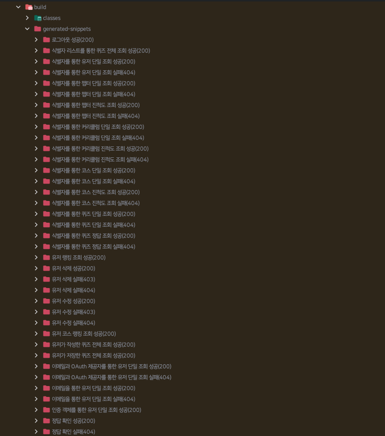
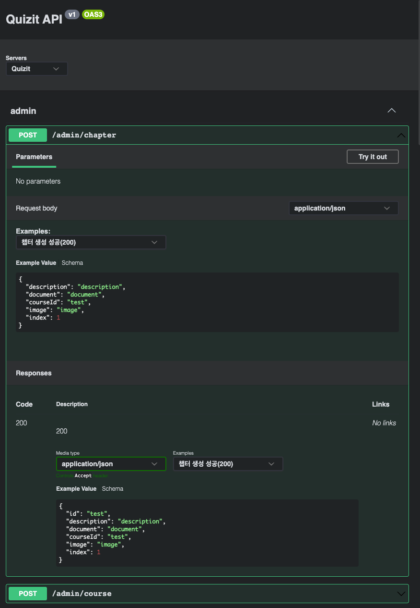

이번 SW 마에스트로 프로젝트에서 백엔드를 개발하면서 프론트엔드를 위해 API 문서화 작업이 필요했습니다.
그래서 적합한 API 문서화 방법을 찾는 도중, 제가 Spring REST Docs와 Swagger를 함께 도입한 경험을 공유해 드리려고 합니다.

# Spring REST Docs

Spring 기반 API에는 문서화 도구로 Swagger와 Spring REST Docs라는 선택지가 있었는데, 현재 백엔드에는 코드 커버리지까지 적용해 테스트 코드를 작성하고 있었던 상황이라 Spring REST Docs가 적합하다고 생각했습니다.
Spring REST Docs는 컨트롤러 계층의 테스트를 기반으로 API 명세서를 생성해주는 도구입니다.
Spring REST Docs를 사용하기 위해서는 Spring REST Docs가 설정된 테스트 환경과 테스트 코드들이 필요합니다.

```kotlin title="ControllerTest.kt" showLineNumbers
@AutoConfigureRestDocs
abstract class ControllerTest : DescribeSpec() {
    @Autowired
    private lateinit var applicationContext: ApplicationContext

    @Autowired
    private lateinit var restDocumentation: RestDocumentationContextProvider

    protected val webClient: WebTestClient by lazy {
        WebTestClient.bindToApplicationContext(applicationContext)
            .configureClient()
            .filter(WebTestClientRestDocumentation.documentationConfiguration(restDocumentation))
            .build()
    }
}
```

우선 컨트롤러 계층 테스트에 사용되는 `WebTestClient`에 Spring REST Docs의 `WebTestClientRestDocumentationConfigurer`를 `ExchangeFilterFunction`으로 등록합니다.
이렇게 되면 `WebTestClient`를 사용하는 테스트에서 자동적으로 스니펫을 생성할 수 있습니다.
추가로 Spring REST Docs가 설정된 `WebTestClient`를 모든 컨트롤러 계층 테스트에 적용하기 위해 `ControllerTest`라는 추상 클래스 내에 `WebTestClient`를 포함시켰습니다.

```kotlin title="QuizControllerTest.kt" showLineNumbers {20-24}
@WebFluxTest(QuizRouter::class, QuizHandler::class)
class QuizControllerTest : ControllerTest() {
    @MockkBean
    private lateinit var quizService: QuizService

    init {
        describe("getQuizById()는") {
            context("퀴즈가 존재하는 경우") {
                every { quizService.getQuizById(any()) } returns createQuizResponse()
                withMockUser()

                it("상태 코드 200과 quizResponse를 반환한다.") {
                    webClient
                        .get()
                        .uri("/quiz/{id}", ID)
                        .exchange()
                        .expectStatus()
                        .isOk
                        .expectBody<QuizResponse>()
                        .document(
                            "식별자를 통한 퀴즈 단일 조회 성공(200)",
                            pathParameters("id" paramDesc "식별자"),
                            responseFields(quizResponseFields)
                        )
                }
            }
        }
    }
}
```
```kotlin title="RestDocsUtil.kt" showLineNumbers
infix fun String.desc(description: String): FieldDescriptor =
    PayloadDocumentation.fieldWithPath(this)
        .description(description)

infix fun String.paramDesc(description: String): ParameterDescriptor =
    RequestDocumentation.parameterWithName(this)
        .description(description)

fun <T> BodySpec<T, *>.document(
    identifier: String,
    vararg snippets: Snippet
): BodySpec<T, *> =
    consumeWith(
        WebTestClientRestDocumentationWrapper.document<T>(
            identifier,
            Preprocessors.preprocessRequest(Preprocessors.prettyPrint()),
            Preprocessors.preprocessResponse(Preprocessors.prettyPrint()),
            *snippets
        )
    )
```

기존의 컨트롤러 계층 테스트 코드에 `ControllerTest`에 포함된 `WebTestClient`와 함께 API 명세에 대한 정보만 추가해주면 다음과 같이 알아서 `/build/generated-snippets` 경로에 스니펫이 생성됩니다.
참고로 Kotlin DSL을 통해 문서화 코드를 어느정도 간소화하였습니다.



이렇게 생성된 스니펫들은 AsciiDoc 형태로 저장되는데, 이 스니펫만으로는 API 명세를 표현하기 힘듭니다.
그래서 스니펫들을 이용해서 API 명세서를 직접 작성해야 합니다.
바로 이 점이 Spring REST Docs의 단점이라고 생각합니다.
스니펫이 API 명세서가 되는 과정까지가 완전히 자동적이지는 않았으며, 막상 스니펫을 이용해 직접 작성한 API 명세서는 UI가 맘에 들지 않았습니다.
저는 이 점을 Swagger를 통해 극복하려고 했습니다.

# Swagger

Swagger는 Spring REST Docs와 같이 API 문서화를 위한 도구입니다.



그러나 Swagger는 Spring REST Docs와 다르게 위처럼 깔끔한 전용 UI도 제공하며, API 테스트 기능까지 가지고 있습니다.
이럼에도 앞서 문서화 도구로 Swagger를 사용하지 않았던 이유는 Swagger가 테스트 코드에만 영향을 주는 Spring REST Docs와 달리 프로덕션 코드에도 영향을 주기 때문입니다.
Swagger는 프로덕션 코드에 작성된 어노테이션들을 기반으로 API 명세서를 생성합니다.
이 점에서 프로덕션 코드에 문서화 관련 코드가 포함되는 것이 싫었던 저는 Swagger가 아닌 Spring REST Docs를 사용하기로 했던 것입니다.

# Spring REST Docs with Swagger

결국 이렇게 상반된 장단점을 가진 Spring REST Docs와 Swagger를 함께 사용해보기로 했습니다.
우선 Spring REST Docs가 생성한 스니펫들을 Swagger가 읽을 수 있는 OpenAPI Specification에 맞춘 문서로 변환할 것입니다.
그렇게 변환한 문서를 Swagger로 읽으면 끝입니다.

```kotlin title="build.gradle.kts" showLineNumbers
plugins {
    id("com.epages.restdocs-api-spec") version "0.17.1"
    ...
}

dependencies {
    testImplementation("com.epages:restdocs-api-spec-webtestclient:0.17.1")
    testImplementation("com.epages:restdocs-api-spec:0.17.1")
    ...
}
```

우선 스니펫들을 OpenAPI 문서로 변환해주는데 사용하는 의존성들을 추가합니다.


```kotlin title="build.gradle.kts" showLineNumbers {4, 9-16}
tasks {
    test {
        useJUnitPlatform()
        finalizedBy(jacocoTestReport, withType<OpenApi3Task>())
    }
    ...
}

openapi3 {
    setServer("Quizit")
    title = "Quizit API"
    version = "v1"
    format = "yaml"
    outputFileNamePrefix = "api"
    outputDirectory = "src/main/resources/static/docs"
}
```

그 다음, 스니펫을 OpenAPI 문서로 변환하는 작업인 `openapi3`를 설정한 후 테스트 작업 과정에 추가했습니다.
이렇게 되면 테스트 코드를 실행한 후 Spring REST Docs에 의해 스니펫들이 생성되고 `openapi3` 작업을 거쳐 스니펫들을 기반으로 한 OpenAPI 문서가 `/src/main/resources/static/docs` 경로에 생성됩니다.
참고로 `/src/main/resources/static/docs` 디렉토리가 존재하는 상태여야 합니다.

```yaml title="api.yaml" showLineNumbers
openapi: 3.0.1
info:
  title: Quizit API
  version: v1
servers:
- url: Quizit
tags: []
paths:
  /admin/chapter:
    post:
      tags:
      - admin
      operationId: 챕터 생성 성공(200)
      requestBody:
        content:
          application/json:
            schema:
              $ref: '#/components/schemas/admin-chapter-650774478'
            examples:
              챕터 생성 성공(200):
                value: |-
                  {
                    "description" : "description",
                    "document" : "document",
                    "courseId" : "test",
                    "image" : "image",
                    "index" : 1
                  }
      responses:
        "200":
          description: "200"
          content:
            application/json:
              schema:
                $ref: '#/components/schemas/admin-chapter-id-715247309'
              examples:
                챕터 생성 성공(200):
                  value: |-
                    {
                      "id" : "test",
                      "description" : "description",
                      "document" : "document",
                      "courseId" : "test",
                      "image" : "image",
                      "index" : 1
                    }
  ...
```

테스트가 성공적으로 완료되면 위처럼 OpenAPI 문서인 `api.yaml`이 생성됩니다.
이 문서와 Swagger만 있다면 언제든지 Swagger UI로 API 명세서를 볼 수 있습니다.

## CI / CD

이제 API 명세서를 생성하는 것까지 자동화가 되었습니다.
하지만 실제로 API 명세서를 제일 많이 필요로 하는 프론트엔드 팀원도 결국은 API 명세를 보기 위해 어떻게든 로컬에서 테스트 코드를 돌리거나 Swagger를 구해야한다는 과정을 거쳐야합니다.
이러한 불필요한 과정을 없애기 위해 Kubernetes 클러스터에 프론트엔드 팀원이 접속할 수 있는 Swagger도 함께 구동시켰습니다.
또한 백엔드가 업데이트 될 때, API 명세서에도 변경 사항이 바로 반영되도록 CI / CD 파이프라인을 활용했습니다.

```groovy title="Jenkinsfile" showLineNumbers {}
pipeline{
    agent {
        ...
    }

    stages{
        stage('Build') {
            steps {
                container('gradle') {
                    sh('mkdir ./src/main/resources/static')
                    sh('mkdir ./src/main/resources/static/docs')
                    sh('gradle build')
                    sh('mv ./build/libs/quiz-service.jar ./')
                }
            }
        }

        stage('Update API Specification'){
            steps{
                container('aws'){
                    sh "aws s3 cp src/main/resources/static/docs/api.yml s3://quizit-swagger/quiz.yml"
                }
            }
        }
        ...
    }
}
```

이미 구성된 CI 파이프라인에 생성된 OpenAPI 문서를 객체 스토리지인 AWS S3에 저장하는 스테이지을 추가했습니다.
이후 Swagger가 OpenAPI 문서인 객체 URL을 참조하도록 설정합니다.

이렇게 문서화하는 과정을 완전히 자동화하는데 성공했습니다.

# 마치며

지금까지 Spring REST Docs와 Swagger를 함께 사용한 문서화 경험을 공유해보았습니다.
확실히 Spring REST Docs와 Swagger를 함께 도입하니 협업 관점에서 도움을 굉장히 많이 얻은 것 같습니다.
역시 협업에서는 문서화가 굉장히 중요한데, 앞서 설명한 방식을 도입해서 원활한 문서화 경험을 겪어보시길 바랍니다.
