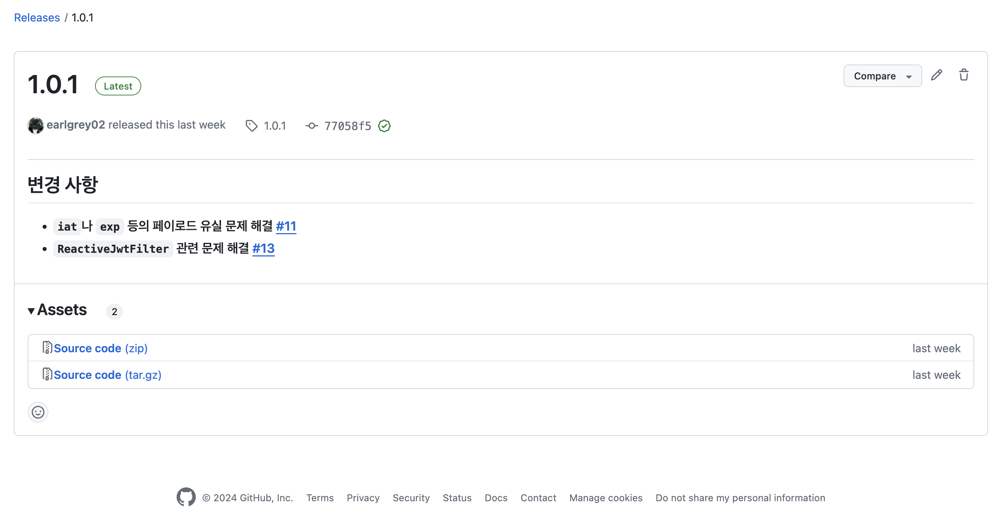
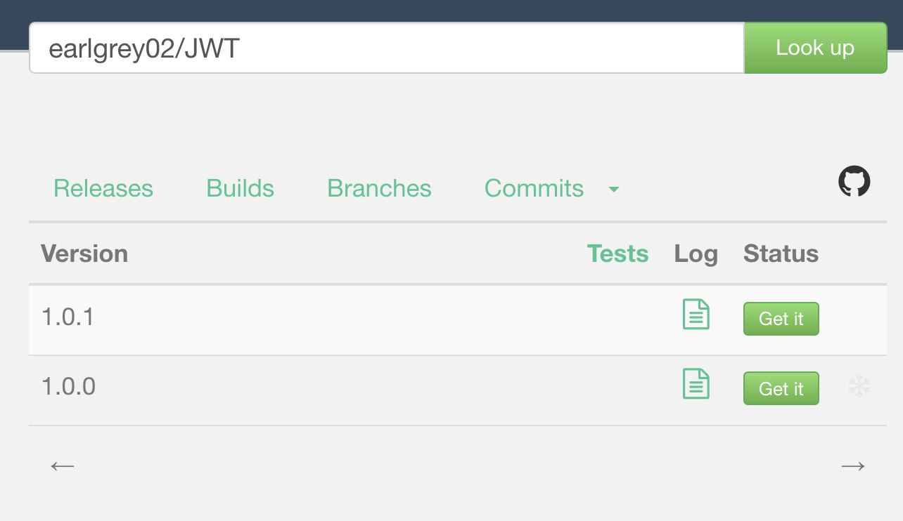
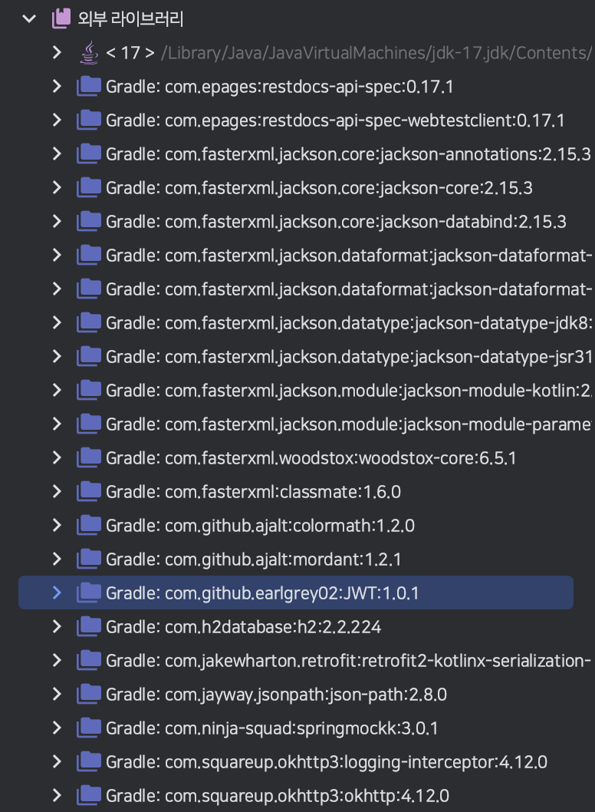

이번에 SW 마에스트로 프로젝트에서 백엔드를 MSA(Micro Service Architecture)로 개발하고 있습니다.
MSA를 개발하면서 발생한 중복 코드를 JVM 라이브러리로 배포해 관리한 경험을 공유해 드리려고 합니다.

## 중복 코드

MSA의 근본적인 가치는 하나의 큰 서비스를 여러 작은 서비스들로 분리해서 비즈니스 민첩성을 확보함에 있습니다.
그래서 무조건 중복 코드를 줄이고자 공통 모듈을 만들어버리면 그에 따른 의존성 때문에 MSA의 의미가 없어져버립니다.
그렇지만 모든 서비스에서 무조건 사용해야 하고 변경 빈도가 적은 코드들은 공통 모듈로 모듈화할 가치가 있다고 생각했습니다.
저희는 이렇게 공통 모듈로 모듈화할 코드들로 JWT 인증 및 인가를 선택했습니다.

## JWT

저희는 서버의 확장성을 위해 인증 및 인가 방식으로 JWT(JSON Web Token)를 사용하기로 했습니다.
JWT 토큰에는 유효 기간, 유저 식별자, 서명 등의 요소가 포함되며, 서버에서는 오직 서명을 통해 유효성을 검사합니다.
그러므로 JWT는 세션과 달리 무상태(Stateless)이며 DB에 저장할 필요가 없습니다.

## 모듈화

기본적으로 모든 서비스에서는 JWT 인가 기능을 필요로 합니다.
저희 서버들은 모두 Spring WebFlux를 사용하고 있으므로 JWT 인가 과정을 포함한 `WebFilter`를 구현해 `SecurityFilterChain`에 등록하는 방식으로 인가 기능을 구현합니다.
이러한 과정에서 기본적인 토큰 파싱 로직과 `WebFilter`에 대한 코드가 모두 중복 코드로 남게 됩니다.
그래서 앞서 설명했듯이, 이 코드들을 모듈화해 공통 모듈로 관리하기로 했습니다.

```kotlin title="JwtAuthentication.kt" showLineNumbers
data class JwtAuthentication(
    val id: String,
    @JvmField
    val authorities: Set<GrantedAuthority>
) : Authentication {
    override fun getAuthorities(): Set<GrantedAuthority> = authorities

    override fun getName(): String? = null

    override fun getCredentials(): Any? = null

    override fun getDetails(): Any? = null

    override fun getPrincipal(): Any? = null

    override fun isAuthenticated(): Boolean = true

    override fun setAuthenticated(isAuthenticated: Boolean) {
        throw UnsupportedOperationException("Cannot change the authenticated state of JwtAuthentication")
    }
}
```

우선 토큰으로부터 가져올 수 있는 인증 객체인 `JwtAuthentication`을 구현했습니다.
`JwtAuthenticaion`은 인가 과정에서 `SecurityContext`에 저장됩니다.
추가로 Kotlin에 의해 생성되는 `getAuthorities()`와 `Authenticaion`의 추상 메서드인 `getAuthorities()`로 인해 시그니처 충돌이 발생합니다.
그래서 `@JvmField`를 통해 `authorities`에 대해서 Getter가 생성되지 않도록 했습니다.

```kotlin title="JwtProvider.kt" showLineNumbers
class JwtProvider(
    private val secretKey: SecretKey,
    private val accessTokenExpire: Long,
    private val refreshTokenExpire: Long
) {
    fun createAccessToken(authentication: JwtAuthentication): String =
        createToken(authentication.toClaims(), accessTokenExpire)

    fun createRefreshToken(authentication: JwtAuthentication): String =
        createToken(authentication.toClaims(), refreshTokenExpire)

    fun getAuthentication(token: String): JwtAuthentication =
        Jwts.parserBuilder()
            .setSigningKey(secretKey)
            .build()
            .parseClaimsJws(token)
            .body
            .toAuthentication()

    private fun createToken(claims: Claims, expire: Long): String =
        Date().let {
            Jwts.builder()
                .setClaims(claims)
                .setIssuedAt(it)
                .setExpiration(Date(it.time + expire))
                .signWith(secretKey, SignatureAlgorithm.HS256)
                .compact()
        }

    private fun JwtAuthentication.toClaims(): Claims =
        Jwts.claims(
            mapOf(
                "id" to id,
                "authorities" to authorities.joinToString(",") { it.authority }
            )
        )

    private fun Claims.toAuthentication(): JwtAuthentication =
        JwtAuthentication(
            id = get("id") as String,
            authorities = (get("authorities") as String)
                .split(",")
                .map(::SimpleGrantedAuthority)
                .toHashSet()
        )
}
```

토큰 생성이나 `JwtAuthenticaion`을 가져오는 기능들을 가진 `JwtProvider`도 구현합니다.
`secretKey` 등의 값들은 Bean으로 등록되는 시점에 프로퍼티를 통해 주입될 예정입니다.

```kotlin title="ReactiveJwtFilter.kt" showLineNumbers {11}
class ReactiveJwtFilter(
    private val jwtProvider: JwtProvider
) : WebFilter {
    override fun filter(exchange: ServerWebExchange, chain: WebFilterChain): Mono<Void> =
        Mono.justOrEmpty(exchange.request.headers.getFirst(HttpHeaders.AUTHORIZATION))
            .filter { it.startsWith("Bearer ") }
            .switchIfEmpty { Mono.error(IllegalArgumentException("Authorization header is invalid.")) }
            .map { jwtProvider.getAuthentication(it.substring(7)) }
            .flatMap {
                chain.filter(exchange)
                    .contextWrite(ReactiveSecurityContextHolder.withAuthentication(it))
            }
            .onErrorResume { chain.filter(exchange) }
}
```

그 다음, 인가 과정을 포함하는 `ReactiveJwtFilter`를 구현합니다.
Spring Reactive Security는 컨텍스트 스위칭(Context Switching)을 대비해 Reactor Context 내의 `SecurityContext`를 통해 권한을 확인합니다.
그러므로 인가 과정을 통과하면 토큰으로부터 가져온 `JwtAuthenticaion`을 포함하는 `SecurityContext`를 `contextWrite()`를 통해 Reactor Context에 저장하도록 해야합니다.

```kotlin title="JwtConfiguration.kt" showLineNumbers
@AutoConfiguration
class JwtConfiguration {
    @Bean
    fun jwtProvider(
        @Value("\${jwt.secretKey}")
        secretKey: String,
        @Value("\${jwt.accessTokenExpire}")
        accessTokenExpire: Long,
        @Value("\${jwt.refreshTokenExpire}")
        refreshTokenExpire: Long
    ): JwtProvider = JwtProvider(
        secretKey = Keys.hmacShaKeyFor(Decoders.BASE64.decode(secretKey)),
        accessTokenExpire = TimeUnit.MINUTES.toMillis(accessTokenExpire),
        refreshTokenExpire = TimeUnit.MINUTES.toMillis(refreshTokenExpire)
    )
}
```

마지막으로 `JwtProvider`를 Bean으로 설정하는 `JwtConfiguration`을 구현했습니다.
`JwtConfiguration`에서는 프로퍼티를 기반으로 `secretKey` 등을 `JwtProvider`에 주입하게 됩니다.
`@AutoConfiguration`을 통해 `@EnableAutoConfiguration`이 있는 경우, 자동으로 설정 클래스를 Bean으로 등록하도록 합니다.

```java title="SpringBootApplication.java" showLineNumbers
@Target(ElementType.TYPE)
@Retention(RetentionPolicy.RUNTIME)
@Documented
@Inherited
@SpringBootConfiguration
@EnableAutoConfiguration
@ComponentScan(excludeFilters = { @Filter(type = FilterType.CUSTOM, classes = TypeExcludeFilter.class),
		@Filter(type = FilterType.CUSTOM, classes = AutoConfigurationExcludeFilter.class) })
public @interface SpringBootApplication {
  ...
}
```

`@SpringBootApplication`에는 기본적으로 `@EnableAutoConfiguration`가 등록되어 있습니다.
하지만 단순히 `@AutoConfiguration`만으로는 Bean으로 등록되지 않습니다.
어노테이션을 통해 Bean을 등록하는 Component Scan 방식은 `@ComponentScan`이 등록된 클래스 패키지 하위에만 적용되기 때문입니다.

## AutoConfiguration

`@AutoConfiguration`을 사용하기 전에 자동 설정 클래스들이 어떻게 Bean으로 등록되는 지를 알아야 합니다.

`AutoConfigurationImportSelector`
```java title="EnableAutoConfiguration.java' showLineNumbers {6}
@Target(ElementType.TYPE)
@Retention(RetentionPolicy.RUNTIME)
@Documented
@Inherited
@AutoConfigurationPackage
@Import(AutoConfigurationImportSelector.class)
public @interface EnableAutoConfiguration {
  ...
}
```

`@EnableAutoConfiguration`은 `@Import`와 `ImportSelector`의 구현체를 통해 동적으로 Bean을 등록하고 있었습니다.
이때, `AutoConfigurationImportSelector`는 `resources/META-INF/spring/org.springframework.boot.autoconfigure.AutoConfiguration.imports` 내의 메타 데이터들을 기반으로 Bean을 등록합니다.
그러므로 `JwtConfiguration`도 `resources/META-INF/spring/org.springframework.boot.autoconfigure.AutoConfiguration.imports`에 추가하면 자동 설정 클래스에 포함됩니다.

```text title="org.springframework.boot.autoconfigure.AutoConfiguration.imports" showLineNumbers
com.github.jwt.config.JwtConfiguration
```

공통 모듈에 `org.springframework.boot.autoconfigure.AutoConfiguration.imports`를 추가하고 위와 같이 클래스 패키지를 추가합니다.

## 배포

이제 공통 모듈을 배포할 차례입니다.
배포는 JVM 오픈소스 라이브러리 배포 플랫폼인 JitPack을 사용합니다.
그 전에 간단한 설정들이 필요합니다.

```kotlin title="build.gradle.kts" showLineNumbers
plugins {
    id("maven-publish")
    ...
}

publishing {
    publications {
        create<MavenPublication>("maven") {
            groupId = "com.github"
            artifactId = "jwt"
            version = "1.0.0"

            from(components["java"])
        }
    }
}
```

`build.gradle.kts`에서 maven-publish 플러그인 관련 설정을 해줍니다.

```yaml title="jitpack.yaml" showLineNumbers
jdk:
  - openjdk17
install:
  - ./gradlew assemble publishToMavenLocal
```

그 다음, `jitpack.yaml`을 작성합니다.
`jitpack.yaml`은 JitPack에서 빌드 커맨드를 커스터마이징 하기 위해 사용합니다.



마지막으로 공통 모듈의 레포지토리에서 릴리즈를 생성합니다.



릴리즈를 생성하면 JitPack이 자동으로 빌드를 시작합니다.
`jitpack.io`에서 배포 상태를 확인할 수 있습니다.

## 사용

```kotlin title="build.gradle.kts" showLineNumbers
repositories {
    mavenCentral()
    maven { url = uri("https://jitpack.io") }
    implementation("`com.github.earlgrey02:JWT:1.0.1")
}

dependencise {
    implementation("com.github.earlgrey02:JWT:1.0.1")
}
```

JitPack 레포지토리를 등록한 다음, 이전에 maven-publish 플러그인에서 설정한 그룹, 아키팩트와 함께 레포지토리 이름으로 라이브러리를 가져올 수 있습니다.



정상적으로 공통 모듈이 가져와지는 것을 확인할 수 있습니다.

## 마치며

지금까지 MSA에서 중복 코드를 모듈화해 JVM 라이브러리로 배포한 경험을 공유해보았습니다.
만약 멀티 모듈이 아닌 모놀리식, MSA 아키텍처에서 중복 코드를 외부에서 공통 모듈로 관리하고 싶으시다면 저처럼 JVM 라이브러리로 배포해 관리해보는 것도 좋다고 생각합니다.
