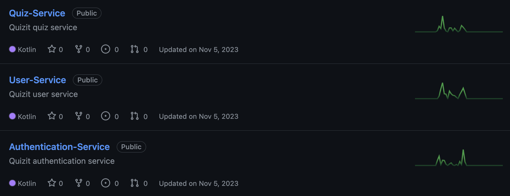
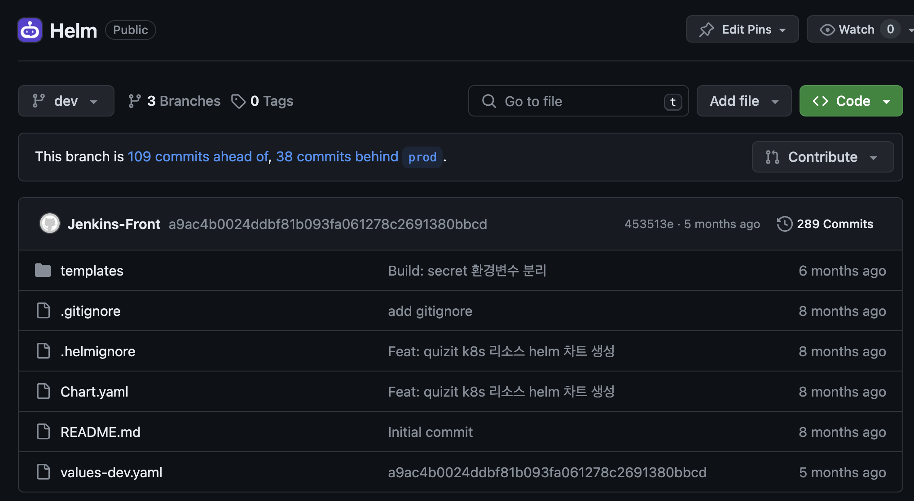

이번 SW 마에스트로 프로젝트에서 백엔드를 개발하면서 MSA(Micro Service Architecture)를 적용했었습니다.
그래서 Kubernetes, Spring 기반으로 MSA로 구성한 경험을 공유해 드리려고 합니다.

# MSA

MSA는 모놀리식 아키텍처의 단점을 보완해 비즈니스 민첩성을 확보하는 아키텍처입니다.
비즈니스 민첩성이란 끊임 없이 변화하는 비즈니스 요구 사항을 신속하게 수용할 수 있는 조직의 능력을 의미합니다.
MSA는 이러한 비즈니스 민첩성을 확보하기 위해 모놀리식 아키텍처와 반대로 애플리케이션을 작은 서비스들의 집합으로 구성하였습니다.
이렇게 되면 기존의 모놀리식 아키텍처와 정반대되는 장단점을 가지게 됩니다.



각각의 서비스들은 독립된 레포지토리를 가지게 되며, 이에 따라 배포 단위가 작아져 빠른 배포 속도를 가지게 됩니다.
스케일 아웃의 경우, 트래픽이 급증한 서비스에 대해서만 적용할 수도 있게 됩니다.
즉, MSA는 모놀리식 아키텍처와 달리 확장성이 뛰어나다는 것을 알 수 있습니다.

# MSA의 단점

MSA는 모놀리식 아키텍처와 정반대의 장점을 가진 동시에 정반대의 단점도 가지고 있습니다.
모놀리식 아키텍처에서는 다른 서비스의 기능을 사용하기 위해서 단순히 모듈을 가져오기만 하면 되는데, MSA에서는 서비스 간의 완전한 분리 때문에 모듈을 가져올 수 없습니다.
이에 따라 MSA에서는 서비스 간 네트워크 통신을 사용하게 됩니다.
또한 서비스 뿐만 아니라 데이터베이스도 분리된 상태이므로 분산 트랜잭션 처리가 따로 필요합니다.

<br/><br/>

이처럼 MSA는 개발 및 관리의 어려움, 서비스 간 통신으로 인한 비용 및 지연 시간 증가 등의 단점을 가지고 있습니다.

# MSA를 선택한 이유

저희는 모놀리식 아키텍처가 아닌 MSA를 적용하게 되었습니다.
저희는 초반 기획이 어느 정도 부실했던 편이라 요구 사항의 빈번한 변경이 예상이 되었던 상황이었고, 새로운 요구 사항을 빠르게 반영하고자 이미 애자일 프로세스로 프로젝트를 진행할 예정이었습니다.
결정적으로 저와 인프라를 맡은 팀원 분이 둘 다 기술적인 챌린지를 좋아한다는 점도 어느 정도 영향을 주었습니다.
이러한 근거에서 MSA를 적용해서 얻는 손해보다 이익이 더 크다고 판단했기 때문에 MSA를 적용하기로 했습니다.

# Kubernetes vs Spring Cloud

제일 우선적으로 고민했던 것은 Kubernetes와 Spring Cloud였습니다.
저희 서비스는 어느 정도 AI와 관련된 기능(LLM 등)들을 사용하는 서비스입니다.
이에 따라 파이썬으로 특정 서비스를 개발하게 될 수도 있다는 생각을 했었습니다.
만약 Spring Cloud를 사용하게 되면 Python 사용이 어려워지고, 이는 MSA의 장점 중 하나인 폴리그랏 프로그래밍(Polyglot Programming)을 잃는 것이라 생각했습니다.
그래서 결국 Kubernetes를 사용하기로 결정했습니다.

# 서비스 간 통신

저희는 MSA를 선택함에 따라 발생하는 단점들을 최소화하고 싶었습니다.
그 중에서도 서비스 간 통신으로 인해 발생하는 지연 시간을 줄이며 스레드 블로킹이 병목 현상으로 이어지지 않도록 하고 싶었습니다.
이에 따라 비동기, 논블로킹을 지원하는 Spring WebFlux와 비동기 메세지 통신에 사용되는 Apache Kafka를 도입하게 되었습니다.

```kotlin title="QuizService.kt" showLineNumbers {2, 6, 9-21}
fun checkAnswer(id: String, userId: String, request: CheckAnswerRequest): Mono<CheckAnswerResponse> =
    quizRepository.findById(id)
        .switchIfEmpty(Mono.error(QuizNotFoundException()))
        .cache()
        .run {
            zipWith(userClient.getUserById(userId))
                .filter { (_, userResponse) -> (id !in userResponse.correctQuizIds) && (id !in userResponse.incorrectQuizIds) }
                .flatMap { (quiz) ->
                    quizProducer.checkAnswer(
                        CheckAnswerEvent(
                            userId = userId,
                            quizId = id,
                            isAnswer = (request.answer == quiz.answer)
                        ).apply {
                            if (isAnswer) {
                                quiz.correctAnswer()
                            } else {
                                quiz.incorrectAnswer()
                            }
                        }
                    ).thenReturn(quiz)
                }
                .flatMap { quizRepository.save(it) }
                .then(map {
                    CheckAnswerResponse(
                        answer = it.answer,
                        solution = it.solution
                    )
                })
        }
```

위 코드는 퀴즈 채점 기능으로, 유저가 답안을 제출하면 정답을 확인하고 유저와 퀴즈의 정답률을 수정하는 로직을 가지고 있습니다.
`quizRepository`와 `userClient`를 호출하는 부분을 동시에 비동기적으로 처리해 지연 시간을 최소화 했습니다.
또한 유저의 정답률이 바뀌는 부분은 일관성에 민감하지 않다고 판단해 Kafka를 통해 결과적 일관성(Eventually Consistency)을 적용했습니다.

# CI / CD

저희가 MSA를 선택한 이유 중 하나가 빠른 배포인 만큼 CI / CD 파이프라인은 중요하다고 생각했습니다.
그 만큼 CI / CD 파이프라인을 설계하는데 많은 시간을 소모했었습니다.
CI / CD 도구로는 레퍼런스가 많은 Jenkins와 ArgoCD를 사용하였습니다.

<br/><br/>

이에 대해서는 저와 인프라 팀원 분이 IaC(Infrastructure as Code)에 대한 신념이 있었습니다.
저는 IaC가 언제든지 인프라를 복구할 수 있으며 기술 공유가 쉽도록 해준다는 점에서 좋게 평가합니다.
그래서 IaC를 통한 운영 방식으로 GitOps를 선택했으며, 저희는 GitOps를 기반으로 CI / CD 파이프라인을 구성하기로 했습니다.

```groovy title="Jenkinsfile" showLineNumbers
pipeline{
    agent {
        kubernetes{
            yaml '''
               apiVersoin: v1
               kind: Pod
               spec:
                 serviceAccountName: jenkins
                 containers:
                 - name: yq
                   image: mikefarah/yq
                   tty : true
                   command:
                   - sleep
                   args:
                   - infinity
                 - name: aws
                   image: amazon/aws-cli
                   command:
                   - sleep
                   args:
                   - infinity
                 - name: gradle
                   image: gradle:8.1.1
                   command: ['sleep']
                   args: ['infinity']
                 - name: kaniko
                   image: gcr.io/kaniko-project/executor:debug
                   command:
                   - sleep
                   args:
                   - infinity
                   env:
                   - name: AWS_SDK_LOAD_CONFIG
                     value: true
            '''
        }
    }

    stages{
        stage('Git Clone') {
            steps{
                git url: 'https://github.com/SWM-YouQuiz/Quiz-Service.git',
                    branch: "${branch.split("/")[2]}",
                    credentialsId: "github_personal_access_token"
                script{
                    def commitHash = sh(script: 'git rev-parse HEAD', returnStdout: true)
                    sh "echo ${commitHash}"
                    env.tag = commitHash
                }
            }
        }

        stage('Gradle Build') {
            steps{
                container('gradle'){
                    sh 'mkdir ./src/main/resources/static'
                    sh 'mkdir ./src/main/resources/static/docs'

                    sh 'gradle build'

                    sh 'mv ./build/libs/quiz-service.jar ./'
                }
            }
        }

        stage('aws') {
            steps{
                container('aws') {
                    sh "aws s3 cp src/main/resources/static/docs/api.yml s3://quizit-swagger/quiz.yml"
                }
            }
        }

        stage('Docker Build') {
            steps {
                container('kaniko') {
                    script {
                        sh "executor --dockerfile=Dockerfile --context=dir://${env.WORKSPACE} --destination=${env.ECR_QUIZ_SERVICE}:${env.tag}"
                    }
                }
            }
            post {
                failure {
                    slackSend(color: '#FF0000', message: "FAIL : Docker 이미지 Push 실패 '${env.JOB_NAME} [${env.BUILD_NUMBER}]' tag: ${env.tag}")
                }
                success {
                    slackSend(color: '#0AC9FF', message: "SUCCESS : Docker 이미지 Push 성공 '${env.JOB_NAME} [${env.BUILD_NUMBER}]' tag: ${env.tag}")
                }
            }
        }

        stage('Git Manifest Edit & Push') {
            steps {
                container('yq') {
                    script {
                        dir('helm') {
                            git url: 'https://github.com/SWM-YouQuiz/Helm.git',
                                branch: 'dev',
                                credentialsId: "github_personal_access_token"

                            sh "yq e -i -P '.quizItService.quiz.image.tag = \"${env.tag}\"' values-dev.yaml"
                        }
                    }
                }
                script {
                    dir('helm') {
                        withCredentials([gitUsernamePassword(credentialsId: 'github_personal_access_token')]) {
                            sh 'git config --global user.email "<>"'
                            sh 'git config --global user.name "Jenkins-Quiz"'

                            sh "git add ."
                            sh "git commit -m '${env.tag}'"

                            sh 'git push origin dev'
                        }
                    }
                }
            }
        }
    }
}
```

Jenkins에서는 빌드 후 차트 레포지토리에서 이미지 태그를 수정하도록 했습니다.
아쉽게도 워커 노드의 사양 문제로 Jenkins가 서비스를 두개 이상 빌드 시에 노드가 중지되는 상황이 지속되는 관계로, Jenkins의 동시 빌드 수를 1로 설정했었습니다.



그 후 ArgoCD가 Helm 차트 레포지토리의 변경 사항을 감지하고 클러스터에 배포하도록 구성했습니다.

# 프로젝트를 끝내며

어떻게든 기능을 모두 구현한 후, 그 외에도 분산 트랜잭션, 장애 용인(Fault Tolerance) 등의 과제가 남아있었습니다.
하지만 당시 기간이 별로 남지 않았으며 분산 트랜잭션은 무리라고 하셨던 조대협 멘토님의 말씀처럼 분산 트랜잭션과 장애 용인을 끝내 구현하지 못했었습니다.
MSA를 끝내 완성하지 못하고 프로젝트를 끝냈지만 기술적인 챌린지를 통해 더 성장했기 때문에 후회는 없었습니다.
오히려 드는 후회는 "MSA를 하지 말걸"보다는 "MSA를 하면서 이런 시도도 해볼걸"이었습니다.
옛날부터 '배달의 민족'의 마이크로서비스 여행기 글을 보며 MSA에 대한 꿈이 있었는데 조금이나마 이룰 수 있어서 좋았던 경험이 아니었나 싶습니다.

# 마치며

지금까지 실제로 프로젝트에서 MSA를 적용한 경험을 공유해보았습니다.
MSA에 관심이 있으시다면 주저하지 말고 도전해보시는 것을 추천해드리고 싶습니다.
