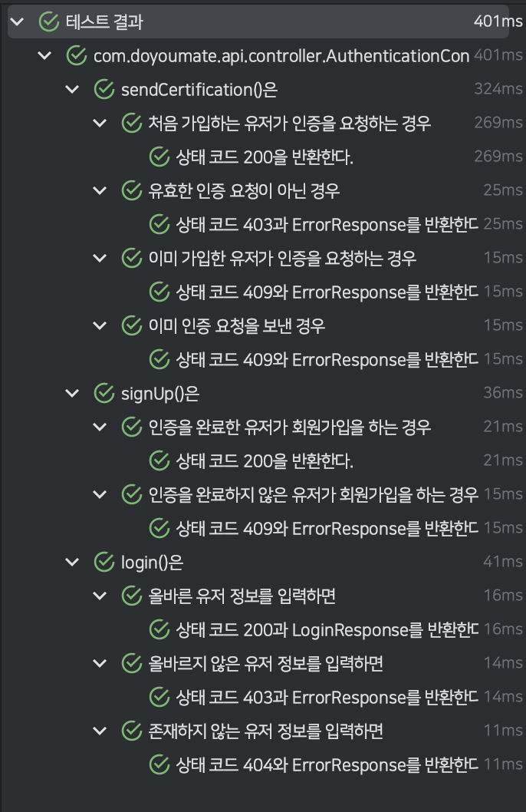

이번 SW 마에스트로 프로젝트에서 백엔드를 개발하면서 테스트 코드를 작성하는데 Kotest를 사용하기로 했습니다.
그래서 Kotest와 Mockk를 함께 사용해 Kotlin DSL로 테스트 코드를 작성한 경험을 공유해 드리려고 합니다.

## Kotlin DSL

DSL(Domain Specific Languages)은 특정 도메인에 국한된 언어입니다.
DSL을 사용하면 코드의 내부 구현을 숨겨 가독성을 좋게 만들 수 있습니다.

```kotlin showLineNumbers
Given("챕터와 각각의 챕터에 속하는 퀴즈들이 존재하는 경우") {
    val quiz = createQuiz()
        .also {
            every { quizRepository.deleteById(any<String>()) } returns empty()
        }
    val quizResponse = QuizResponse(quiz)

    When("유저가 특정 퀴즈를 조회하면") {
        val result = quizService.getQuizById(ID)
            .getResult()

        Then("해당 퀴즈가 조회된다.") {
            result.expectSubscription()
                .expectNext(quizResponse)
                .verifyComplete()
        }
    }
}
```

DSL은 마치 자연어와 프로그래밍 언어 사이에 있는 느낌을 줍니다.
위 코드는 Kotlin으로 구현할 수 있는 Kotlin DSL을 통해 Given-When-Then 패턴을 적용한 테스트 코드입니다.
Kotlin은 DSL을 구현할 수 있는 여러 기능들을 내포하고 있습니다.
일반적으로 람다 표현식, 확장 함수, 중위 함수 등의 기능들로 Kotlin DSL을 구현합니다.

## Kotlin DSL in test

저는 항상 Java에서의 테스트 코드를 보고 굉장히 복잡하다고 생각했습니다.
`@Nested`와 함께 많은 내부 클래스로 중첩 테스트 구조를 나타내다 보니 코드가 복잡해지기 쉬웠습니다.
마침 저희는 Kotlin을 사용하고 있었고 앞서 소개해드린 Kotlin DSL로 다양한 테스트 코드를 작성하도록 도와주는 Kotest와 Mockk를 사용하게 되었습니다.

## Kotest & Mockk

Kotest는 Kotlin을 사용하는 테스트 프레임워크입니다.
Kotest에서는 단순히 `@Test`나 `@Nested`를 사용해서 테스트 코드를 작성하는 것 외에 Given-When-Then 구조의 BDD(Behavior Driven Design) 또는 DCI(Describe-Context-It) 패턴을 Kotlin DSL로 사용할 수 있습니다.
또한 Mockk는 Kotest처럼 Kotlin DSL을 통해 모의 객체를 설정하고 검증하는 모킹(Mocking) 프레임워크입니다.

```kotlin title="build.gradle.kts" showLineNumbers
dependencies {
    testImplementation("io.kotest:kotest-runner-junit5:5.6.2")
    testImplementation("io.kotest:kotest-assertions-core:5.6.2")
    testImplementation("io.kotest.extensions:kotest-extensions-spring:1.1.2")
    testImplementation("io.mockk:mockk:1.13.5")
    testImplementation("com.ninja-squad:springmockk:3.0.1")
}
```

Kotest는 JUnit 기반으로 작동하므로 JUnit이 필요합니다.
Spring은 기본적으로 JUnit을 사용하므로 다른 설정은 필요없습니다.

```kotlin title="ProjectConfiguration.kt" showLineNumbers
@TestConfiguration
class ProjectConfiguration : AbstractProjectConfig() {
    override fun extensions(): List<Extension> = listOf(SpringExtension)
}
```

앞서 Kotest에서 `@Autowired`를 사용하기 위해서는 `AbstractProjectConfig`을 통해 `SpringExtentsion`을 등록해야 합니다.
`@Autowired`는 컨트롤러 테스트에 공통으로 사용되는 Spring REST Docs를 설정할때 사용합니다.

## 컨트롤러 테스트

```kotlin title="ControllerTest.kt" showLineNumbers
@Import(GlobalExceptionHandler::class)
@WebFluxTest
@AutoConfigureRestDocs
abstract class ControllerTest : DescribeSpec() {
    @Autowired
    private lateinit var applicationContext: ApplicationContext

    @Autowired
    private lateinit var restDocumentation: RestDocumentationContextProvider

    protected val webClient: WebTestClient by lazy {
        WebTestClient.bindToApplicationContext(applicationContext)
            .configureClient()
            .filter(WebTestClientRestDocumentation.documentationConfiguration(restDocumentation))
            .build()
    }
}
```

저희는 Spring WebFlux, Spring REST Docs를 사용하고 있으므로 위와 같이 Spring REST Docs와 `WebTestClient`가 설정된 `ControllerTest`를 구현했습니다.
컨트롤러 테스트는 DCI 패턴을 사용할 예정이므로 Kotest의 `DescribeSpec`을 상속받았습니다.
앞으로 모든 컨트롤러 테스트 클래스들은 `ControllerTest`를 상속받기만 하면 됩니다.

```kotlin title="describeSpec.kt" showLineNumbers
abstract class DescribeSpec(body: DescribeSpec.() -> Unit = {}) : DslDrivenSpec(), DescribeSpecRootScope {
   init {
      body()
   }
}
```

`DescribeSpec`의 코드를 보면 전형적인 Kotlin DSL의 구현 방식을 가지고 있습니다.
테스트 코드는 `DescribeSpec`의 생성자 내부나 `init` 블록 내부에 작성할 수 있습니다.

```kotlin title="QuizControllerTest.kt" showLineNumbers
@WebFluxTest(QuizRouter::class, QuizHandler::class)
class QuizControllerTest : ControllerTest() {
    @MockkBean
    private lateinit var quizService: QuizService

    init {
        describe("getQuizById()는") {
            context("퀴즈가 존재하는 경우") {
                every { quizService.getQuizById(any()) } returns Mono.just(createQuizResponse())

                it("상태 코드 200과 quizResponse를 반환한다.") {
                    webClient
                        .get()
                        .uri("/quiz/{id}", ID)
                        .exchange()
                        .expectStatus()
                        .isOk
                        .expectBody<QuizResponse>()
                }
            }

            context("퀴즈가 존재하지 않는 경우") {
                every { quizService.getQuizById(any()) } returns Mono.error(QuizNotFoundException())

                it("상태 코드 404를 반환한다.") {
                    webClient
                        .get()
                        .uri("/quiz/{id}", ID)
                        .exchange()
                        .expectStatus()
                        .isNotFound
                        .expectBody<ErrorResponse>()
                }
            }
        }
    }
}
```

우선 설명을 위해 Spring REST Docs와 관련된 코드들은 전부 생략했습니다.
앞서 `ControllerTest`에서 `DescribeSpec`을 상속받았기 때문에 DCI 패턴을 사용할 수 있습니다.

```kotlin showLineNumbers
@MockkBean
private lateinit var quizService: QuizService
```

`@MockkBean`은 Mockito의 `@MockBean`처럼 모의 객체를 Bean으로 등록해주는 어노테이션입니다.
Kotlin에서는 `lateinit`을 통해 지연 초기화를 사용해야 모의 객체를 생성하고 주입받을 수 있습니다.

```kotlin showLineNumbers
every { quizService.getQuizById(any()) } returns Mono.just(createQuizResponse())
```

`every()`와 `return()`은 Mockk에서 모의 객체의 동작을 설정합니다.
해당 스코프 내에서 `quizService.getQuizById()`를 호출하면 항상 `Mono.just(createQuizResponse())`를 반환하도록 했습니다.
컨트롤러 계층 테스트이기 때문에 서비스 계층을 모킹(Mocking)한 것입니다.

```kotlin showLineNumbers
webClient
    .get()
    .uri("/quiz/{id}", ID)
    .exchange()
    .expectStatus()
    .isNotFound
    .expectBody<ErrorResponse>()
```

검증하는 부분은 `WebTestClient`의 기능을 사용했습니다.
모든 API는 응답이 존재하므로 항상 상태 검증을 수행합니다.



테스트 결과는 JUnit에서 `@Nested`를 사용한 것처럼 계층 구조로 표시됩니다.

## 서비스 테스트

```kotlin title="QuizServiceTest.kt" showLineNumbers
class QuizServiceTest : BehaviorSpec() {
    private val quizRepository = mockk<QuizRepository>()


    private val quizService = QuizService(
        quizRepository = quizRepository
    )

    override fun isolationMode(): IsolationMode = IsolationMode.InstancePerLeaf

    init {
        Given("챕터와 각각의 챕터에 속하는 퀴즈들이 존재하는 경우") {
            val quiz = createQuiz()
                .also {
                    every { quizRepository.findById(any<String>()) } returns it
                }
            val quizResponse = QuizResponse(quiz)

            When("유저가 특정 퀴즈를 조회하면") {
                val result = StepVerifier.create(quizService.getQuizById(ID))

                Then("해당 퀴즈가 조회된다.") {
                    result.expectSubscription()
                        .expectNext(quizResponse)
                        .verifyComplete()
                }
            }
        }
    }
}
```

서비스 계층 테스트는 BDD 패턴을 사용하므로 `BehaviorSpec`을 상속받았습니다.
컨트롤러 계층 테스트와 마찬가지로 `init` 블록 내에 테스트 코드를 작성합니다.

```kotlin showLineNumberss
override fun isolationMode(): IsolationMode = IsolationMode.InstancePerLeaf
```

서비스 계층 테스트에서는 컨트롤러 계층 테스트와 달리 상태 검증 외에도 행위 검증이 존재합니다.
이때, 이전 테스트에서 행위 검증을 시도하는 메서드를 호출해버리면 다음 테스트의 행위 검증에도 영향이 갈 수 있습니다.
이를 방지하기 위해 `isolationMode`를 `IsolationMode.InstancePerLeaf`로 설정해 테스트들을 서로 완전히 격리했습니다.

```kotlin showLineNumbers
result.expectSubscription()
    .expectNext(quizResponse)
    .verifyComplete()
```

Spring WebFlux에서는 서비스 계층에서 일반적으로 `Mono` 또는 `Flux` 같은 `Publisher`를 반환하므로 구독을 통해 검증을 해야 합니다.
그러므로 Mockk가 아닌 Reactor의 `StepVerifier`를 사용하기로 했습니다.

```kotlin showLineNumbers /awaitSingle()/
When("유저가 특정 퀴즈를 조회하면") {
    val result = quizService.getQuizById(ID).awaitSingle()

    Then("해당 퀴즈가 조회된다.") {
        result shouldBeEqual quizResponse
    }
}
```

만약 Spring WebFlux에서 Mockk를 통해 검증을 하고 싶다면 `awaitSingle()` 등의 Coroutine 확장 함수들을 통해 실제로 반환하는 값을 가져와야 합니다.

```kotlin title="BehaviorSpecGivenContainerScope.kt" showLineNumbers
@Suppress("FunctionName")
@KotestTestScope
class BehaviorSpecGivenContainerScope(
   val testScope: TestScope,
) : AbstractContainerScope(testScope) {
   suspend fun When(name: String, test: suspend BehaviorSpecWhenContainerScope.() -> Unit) = addWhen(name, test, xdisabled = false)

   suspend fun Then(name: String, test: suspend TestScope.() -> Unit) = addThen(name, test, xdisabled = false)
}
```

참고로 Kotest는 Coroutine 기반으로 작동하므로 추가적인 Couroutine 빌더 없이 Coroutine 확장 함수를 사용할 수 있습니다.

## 마치며

지금까지 Kotest와 Mockk를 통해 Kotlin 스타일의 테스트 코드를 작성한 경험을 공유해보았습니다.
Kotest는 앞서 설명드린 BDD, DCI 패턴 외에도 기존의 어노테이션 방식의 테스트도 지원합니다.
그래서 만약 Kotlin 기반으로 테스트 코드를 작성하고 계신다면 Kotest나 Mockk를 통해 기존의 테스트 코드를 천천히 마이그레이션 해보는 것도 좋을 것 같습니다.
