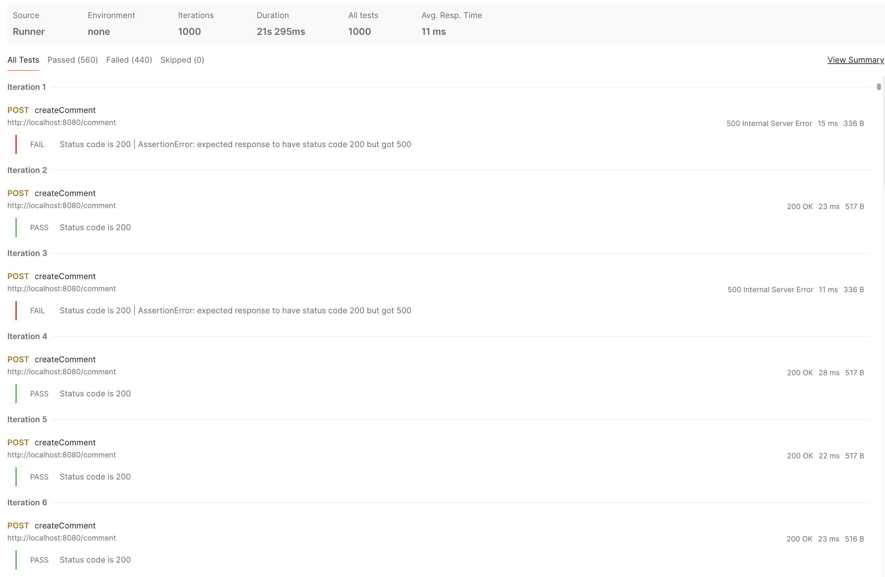
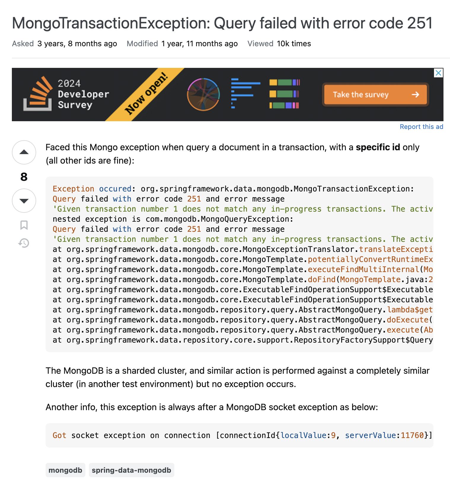
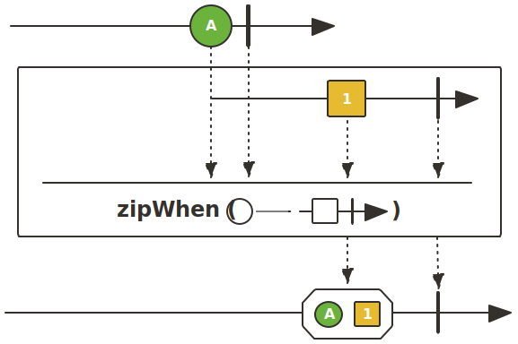
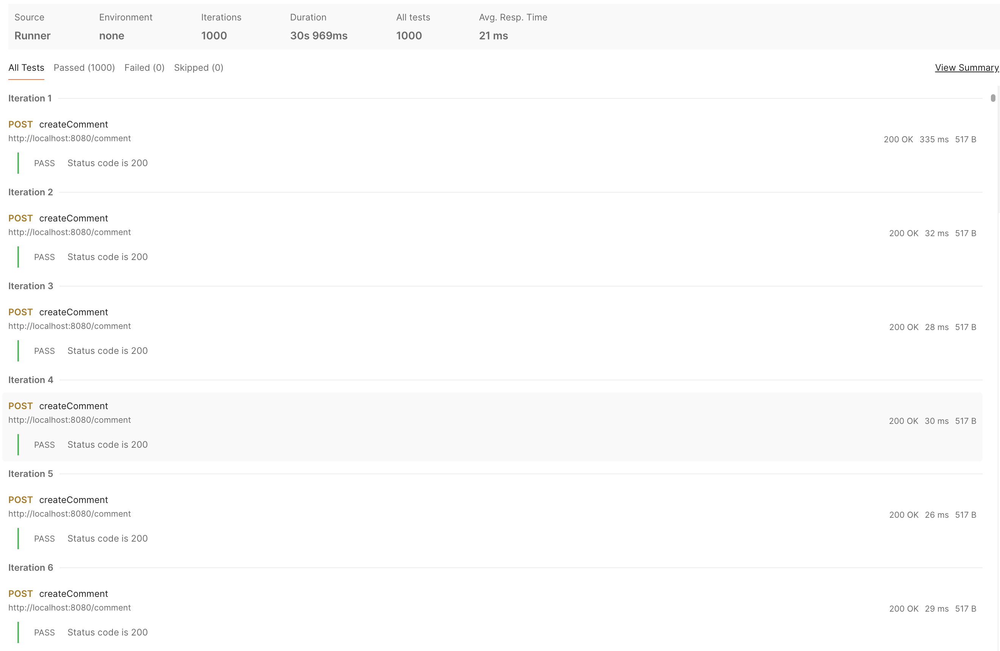

이번 글은 Spring WebFlux에서 트랜잭션(Transaction) 내의 병렬 처리 문제에 대한 글입니다.

<br /><br />

이번에 Spring WebFlux와 MongoDB를 함께 쓰면서 트랜잭션이 실패하는 문제를 겪었습니다.

```kotlin showLineNumbers {4, 7, 11-20}
@Transactional
fun createComment(request: CreateCommentRequest, authentication: DefaultJwtAuthentication): Mono<CommentResponse> =
    with(request) {
        studentRepository.findById(authentication.id)
            .switchIfEmpty(Mono.error(StudentNotFoundException()))
            .zipWith(
                postRepository.findByIdAndDeletedDateIsNull(postId)
                    .switchIfEmpty(Mono.error(PostNotFoundException()))
            )
            .flatMap { (student, post) ->
                commentRepository.save(
                    Comment(
                        postId = postId,
                        writer = Writer(student),
                        content = content
                    )
                ).flatMap {
                    postRepository.save(post.copy(commentIds = post.commentIds.apply { add(it.id!!) }))
                        .thenReturn(it)
                }
            }
            .map { CommentResponse(it) }
    }
```

문제가 발생한 코드는 학생과 게시글을 동시에 조회한 후 댓글을 저장하는 로직을 가지고 있었습니다.

```console
2024-05-20 20:26:39.969 INFO [reactor-http-nio-3] c.d.c.l.LoggingFilter: [e629b518] HTTP POST /comment {"postId":"665afc2ecbdeb92950f8f452", "content":""}
2024-05-20 20:26:39.991 ERROR [nioEventLoopGroup-3-7] c.d.c.e.GlobalExceptionHandler: [e629b518] MongoTransactionException("Command failed with error 251 (NoSuchTransaction): 'Given transaction number 10 does not match any in-progress transactions. The active transaction number is 9' on server mongodb-3:27019. The full response is {"errorLabels": ["TransientTransactionError"], "ok": 0.0, "errmsg": "Given transaction number 10 does not match any in-progress transactions. The active transaction number is 9", "code": 251, "codeName": "NoSuchTransaction", "$clusterTime": {"clusterTime": {"$timestamp": {"t": 1717241199, "i": 2}}, "signature": {"hash": {"$binary": {"base64": "AAAAAAAAAAAAAAAAAAAAAAAAAAA=", "subType": "00"}}, "keyId": 0}}, "operationTime": {"$timestamp": {"t": 1717241199, "i": 1}}}") at org.springframework.data.mongodb.core.MongoExceptionTranslator.translateExceptionIfPossible(MongoExceptionTranslator.java:130)
2024-05-20 20:26:39.993 INFO [nioEventLoopGroup-3-7] c.d.c.l.LoggingFilter: [e629b518] HTTP 500 INTERNAL_SERVER_ERROR
```

해당 문제는 주어진 트랜잭션의 번호가 처리 중인 트랜잭션과 일치하지 않는다는 메세지와 함께 간헐적으로 발생한다는 것이 특징이었는데요.



실제로 1000번의 요청 중 일부에서만 문제가 발생한 것을 확인할 수 있었습니다.

```console
2024-05-20 20:44:36.408 INFO [reactor-http-nio-7] c.d.c.l.LoggingFilter: [dcdd9724] HTTP POST /comment {"postId":"664b32307ae8b314bcdc836c", "content":"Adsdas"}
2024-05-20 20:44:36.412 DEBUG [reactor-http-nio-7] o.s.d.m.ReactiveMongoTransactionManager: [dcdd9724] Creating new transaction with name [com.doyoumate.api.board.service.CommentService.createComment]: PROPAGATION_REQUIRED,ISOLATION_DEFAULT
2024-05-20 20:44:36.412 DEBUG [reactor-http-nio-7] o.s.d.m.ReactiveMongoTransactionManager: [dcdd9724] About to start transaction for session [ClientSessionPublisherImpl@182fb53f id = {"id": {"$binary": {"base64": "VQsltPYDQm2jRP25h+c+QA==", "subType": "04"}}}, causallyConsistent = true, txActive = false, txNumber = 12, closed = false, clusterTime = null].
2024-05-20 20:44:36.412 DEBUG [reactor-http-nio-7] o.s.d.m.ReactiveMongoTransactionManager: [dcdd9724] Started transaction for session [ClientSessionPublisherImpl@182fb53f id = {"id": {"$binary": {"base64": "VQsltPYDQm2jRP25h+c+QA==", "subType": "04"}}}, causallyConsistent = true, txActive = true, txNumber = 13, closed = false, clusterTime = null].
2024-05-20 20:44:36.412 DEBUG [reactor-http-nio-7] o.s.d.m.c.ReactiveMongoTemplate: [dcdd9724] findOne using query: { "id" : "664aa2648ea327103f5f622a"} fields: Document{{}} for class: class com.doyoumate.domain.student.model.Student in collection: student
2024-05-20 20:44:36.413 DEBUG [reactor-http-nio-7] o.s.d.m.r.q.MongoQueryCreator: [dcdd9724] Created query Query: { "id" : "664b32307ae8b314bcdc836c", "deletedDate" : null}, Fields: {}, Sort: {}
2024-05-20 20:44:36.414 DEBUG [reactor-http-nio-7] o.s.d.m.c.ReactiveMongoTemplate: [dcdd9724] find using query: { "_id" : { "$oid" : "664b32307ae8b314bcdc836c"}, "deletedDate" : null} fields: Document{{}} for class: class com.doyoumate.domain.board.model.Post in collection: post
2024-05-20 20:44:36.417 DEBUG [nioEventLoopGroup-3-5] o.s.d.m.ReactiveMongoTransactionManager: [dcdd9724] Initiating transaction rollback
2024-05-20 20:44:36.417 DEBUG [nioEventLoopGroup-3-5] o.s.d.m.ReactiveMongoTransactionManager: [dcdd9724] About to abort transaction for session [ClientSessionPublisherImpl@182fb53f id = {"id": {"$binary": {"base64": "VQsltPYDQm2jRP25h+c+QA==", "subType": "04"}}}, causallyConsistent = true, txActive = true, txNumber = 13, closed = false, clusterTime = {"clusterTime": {"$timestamp": {"t": 1716205474, "i": 2}}, "signature": {"hash": {"$binary": {"base64": "AAAAAAAAAAAAAAAAAAAAAAAAAAA=", "subType": "00"}}, "keyId": 0}}].
2024-05-20 20:44:36.418 DEBUG [nioEventLoopGroup-3-5] o.s.d.m.ReactiveMongoTransactionManager: [dcdd9724] About to release Session [ClientSessionPublisherImpl@182fb53f id = {"id": {"$binary": {"base64": "VQsltPYDQm2jRP25h+c+QA==", "subType": "04"}}}, causallyConsistent = true, txActive = false, txNumber = 13, closed = false, clusterTime = {"clusterTime": {"$timestamp": {"t": 1716205474, "i": 2}}, "signature": {"hash": {"$binary": {"base64": "AAAAAAAAAAAAAAAAAAAAAAAAAAA=", "subType": "00"}}, "keyId": 0}}] after transaction.
2024-05-20 20:44:36.418 ERROR [nioEventLoopGroup-3-5] c.d.c.e.GlobalExceptionHandler: [dcdd9724] MongoTransactionException("Command failed with error 251 (NoSuchTransaction): 'Given transaction number 13 does not match any in-progress transactions. The active transaction number is 12' on server localhost:30000. The full response is {"errorLabels": ["TransientTransactionError"], "operationTime": {"$timestamp": {"t": 1716205474, "i": 1}}, "ok": 0.0, "errmsg": "Given transaction number 13 does not match any in-progress transactions. The active transaction number is 12", "code": 251, "codeName": "NoSuchTransaction", "$clusterTime": {"clusterTime": {"$timestamp": {"t": 1716205474, "i": 2}}, "signature": {"hash": {"$binary": {"base64": "AAAAAAAAAAAAAAAAAAAAAAAAAAA=", "subType": "00"}}, "keyId": 0}}}") at org.springframework.data.mongodb.core.MongoExceptionTranslator.translateExceptionIfPossible(MongoExceptionTranslator.java:130)
2024-05-20 20:44:36.418 INFO [nioEventLoopGroup-3-5] c.d.c.l.LoggingFilter: [dcdd9724] HTTP 500 INTERNAL_SERVER_ERROR
```

문제가 발생한 요청에 대해 `DEBUG` 수준의 로그를 확인해보니 조회 쿼리만 수행된 후에 문제가 발생한 것을 확인할 수 있었습니다.

# 병렬 처리 문제

문제가 발생한 해당 로그에 대해 검색을 하던 도중, 저와 같은 문제를 겪은 사람의 질문을 Stack Overflow에서 발견하게 되었습니다.



해당 질문자는 저와 똑같이 Spring Data Reactive Mongo를 사용하고 있었으며, 오류 메세지 또한 같았습니다.
해당 질문의 답변들에는 모두 첫 쿼리에 대한 병렬 처리를 문제로 제시하고 있었습니다.


저 또한 `zipWith()`를 통해 처음 수행되는 학생 및 게시글 조회를 거의 동시에 수행하도록 구현했는데요.
그래서 `zipWith()`를 `zipWhen()`으로 바꿔보기로 했습니다.



`zipWhen()`은 `zipWith()`와 달리 두 `Mono`를 순차적으로 결합하는 연산자입니다.

```kotlin showLineNumbers {6-9}
@Transactional
fun createComment(request: CreateCommentRequest, authentication: DefaultJwtAuthentication): Mono<CommentResponse> =
    with(request) {
        studentRepository.findById(authentication.id)
            .switchIfEmpty(Mono.error(StudentNotFoundException()))
            .zipWhen {
                postRepository.findByIdAndDeletedDateIsNull(postId)
                    .switchIfEmpty(Mono.error(PostNotFoundException()))
            }
            .flatMap { (student, post) ->
                commentRepository.save(
                    Comment(
                        postId = postId,
                        writer = Writer(student),
                        content = content
                    )
                ).flatMap {
                    postRepository.save(post.copy(commentIds = post.commentIds.apply { add(it.id!!) }))
                        .thenReturn(it)
                }
            }
            .map { CommentResponse(it) }
    }
```



이번에는 1000번의 요청 전부 정상적으로 처리된 것을 확인할 수 있었습니다.

# MongoDB 트랜잭션

문제는 해결했지만 저는 해당 문제의 구체적인 원인을 찾고 싶었습니다.
비슷한 Node.js의 `Promise.all()` 관련 문제 또는 문서를 탐색해봤지만 끝내 원리를 찾지 못했었습니다.
결국 저는 해당 문제가 MongoDB의 트랜잭션 특징과 관련이 있다고 생각하고 마무리했는데요.

```console
2024-05-20 21:50:18.273 DEBUG [AsyncGetter-6-thread-1] o.m.d.p.command: Command "find" started on database "doyoumate" using a connection with driver-generated ID 7 and server-generated ID 6907 to mongodb-3:27019. The request ID is 106 and the operation ID is 103. Command: {"find": "student", "filter": {"_id": {"$oid": "664c0480a158f8347d17ecd9"}}, "limit": 1, "singleBatch": true, "$db": "doyoumate", "$clusterTime": {"clusterTime": {"$timestamp": {"t": 1717246218, "i": 10}}, "signature": {"hash": {"$binary": {"base64": "AAAAAAAAAAAAAAAAAAAAAAAAAAA=", "subType": "00"}}, "keyId": 0}}, "lsid": {"id": {"$binary": {"base64": "/UtJTyDjSJe+lJy8jwQD1w==", "subType": "04"}}}, "txnNumber": 23, "startTransaction": true, "autocommit": false}
2024-05-20 21:50:18.273 DEBUG [AsyncGetter-6-thread-1] o.m.d.p.command: Command "find" started on database "doyoumate" using a connection with driver-generated ID 8 and server-generated ID 6908 to mongodb-3:27019. The request ID is 107 and the operation ID is 104. Command: {"find": "post", "filter": {"_id": {"$oid": "665afc2ecbdeb92950f8f452"}, "deletedDate": null}, "limit": 2, "batchSize": 256, "$db": "doyoumate", "$clusterTime": {"clusterTime": {"$timestamp": {"t": 1717246218, "i": 10}}, "signature": {"hash": {"$binary": {"base64": "AAAAAAAAAAAAAAAAAAAAAAAAAAA=", "subType": "00"}}, "keyId": 0}}, "lsid": {"id": {"$binary": {"base64": "/UtJTyDjSJe+lJy8jwQD1w==", "subType": "04"}}}, "txnNumber": 23, "autocommit": false}
```

MongoDB에서는 `startTransaction`이 `true`인 쿼리가 데이터베이스에 도달하면 트랜잭션이 시작됩니다.
실제로 로그를 확인해보면 처음 수행되는 조회에서만 Spring `startTransaction`이 `true`인 것을 확인할 수 있습니다.
하지만 첫 번째 쿼리를 다른 쿼리와 동시에 수행하면 `startTransaction`이 `true`인 첫 번째 쿼리가 데이터베이스에 도달하기 전에 다른 쿼리가 데이터베이스에 도달하는 상황이 존재할 수 있습니다.
이 경우, 해당 쿼리는 트랜잭션 시작 전에 수행되며 존재하지 않는 트랜잭션을 참조하게 되어 `NoSuchTransaction`이 발생한다는 것이 제 생각입니다.
