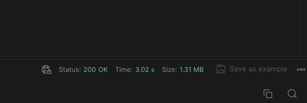

이번 글은 Spring Batch와 Kubernetes의 CronJob을 통한 배치 작업에 대한 글입니다.

<br /><br />

서비스를 개발하다 보면 외부 API를 사용하는 경우가 빈번하게 존재합니다.
물론 서비스마다 외부 API를 사용하는 빈도는 다 다르지만, 제가 개발하는 서비스에서는 외부 API 통신이 많은 편이었습니다.



문제는 제가 사용하는 외부 API인 학교 API가 지연 시간이 긴 편이며 요청과 응답이 대부분 복잡하고 용량이 큰 XML이라는 점인데요.
이렇게 되면 아무리 저희가 성능 최적화를 수행해도 학교 API에 의존하는 이상 성능이 안좋아질 수 밖에 없다고 생각했습니다.
그래서 주기적으로 학교 API로부터 데이터를 가져와 데이터베이스에 저장하기로 했습니다.
이러면 기존의 학교 API를 사용하는 부분에서 지연 시간이 짧은 서버 데이터베이스를 사용할 수 있게 됩니다.

<br /><br />

일반적으로 이런 상황에서 사용되는 것이 배치(Batch)입니다.
배치 작업은 주기적으로 데이터를 처리하는 작업을 의미합니다.

# Spring Batch with Kubernetes

배치 작업을 구현하는데에는 Spring Batch와 Kubernetes의 CronJob을 사용합니다.
외부 API로부터 가져온 데이터들을 데이터베이스를 저장하는 작업을 Spring Batch를 통해 구현하고, 해당 작업을 Kubernetes의 CronJob을 통해 주기적으로 수행하면 됩니다.

# Spring Batch

```yaml title="application.yaml" showLineNumbers
spring:
  datasource:
    url: jdbc:h2:mem:batch
    username: sa
    password:
    driverClassName: org.h2.Driver
```

우선 Spring Batch를 사용하기 위해서는 배치 작업을 관리하는 메타 데이터를 저장할 공간이 필요합니다.
이에 대해서는 임시적으로 인메모리(In-Memory) DB인 H2를 사용하기로 했습니다.

# Step

Spring Batch에서 `Step`은 `Job`을 구성하는 하나의 단계로, 실제로 수행되는 작업을 정의합니다.
이때, `Step`은 청크(Chunk)나 Tasklet을 기반으로 구현됩니다.
Tasklet 기반 배치는 `Step`을 하나의 메서드로 한번에 처리하는 반면, 청크 기반 배치는 `Step`을 `read()`, `process()`, `write()`로 구성해 설정한 `chunk` 수만큼 데이터를 묶어 처리합니다.
즉, `chunk`가 5인 경우 `ItemReader`와 `ItemProcessor`가 데이터를 각각 1개씩 읽고 처리한 후 5개를 모아서 `ItemWriter`에 한번에 전달합니다.

<br /><br />

학교 API에는 강의들을 각 연도와 학기 별로 조회하는 방법 밖에 없으므로 청크 기반 배치가 아닌 Tasklet 기반 배치를 사용해도 큰 성능 차이는 없습니다.
그렇지만 청크 기반 배치가 좀 더 가독성이 좋다고 생각해 청크 기반으로 `Step`을 구현해 보았습니다.

```java title="ItemReader.java" showLineNumbers
@FunctionalInterface
public interface ItemReader<T> {
	T read() throws Exception, UnexpectedInputException, ParseException, NonTransientResourceException;
}
```
```java title="ItemWriter.java" showLineNumbers
@FunctionalInterface
public interface ItemWriter<T> {
	void write(@NonNull Chunk<? extends T> chunk) throws Exception;
}
```

우선 `Step`을 구성할 `ItemReader`와 `ItemWriter`를 구현해야 합니다.
조회 및 저장 외의 복잡한 처리가 필요하지 않으므로 `ItemProcessor`는 구현하지 않았습니다.

```kotlin title="SynchronizeLecturesReader.kt" showLineNumbers
class SynchronizeLecturesReader(
    private val lectureClient: LectureClient
) : ItemReader<Flux<Lecture>> {
    private val semesters = enumValues<Semester>()
    private val years = (2020..Year.now().value).toList()
    private val pairs = years.flatMap { year ->
        semesters.map { semester ->
            year to semester
        }
    }
    private var idx = 0

    override fun read(): Flux<Lecture>? =
        pairs.getOrNull(idx++)
            ?.let { (year, semester) -> lectureClient.getLecturesByYearAndSemester(year, semester) }
}
```

`SynchronizeLecturesReader`는 각 연도와 학기를 순회하며 학교 API로부터 강의들을 조회합니다.
`ItemReader`는 `read()`에서 `null`을 반환하면 조회 작업을 종료합니다.

```kotlin title="SynchronizeLecturesWriter.kt" showLineNumbers {7}
class SynchronizeLecturesWriter(
    private val lectureRepository: LectureRepository
) : ItemWriter<Flux<Lecture>> {
    override fun write(chunk: Chunk<out Flux<Lecture>>) {
        lectureRepository.saveAll(chunk.items.first())
            .collectList()
            .block()
    }
}
```

`SynchronizeLecturesWriter`는 조회한 강의들을 데이터베이스에 저장합니다.
Spring Batch는 아직까진 리액티브 프로그래밍을 지원하지 않으므로 Spring WebFlux 환경에서 Spring Batch를 사용할 때는 `block()`을 통해 스레드를 블로킹(Blocking)해야 합니다.
그렇지 않으면 모든 스트림을 구독한 채로 배치 스레드가 종료되어 작업이 완료되지 못합니다.

```kotlin title="LectureBatchConfiguration.kt" showLineNumbers
@JobScope
@Bean
fun synchronizeLecturesStep(): Step =
    StepBuilder("synchronizeLecturesStep", jobRepository)
        .chunk<Flux<Lecture>, Flux<Lecture>>(1, transactionManager)
        .reader(synchronizeLecturesReader())
        .writer(synchronizeLecturesWriter())
        .build()

@StepScope
@Bean
fun synchronizeLecturesReader(): ItemReader<Flux<Lecture>> =
    SynchronizeLecturesReader(lectureClient)

@StepScope
@Bean
fun synchronizeLecturesWriter(): ItemWriter<Flux<Lecture>> =
    SynchronizeLecturesWriter(lectureRepository)
```

앞서 정의한 `SynchronizeLecturesReader`와 `SynchronizeLecturesWriter`를 Bean으로 등록한 후 `Step`을 정의합니다.
이때, `@JobScope`와 `@StepScope`는 해당 Bean의 생성 시점을 자신을 포함한 `Job`과 `Step`이 생성되는 시점으로 미루도록 해줍니다.
사용하는 이유는 추후에 `JobParameter`를 지연 바인딩(Late Binding)하기 위해 사용하거나 배치 작업을 병렬로 수행할 때 각각의 작업들이 독립적으로 수행되도록 하기 위해 사용합니다.

# Job

```kotlin title="LectureBatchConfiguration.kt" showLineNumbers {4}
@Bean
fun synchronizeLecturesJob(): Job =
    JobBuilder("synchronizeLecturesJob", jobRepository)
        .start(synchronizeLecturesStep())
        .build()
```

마지막으로 `SynchronizeLecturesStep`을 `Step`으로 가지는 `SynchronizeLecturesJob`을 Bean으로 등록합니다.

# 배치 실행

```console
2024-01-25 13:47:21.851 INFO [main] o.s.b.c.l.s.SimpleJobLauncher: Job: [SimpleJob: [name=synchronizeLecturesJob]] launched with the following parameters: [{}]
2024-01-25 13:47:21.861 INFO [main] o.s.b.c.j.SimpleStepHandler: Executing step: [synchronizeLecturesStep]
2024-01-25 13:47:50.287 INFO [main] o.s.b.c.l.s.SimpleJobLauncher: Job: [SimpleJob: [name=synchronizeLecturesJob]] completed with the following parameters: [{}] and the following status: [COMPLETED] in 28s426ms
```

애플리케이션을 시작하면 `JobLauncherApplicationRunner`가 `JobLauncher`를 통해 `SynchronizeLecturesJob`을 실행하게 됩니다.

```yaml title="application.yaml" showLineNumbers
spring:
  batch:
    job:
      name: ${JOB}
```

배치 작업이 여러 개인 경우, 애플리케이션 시작 시에 수행할 `Job`을 환경 변수로 정의할 수 있도록 했습니다.

```kotlin title="BatchApplication.kt" showLineNumbers
fun main(args: Array<String>) {
    exitProcess(SpringApplication.exit(runApplication<BatchApplication>(*args)))
}
```

또한 Kubernetes의 CronJob을 통해 배치 작업을 수행할 예정이므로 배치 작업이 끝나면 종료 코드와 함께 프로세스가 종료되도록 했습니다.

# CronJob

이제 Kubernetes의 CronJob을 통해 해당 배치 작업을 특정 시간에 주기적으로 수행하도록 하겠습니다.
참고로 현재 인프라에서는 Helm과 ArgoCD를 통해 배포를 진행하고 있는데요.
그러므로 따로 존재하는 Helm 레포지토리 내에 CronJob에 대한 매니페스트(Manifest)를 작성하도록 하겠습니다.

```yaml title="values.yaml" showLineNumbers
jobs:
- name: synchronizeLecturesJob
  schedule: 0 3 * * *
- name: synchronizeStudentsJob
  schedule: 0 3 * * *
```
```yaml title="cronjob.yaml" showLineNumbers
{{- range .Values.jobs }}
---
apiVersion: batch/v1
kind: CronJob
metadata:
  name: {{ kebabcase .name }}
spec:
  schedule: {{ .schedule }}
  timeZone: 'Asia/Seoul'
  jobTemplate:
    spec:
      template:
        spec:
          restartPolicy: OnFailure
          containers:
          - name: {{ $.Values.controller.batch.containerName }}
            image: {{ $.Values.controller.batch.image.name }}:{{ $.Values.controller.batch.image.tag }}
            imagePullPolicy: Always
            env:
            - name: SPRING_PROFILES_ACTIVE
              value: {{ $.Values.env }}
            - name: JOB
              value: {{ .name }}
            envFrom:
            - secretRef:
                name: {{ $.Values.secret.name }}
          imagePullSecrets:
          - name: docker-secret
---
{{- end }}
```

CronJob에서 `schedule`을 통해 Cron 표현식으로 해당 작업을 수행할 시간을 정의할 수 있습니다.
저는 반복문을 통해 `values.yaml`에서 여러 배치 작업들의 `Job` 이름과 수행할 시간을 받아 CronJob을 생성하도록 구현했습니다.

```console
> kubectl get job -n doyoumate
NAME                                COMPLETIONS   DURATION   AGE
synchronize-lectures-job-28574100   1/1           71s        10h
synchronize-students-job-28574100   1/1           16m        10h
```

실제로 CronJob에 의해 특정 시간에 배치 작업이 자동으로 수행된 것을 확인할 수 있습니다.

# Spring Batch with Kotlin DSL

저는 추가로 Spring Batch 코드를 개선하고 싶었습니다.
우선 청크 기반 배치의 방식을 가져가면서 코드는 Tasklet 기반 배치처럼 하나의 클래스에 `read()`와 `write()`를 묶고 싶었고, Kotlin DSL을 통해 Spring Batch를 구현하고 싶었습니다.

```kotlin title="BatchUtil.kt" showLineNumbers
interface ItemTasklet<T> : ItemReader<T>, ItemWriter<T>
```

우선 `ItemReader`와 `ItemWriter`를 하나의 믹스인(Mixin) 인터페이스인 `ItemTasklet`로 묶었습니다.

```kotlin title="SynchronizeLecturesTasklet.kt" showLineNumbers
@StepScope
@Component
class SynchronizeLecturesTasklet(
    private val lectureRepository: LectureRepository,
    private val lectureClient: LectureClient
) : ItemTasklet<Flux<Lecture>> {
    private val semesters = enumValues<Semester>()
    private val years = (2020..Year.now().value).toList()
    private val pairs = years.flatMap { year ->
        semesters.map { semester ->
            year to semester
        }
    }
    private var idx = 0

    override fun read(): Flux<Lecture>? =
        pairs.getOrNull(idx++)
            ?.let { (year, semester) -> lectureClient.getLecturesByYearAndSemester(year, semester) }

    override fun write(chunk: Chunk<out Flux<Lecture>>) {
        lectureRepository.saveAll(chunk.items.first())
            .collectList()
            .block()
    }
}
```

그리고 기존의 `SynchronizeLecturesReader`와 `SynchronizeLecturesWriter`도 하나의 `SynchronizeLecturesTasklet`으로 통합합니다.
이제 이 `ItemTasklet`을 `Step`에 등록하는 Kotlin DSL을 구현하겠습니다.

```kotlin title="BatchDsl.kt" showLineNumbers
fun job(
    name: String,
    repository: JobRepository,
    transactionManager: PlatformTransactionManager,
    init: JobDsl.() -> Unit
): Job =
    JobDsl(name, repository, transactionManager)
        .apply(init)
        .registerSteps()
        .build()

class JobDsl(
    private val name: String,
    private val repository: JobRepository,
    private val transactionManager: PlatformTransactionManager
) {
    private val jobBuilder = JobBuilder(name, repository)
    private val steps = mutableListOf<Step>()

    fun <T> step(name: String, init: StepDsl<T>.() -> SimpleStepBuilder<T, T>) {
        steps.add(
            StepDsl<T>(name, repository, transactionManager)
                .init()
                .build()
        )
    }

    fun build(): SimpleJobBuilder {
        lateinit var simpleJobBuilder: SimpleJobBuilder

        steps.mapIndexed { index, step ->
            if (index == 0) {
                simpleJobBuilder = jobBuilder.start(step)
            } else {
                simpleJobBuilder.next(step)
            }
        }

        return simpleJobBuilder
    }
}

class StepDsl<T>(
    private val name: String,
    private val repository: JobRepository,
    private val transactionManager: PlatformTransactionManager
) {
    private val stepBuilder = StepBuilder(name, repository)

    fun chunk(count: Int, init: SimpleStepBuilder<T, T>.() -> SimpleStepBuilder<T, T>): SimpleStepBuilder<T, T> =
        stepBuilder.chunk<T, T>(count, transactionManager)
            .init()

    fun SimpleStepBuilder<T, T>.tasklet(itemTasklet: ItemTasklet<T>): SimpleStepBuilder<T, T> =
        reader(itemTasklet::read)
            .writer(itemTasklet::write)
}
```

제가 Spring Batch에서 사용하는 최소한의 기능만을 포함한 `JobDsl`과 `StepDsl`을 구현했습니다.
구현 방식은 다른 Kotlin DSL을 구현하는 방식과 같습니다.

```kotlin title="BatchUtil.kt" showLineNumbers {7, 17-29}
class JobDsl(
    private val name: String,
    private val repository: JobRepository,
    private val transactionManager: PlatformTransactionManager
) {
    private val jobBuilder = JobBuilder(name, repository)
    private val steps = mutableListOf<Step>()

    fun <T> step(name: String, init: StepDsl<T>.() -> SimpleStepBuilder<T, T>) {
        steps.add(
            StepDsl<T>(name, repository, transactionManager)
                .init()
                .build()
        )
    }

    fun build(): SimpleJobBuilder {
        lateinit var simpleJobBuilder: SimpleJobBuilder

        steps.mapIndexed { index, step ->
            if (index == 0) {
                simpleJobBuilder = jobBuilder.start(step)
            } else {
                simpleJobBuilder.next(step)
            }
        }

        return simpleJobBuilder
    }
}
```

특별히 주의할 점이라면 `JobDsl`에서 `step()`을 단순하게 `JobBuilder`의 `start()`로 `Step`을 추가하는 방식으로 구현하면 안된다는 점입니다.
그렇게 되면 만약 `Job`이 여러 `Step`으로 구성된다면 마지막으로 추가한 `Step`만 실행됩니다.
그래서 저는 `step()`을 `MutableList<Step>`에 `Step`을 추가하는 방식으로 구현해 `registerSteps()`에서 모든 `Step`이 `start()`와 `next()`로 추가되도록 구현했습니다.

```kotlin title="LectureBatchConfiguration.kt" showLineNumbers
@Configuration
class LectureBatchConfiguration(
    private val jobRepository: JobRepository,
    private val transactionManager: PlatformTransactionManager,
    private val synchronizeLecturesTasklet: SynchronizeLecturesTasklet
) {
    @Bean
    fun synchronizeLecturesJob(): Job =
        job("synchronizeLecturesJob", jobRepository, transactionManager) {
            step("synchronizeLecturesStep") {
                chunk(1) {
                    tasklet(synchronizeLecturesTasklet)
                }
            }
        }
}
```

구현한 Kotlin DSL을 기존 코드에 적용한 모습은 위와 같습니다.
