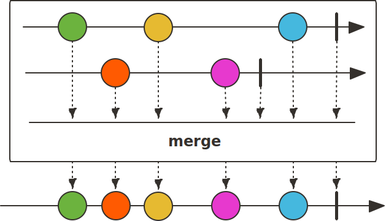
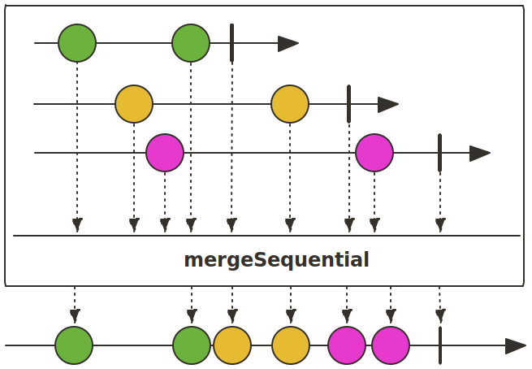
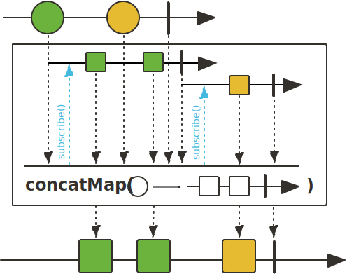

이번에 사이드 프로젝트에서 백엔드를 개발하면서 외부 API를 사용하게 되었습니다.
외부 API를 사용하는 기능을 구현하는 중 외부 API의 성능 문제가 저희 백엔드로 전이되는 문제를 겪었습니다.
그 문제를 동기 처리를 통해 해결한 경험을 공유해 드리려고 합니다.

# 외부 API의 성능 문제

저희는 학교 API로부터 학생과 학생이 신청한 강의들을 조회해 데이터베이스에 저장하는 배치 작업이 구성했습니다.

```kotlin title="SynchronizeStudentsTasklet.kt" showLineNumbers
@Tasklet
class SynchronizeStudentsTasklet(
    private val customStudentRepository: CustomStudentRepository,
    private val studentClient: StudentClient,
    private val lectureClient: LectureClient
) : ItemTasklet<Mono<Student>> {
    private val years = (2018..Year.now().value).toList()
    private var number = 100000
    private var idx = 0

    override fun read(): Mono<Student>? =
        years.getOrNull(idx)
            ?.let { year ->
                if (number >= 102000) {
                    idx += 1
                    number = 100000
                }

                "$year${number++}"
            }
            ?.let {
                studentClient.getStudentById(it)
                    .flatMap { student ->
                        if (student.status.run { contains("휴학") || contains("졸업") }) {
                            Mono.just(student)
                        } else {
                            Mono.zip(
                                lectureClient.getAppliedLectureIdsByStudentId(it)
                                    .collectList(),
                                lectureClient.getPreAppliedLectureIdsByStudentId(it)
                                    .collectList()
                            ).map { (appliedLectureIds, preAppliedLectureIds) ->
                                student.copy(
                                    appliedLectureIds = appliedLectureIds.toHashSet(),
                                    preAppliedLectureIds = preAppliedLectureIds.toHashSet()
                                )
                            }
                        }
                    }
            }

    override fun write(chunk: Chunk<out Mono<Student>>) {
        Flux.merge(chunk.items)
            .flatMap { customStudentRepository.upsert(it) }
            .collectList()
            .block()
    }
}
```

배치 작업은 Spring Batch의 `ItemReader`와 `ItemWriter`의 믹스인(Mixin) 인터페이스인 `ItemTasklet`을 사용해서 구현했습니다.
`read()`에서 학번에 해당하는 학생과 학생이 장바구니에 담은 강의, 신청한 강의들을 가져와 `write()`에서 저장하는 방식으로 배치 작업을 구현했습니다.

<br/><br/>

문제는 계속해서 외부 API와 통신을 하는 부분에서 Timeout이 발생한다는 점입니다.

# 스트림 비동기 처리

```kotlin title="SynchronizeStudentsTasklet.kt" showLineNumbers {2}
override fun write(chunk: Chunk<out Mono<Student>>) {
    Flux.merge(chunk.items)
        .flatMap { customStudentRepository.updateStudent(it) }
        .collectList()
        .block()
}
```

모든 학생 데이터가 `chunk.items`에 주어지는데 청크 수를 100으로 설정했으므로 100개의 학생 데이터가 담긴 `List<Mono<T>>`가 주어집니다.
`List<Mono<T>>`인 `chunk.items`는 `merge()`를 통해 `Flux<T>`로 변환됩니다.



이때, `merge()`는 인자로 받은 여러 Publisher들을 동시에 구독하여 결합합니다.
이렇게 되면 `read()`에서 여러 `WebClient` 통신들을 100개씩 비동기적으로 수행합니다.

<br/><br/>

어느 정도 구식인 학교 API는 이 요청들을 감당하지 못해 매번 Timeout을 발생시켰고, 이를 해결하기 위해서는 어쩔 수 없이 제가 작성한 코드를 건드릴 수밖에 없었습니다.

# WebClient Timeout 설정

```console
org.springframework.web.reactive.function.client.WebClientRequestException: handshake timed out after 10000ms
```

우선 로그를 확인한 결과 TLS Handshake 과정에서 Timeout이 발생한 것을 알 수 있습니다.

```kotlin title="WebClientConfiguration.kt" showLineNumbers {6-9}
@Configuration
class WebClientConfiguration {
    @Bean
    fun webClient(): WebClient =
        HttpClient.create()
            .secure {
                it.sslContext(TcpSslContextSpec.forClient())
                    .handshakeTimeout(Duration.ofSeconds(60))
            }
            .let { httpClient ->
                WebClient.builder()
                    .clientConnector(ReactorClientHttpConnector(httpClient))
                    .codecs {
                        it.defaultCodecs()
                            .maxInMemorySize(-1)
                    }
                    .build()
            }
}
```

그래서 WebClient의 Handshake Timeout을 60초로 설정해보았습니다.

```console
org.springframework.web.reactive.function.client.WebClientRequestException: connection timed out after 30000 ms
```

이번에는 Connection Timeout이 발생한 것을 확인했습니다.

```kotlin title="WebClientConfiguration.kt" showLineNumbers {6}
@Configuration
class WebClientConfiguration {
    @Bean
    fun webClient(): WebClient =
        HttpClient.create()
            .option(ChannelOption.CONNECT_TIMEOUT_MILLIS, 60000)
            .secure {
                it.sslContext(TcpSslContextSpec.forClient())
                    .handshakeTimeout(Duration.ofSeconds(60))
            }
            .let { httpClient ->
                WebClient.builder()
                    .clientConnector(ReactorClientHttpConnector(httpClient))
                    .codecs {
                        it.defaultCodecs()
                            .maxInMemorySize(-1)
                    }
                    .build()
            }
}
```

그래서 이전의 Handshake Timeout의 경우처럼 WebClient의 Connection Timeout을 60초로 설정해주었습니다.

```console
java.io.IOException: Operation timed out
```

다시 Timeout이 발생하는 것을 볼 수 있었습니다.
저는 이렇게 계속 발생하는 문제를 무작정 Timeout을 늘려서 해결하는 것은 적절하지 않다고 생각했습니다.
또한 배치 작업이 실행되는 중에는 1분을 넘기는 응답도 존재했었습니다.

<br/><br/>

이렇게 되면 학교 서버에 부하를 주지 않는 방식으로 요청을 보내는 것이 더 효율적일 것이라고 생각했습니다.

# 스트림 동기 처리

이번엔 요청을 보내는 방식을 바꿔보았습니다.
제일 간단한 방법은 기존의 비동기 방식의 처리를 동기적으로 바꾸는 것입니다.



동기 처리를 위해서 사용하는 리액티브 연산자로 `margeSequential()`이 있었습니다.

```kotlin title="SynchronizeStudentsTasklet.kt" showLineNumbers {2}
override fun write(chunk: Chunk<out Mono<Student>>) {
    Flux.mergeSequential(chunk.items)
        .flatMap { customStudentRepository.updateStudent(it) }
        .collectList()
        .block()
}
```

하지만 결과는 `merge()`을 사용했을 때와 같이 Timeout이 발생했습니다.
그 이유는 `mergeSequential()`은 단순히 결과의 순서를 보장해주는 것 뿐이지 작업은 `merge()`와 같이 비동기적으로 수행하기 때문이었습니다.

<br/><br/>

저는 다른 방법을 찾는 중에 `concat()`을 찾았습니다.


`concat()`은 `merge()`와 달리 동기적으로 작동하며 `margeSequential()`처럼 결과의 순서 또한 보장합니다.

```kotlin title="SynchronizeStudentsTasklet.kt" showLineNumbers {2}
override fun write(chunk: Chunk<out Mono<Student>>) {
    Flux.concat(chunk.items)
        .flatMap { customStudentRepository.updateStudent(it) }
        .collectList()
        .block()
}
```

이렇게 되면 이전 스트림의 값이 발행되고 나서야 다음 스트림의 구독이 시작됩니다.

```console
2024-02-02 06:02:48.693 INFO [main] o.s.b.c.s.AbstractStep: Step: [synchronizeAppliedLecturesStep] executed in 5m14s824ms
```

정상적으로 작업이 완료된 것을 볼 수 있습니다.

## 성능 최적화

하지만 `concat()`을 통해 데이터를 하나씩 처리하는 방식은 성능 면에서 좋지 않다고 생각했습니다.


이때, `buffer()`를 통해 스트림을 배치 단위로 묶어 처리하는 방법을 생각했습니다.
`buffer()`는 `Flux<T>`를 `Flux<List<T>>`로 반환합니다.
묶인 `List<T>` 내의 데이터들은 비동기적으로, `List<T>`들은 기존의 방식처럼 서로 동기적으로 수행되도록 구현합니다.



`Flux<Flux<T>>`에 동기 처리를 위해서 `concat()`과 `map()`을 결합한 `concatMap()`을, `Flux<T>`에 비동기 처리를 위해서는 `flatMap()`을 사용합니다.

```kotlin title="SynchronizeAppliedLecturesTasklet.kt" showLineNumbers {3}
override fun write(chunk: Chunk<out Mono<Student>>) {
    Flux.merge(chunk.items)
        .buffer(10)
        .map { Flux.fromIterable(it) }
        .concatMap { student ->
            student.flatMap { customStudentRepository.updateStudent(it) }
        }
        .collectList()
        .block()
}
```

`buffer()`를 통해 데이터를 10개씩 `List<T>`에 담아 `Flux<List<T>>`로 변환합니다.
`concatMap()` 내에서 `List<T>`는 비동기적으로 처리할 것이므로 미리 `map()`을 통해 `Flux<List<T>>`를 `Flux<Flux<T>>`로 변환했습니다.
이렇게 되면 동기적으로 처리되는 `concatMap()` 내부에서는 `Flux<T>`가 `flatMap()`을 통해 비동기적으로 작업이 처리됩니다.

```console
2024-02-02 06:06:52.914 INFO [main] o.s.b.c.s.AbstractStep: Step: [synchronizeAppliedLecturesStep] executed in 56s178ms
```

`buffer()`를 사용하지 않는 코드보다 더 빠르게 작업이 수행되는 것을 볼 수 있었습니다.

<br/><br/>

전체 코드는 다음과 같습니다.

```kotlin title="SynchronizeStudentsTasklet.kt" showLineNumbers
@Tasklet
class SynchronizeStudentsTasklet(
    private val customStudentRepository: CustomStudentRepository,
    private val studentClient: StudentClient,
    private val lectureClient: LectureClient
) : ItemTasklet<Mono<Student>> {
    private val years = (2018..Year.now().value).toList()
    private var number = 100000
    private var idx = 0

    override fun read(): Mono<Student>? =
        years.getOrNull(idx)
            ?.let { year ->
                if (number >= 102000) {
                    idx += 1
                    number = 100000
                }

                "$year${number++}"
            }
            ?.let {
                studentClient.getStudentById(it)
                    .filter { student -> !student.status.contains("제적") }
                    .flatMap { student ->
                        if (student.status.run { contains("휴학") || contains("졸업") }) {
                            Mono.just(student)
                        } else {
                            Mono.zip(
                                lectureClient.getAppliedLectureIdsByStudentId(it)
                                    .collectList(),
                                lectureClient.getPreAppliedLectureIdsByStudentId(it)
                                    .collectList()
                            ).map { (appliedLectureIds, preAppliedLectureIds) ->
                                student.copy(
                                    appliedLectureIds = appliedLectureIds.toHashSet(),
                                    preAppliedLectureIds = preAppliedLectureIds.toHashSet()
                                )
                            }
                        }
                    }
            }

    override fun write(chunk: Chunk<out Mono<Student>>) {
        Flux.merge(chunk.items)
            .buffer(10)
            .map { Flux.fromIterable(it) }
            .concatMap { student ->
                student.flatMap { customStudentRepository.updateStudent(it) }
            }
            .collectList()
            .block()
    }
}
```

# 마치며

지금까지 리액티브 프로그래밍 환경에서 동기 처리를 통해 외부 API의 성능 문제를 극복한 경험을 공유해보았습니다.
동기 처리보다 비동기 처리의 짧은 지연 시간만을 생각해 모든 작업에 비동기를 적용해버리는 것은 옳지 않다는 것을 깨달은 계기였던 것 같습니다.
