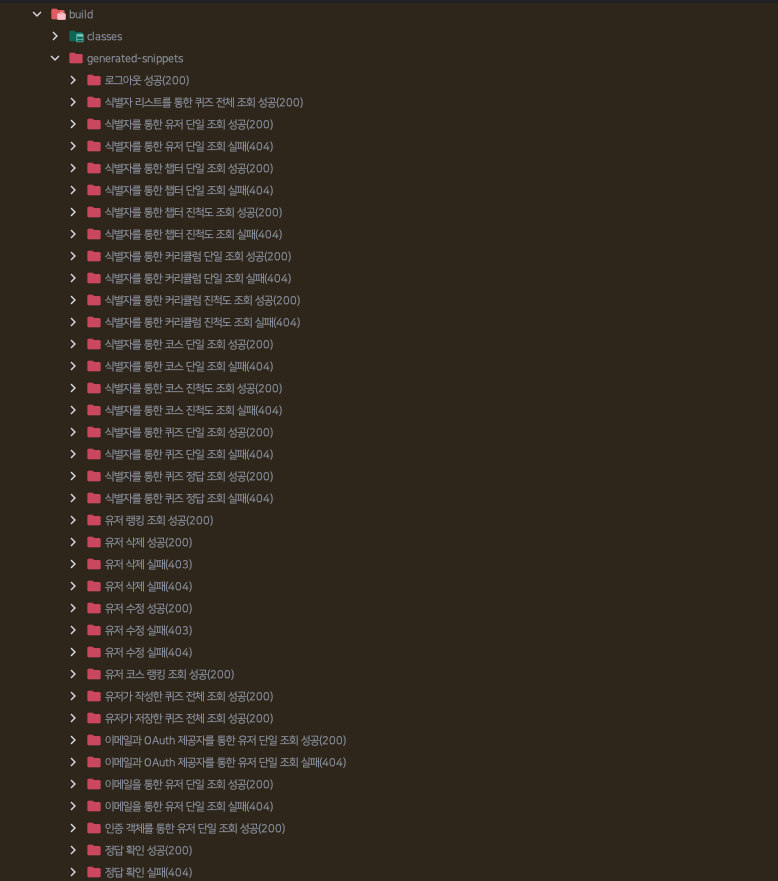
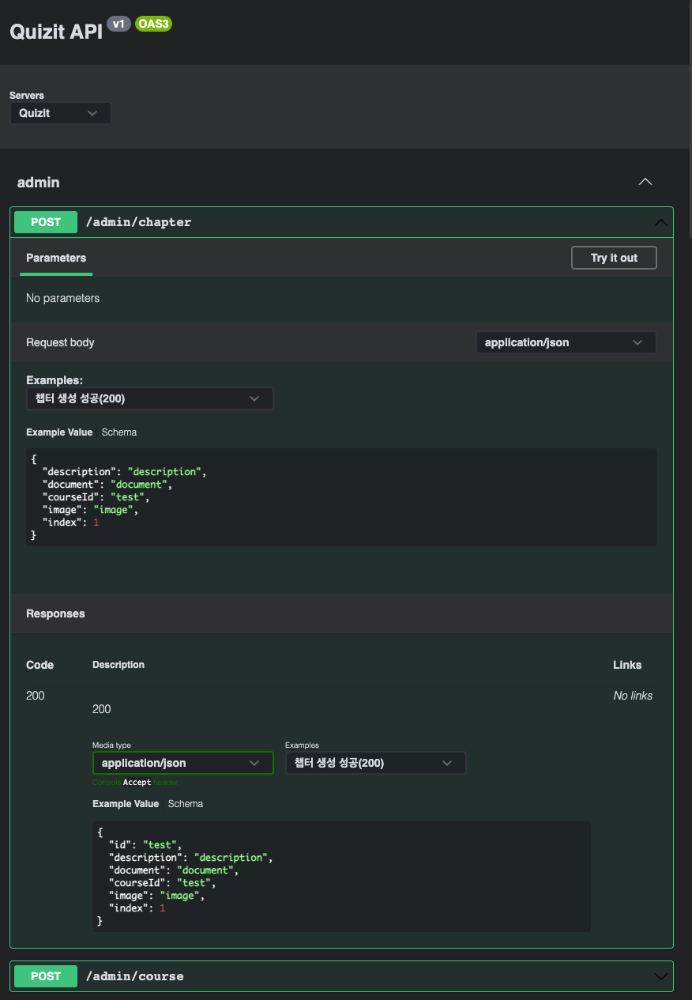
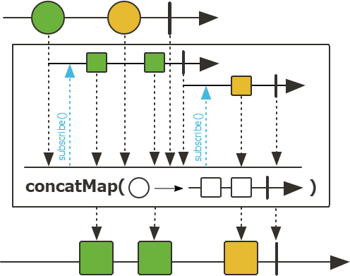
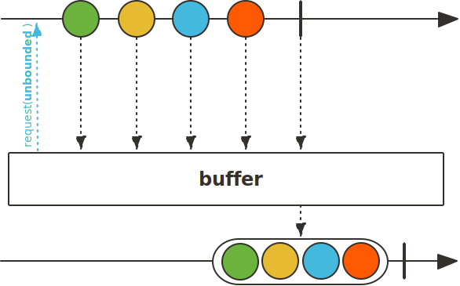

이번에 토이 프로젝트에서 백엔드를 개발하면서 외부 API를 사용하게 되었습니다.
외부 API를 사용하는 기능을 구현하는 중 외부 API의 성능 문제가 저희 백엔드로 전이되는 문제를 겪었습니다.
그 문제를 동기 처리를 통해 해결한 경험을 공유해 드리려고 합니다.

## 외부 API의 성능 문제

저희 백엔드에는 서버 데이터베이스에 있는 학생 데이터를 모두 가져와 각 학생마다 학교 API로부터 신청한 강의를 조회해 데이터베이스에 반영하는 배치 작업이 구성되어 있습니다.

```kotlin title="UpdateAppliedLecturesTasklet.kt" showLineNumbers
@StepScope
@Component
class UpdateAppliedLecturesTasklet(
    private val studentRepository: StudentRepository,
    private val lectureClient: LectureClient,
) : ItemTasklet<Flux<Student>> {
    private var isFinished = false

    override fun read(): Flux<Student>? =
        if (isFinished) {
            null
        } else {
            isFinished = true
            studentRepository.findAll()
        }

    override fun write(chunk: Chunk<out Flux<Student>>) {
        chunk.items
            .first()
            .flatMap { student ->
                lectureClient.getAppliedLecturesByStudentId(student.id)
                    .map { it.id }
                    .collectList()
                    .filter { it.isNotEmpty() }
                    .map { student.apply { lectureIds = it.toHashSet() } }
            }
            .flatMap { studentRepository.save(it) }
            .collectList()
            .block()
    }
}
```

배치 작업은 Spring Batch의 `ItemReader`와 `ItemWriter`의 믹스인(Mixin) 인터페이스인 `ItemTasklet`을 사용해서 구현했습니다.
`read()`에서 데이터베이스로부터 모든 학생 데이터를 가져와 `write()`에서 학생마다 학교 API를 호출해 신청한 강의를 가진 `lectureIds` 필드를 갱신하는 방식으로 수행됩니다.

<br/><br/>

문제는 `write()` 내의 외부 API를 호출하는 `flatMap()`에서 발생했습니다.

## Flux의 비동기 처리



`flatMap()`은 비동기적(Asynchronous)으로 작업을 수행합니다.

```kotlin showLineNumbers
Flux.just(1, 2, 3)
    .flatMap {
        Mono.just(1)
            .delayElement(Duration.ofSeconds(3))
    }
    .subscribe { println(it) }
```

위 코드에서 `flatMap()`은 각각 3초가 걸려 총 9초가 소요될 것 같지만 실제로는 비동기적으로 작동해 총 3초가 걸리게 됩니다.

```kotlin title="UpdateAppliedLecturesTasklet.kt" showLineNumbers {4}
chunk.items
    .first()
    .flatMap { student ->
        lectureClient.getAppliedLecturesByStudentId(student.id)
            .map { it.id }
            .collectList()
            .filter { it.isNotEmpty() }
            .map { student.apply { lectureIds = it.toHashSet() } }
    }
```

마찬가지로 `write()`에서 `flatMap()` 내의 `LectureClient`는 비동기적으로 호출됩니다.
모든 학생 데이터가 `chunk.items.first()`에 주어지는데, 문제는 `flatMap()`으로 주어지는 스트림의 데이터가 너무 많다는 것입니다.
학생 수는 약 8000명이므로 `LectureClient`가 거의 동시에 8000번 호출되는 것입니다.

<br/><br/>

어느 정도 구식인 학교 API는 이 요청들을 감당하지 못해 매번 Timeout을 발생시켰고, 이를 해결하기 위해서는 어쩔 수 없이 내 코드를 건드릴 수밖에 없었습니다.

## WebClient Timeout 설정

```console
org.springframework.web.reactive.function.client.WebClientRequestException: handshake timed out after 10000ms
```

우선 로그를 확인한 결과 TLS Handshake 과정에서 Timeout이 발생한 것을 알 수 있습니다.

```kotlin title="WebClientConfiguration.kt" showLineNumbers {6-9}
@Configuration
class WebClientConfiguration {
    @Bean
    fun webClient(): WebClient =
        HttpClient.create()
            .secure {
                it.sslContext(TcpSslContextSpec.forClient())
                    .handshakeTimeout(Duration.ofSeconds(60))
            }
            .let { httpClient ->
                WebClient.builder()
                    .clientConnector(ReactorClientHttpConnector(httpClient))
                    .codecs {
                        it.defaultCodecs()
                            .maxInMemorySize(-1)
                    }
                    .build()
            }
}
```

그래서 WebClient의 Handshake Timeout을 60초로 설정해보았습니다.

```console
org.springframework.web.reactive.function.client.WebClientRequestException: connection timed out after 30000 ms
```

이번에는 Connection Timeout이 발생한 것을 확인했습니다.

```kotlin title="WebClientConfiguration.kt" showLineNumbers {6}
@Configuration
class WebClientConfiguration {
    @Bean
    fun webClient(): WebClient =
        HttpClient.create()
            .option(ChannelOption.CONNECT_TIMEOUT_MILLIS, 60000)
            .secure {
                it.sslContext(TcpSslContextSpec.forClient())
                    .handshakeTimeout(Duration.ofSeconds(60))
            }
            .let { httpClient ->
                WebClient.builder()
                    .clientConnector(ReactorClientHttpConnector(httpClient))
                    .codecs {
                        it.defaultCodecs()
                            .maxInMemorySize(-1)
                    }
                    .build()
            }
}
```

그래서 이전의 Handshake Timeout의 경우처럼 WebClient의 Connection Timeout을 60초로 설정해주었습니다.

```console
java.io.IOException: Operation timed out
```

다시 Timeout이 발생하는 것을 볼 수 있었습니다.
저는 이렇게 계속 발생하는 문제를 무작정 Timeout을 늘려서 해결하는 것은 적절하지 않다고 생각했습니다.
또한 배치 작업이 실행되는 중에 Postman으로 학교 API에 요청을 보내본 결과, 1분을 넘기는 응답도 존재했었습니다.

<br/><br/>

이렇게 되면 학교 서버에 부하를 주지 않는 방식으로 요청을 보내는 것이 더 효율적일 것이라고 생각했습니다.

## Flux의 동기 처리

이번엔 요청을 보내는 방식을 바꿔보았습니다.
제일 간단한 방법은 기존의 비동기 방식의 처리를 동기적으로 바꾸는 것입니다.



동기 처리를 위해서 사용하는 리액티브 연산자로 `flatMapSequential()`이 있었습니다.

```kotlin title="UpdateAppliedLecturesTasklet.kt" showLineNumbers /flatMapSequential/
chunk.items
    .first()
    .flatMapSequential { student ->
        lectureClient.getAppliedLecturesByStudentId(student.id)
            .map { it.id }
            .collectList()
            .filter { it.isNotEmpty() }
            .map { student.apply { lectureIds = it.toHashSet() } }
    }
```

하지만 결과는 `flatMap()`을 사용했을 때와 같이 Timeout이 발생했습니다.
그 이유는 `flatMapSequential()`도 비동기적으로 작업을 수행하기 때문입니다.
`flatMapSequential()`은 `flatMap()`과 비슷하게 동작하며 유일한 차이점은 단순히 업 스트림(Upstream)의 순서를 보장해준다는 점이었던 것입니다.

<br/><br/>

저는 다른 방법을 찾는 중에 `concatMap()`을 찾았습니다.



`concatMap()`은 `flatMap()`과 달리 동기적으로 작동하며 `flatMapSequential()`과 같이 순서 또한 보장합니다.

```kotlin title="UpdateAppliedLecturesTasklet.kt" showLineNumbers /concatMap/
chunk.items
    .first()
    .concatMap { student ->
        lectureClient.getAppliedLecturesByStudentId(student.id)
            .map { it.id }
            .collectList()
            .filter { it.isNotEmpty() }
            .map { student.apply { lectureIds = it.toHashSet() } }
    }
```

이렇게 되면 이전 요청이 끝나고 나서야 다음 요청이 동기적으로 시작됩니다.

```console
2024-02-02 06:02:48.693 INFO [main] o.s.b.c.s.AbstractStep: Step: [updateAppliedLecturesStep] executed in 5m14s824ms
```

정상적으로 작업이 완료된 것을 볼 수 있습니다.

## 성능 최적화

하지만 `concatMap()`을 통해 데이터를 하나씩 처리하는 방식은 성능 면에서 좋지 않다고 생각했습니다.



이때, `buffer()`를 통해 데이터를 배치 단위로 묶어 처리하는 방법을 생각했습니다.
`buffer()`는 `Flux<T>`를 `Flux<List<T>>`로 반환합니다.
`buffer()`를 통해 인자로 주어지는 `size` 수만큼 데이터를 묶어 `concatMap()` 내에서는 비동기적으로 데이터를 처리하도록 구현했습니다.

```kotlin title="UpdateAppliedLecturesTasklet.kt" showLineNumbers {3}
chunk.items
    .first()
    .buffer(10)
    .map { it.toFlux() }
    .concatMap { flux ->
        flux.flatMap { student ->
            lectureClient.getAppliedLecturesByStudentId(student.id)
                .map { it.id }
                .collectList()
                .filter { it.isNotEmpty() }
                .map {
                    student.apply {
                        lectureIds = it.toHashSet()
                    }
                }
            }
        }
```

`buffer()`를 통해 데이터를 10개씩 가져와 처리합니다.
`concatMap()` 내에서 10개의 데이터는 비동기적으로 처리할 것이므로 미리 `map()`을 통해 `Flux<List<T>>`를 `Flux<Flux<T>>`로 변환했습니다.
이렇게 되면 동기적으로 처리되는 `concatMap()` 내부에서는 `flatMap()`을 통해 비동기적으로 작업이 처리됩니다.

```console
2024-02-02 06:06:52.914 INFO [main] o.s.b.c.s.AbstractStep: Step: [updateAppliedLecturesStep] executed in 56s178ms
```

`buffer()`를 사용하지 않는 코드보다 확실히 더 빨리 작업이 끝난 것을 볼 수 있었습니다.

<br/><br/>

전체 코드는 다음과 같습니다.

```kotlin title="UpdateAppliedLecturesTasklet.kt" showLineNumbers
class UpdateAppliedLecturesTasklet(
    private val studentRepository: StudentRepository,
    private val lectureClient: LectureClient,
) : ItemTasklet<Flux<Student>> {
    private var isFinished = false

    override fun read(): Flux<Student>? =
        if (isFinished) {
            null
        } else {
            isFinished = true
            studentRepository.findAll()
        }

    override fun write(chunk: Chunk<out Flux<Student>>) {
        chunk.items
            .first()
            .buffer(10)
            .map { it.toFlux() }
            .concatMap { flux ->
                flux.flatMap { student ->
                    lectureClient.getAppliedLecturesByStudentId(student.id)
                        .map { it.id }
                        .collectList()
                        .filter { it.isNotEmpty() }
                        .map {
                            student.apply {
                                lectureIds = it.toHashSet()
                            }
                        }
                }
            }
            .flatMap { studentRepository.save(it) }
            .collectList()
            .block()
    }
}
```

## 마치며

지금까지 리액티브 프로그래밍 환경에서 동기 처리를 통해 외부 API의 성능 문제를 극복한 경험을 공유해보았습니다.
동기 처리보다 비동기 처리의 짧은 지연 시간만을 생각해 모든 작업에 비동기를 적용해버리는 것은 옳지 않다는 것을 깨달은 계기였던 것 같습니다.
