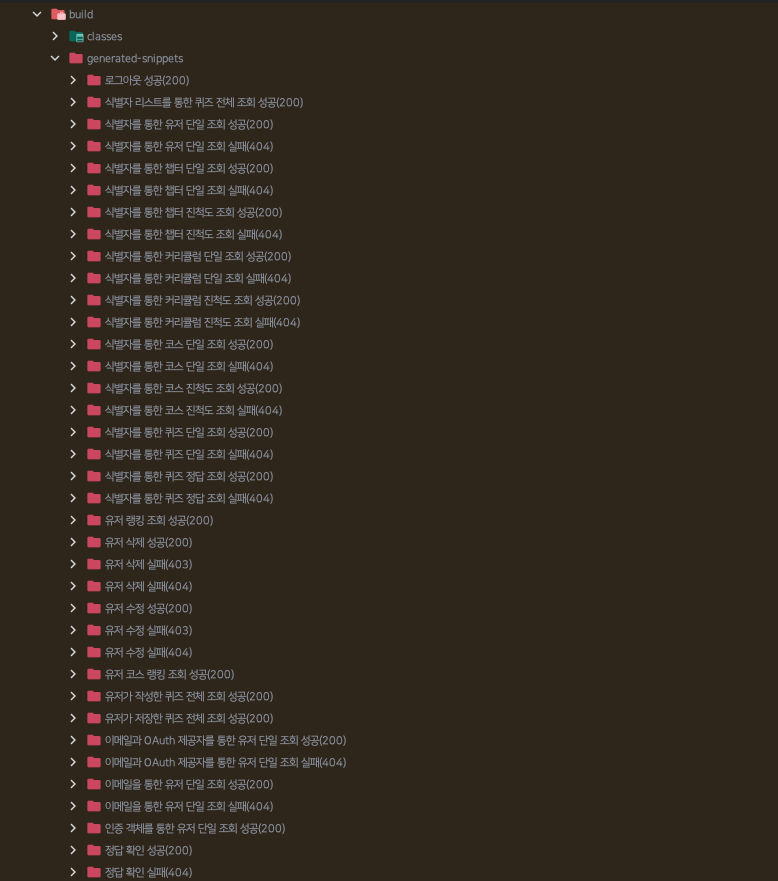

이번 글은 토이 프로젝트로 학교 편의 앱을 개발하면서 우리 학교의 API를 사용하다 겪은 문제에 대한 글이다.

<br/><br/>

문제를 겪은 상황은 다음과 같다.
나는 학생들에게 본인이 신청한 강의에 대한 정보를 제공하는 기능을 구현하려고 했다.
그래서 내 서버 데이터베이스에 있는 학생 데이터를 모두 가져와 각 학생마다 학교 API로부터 신청한 강의를 조회해 데이터베이스에 반영하는 배치 작업을 구현했다.

```kotlin title="UpdateAppliedLecturesTasklet.kt" showLineNumbers
@StepScope
@Component
class UpdateAppliedLecturesTasklet(
    private val studentRepository: StudentRepository,
    private val lectureClient: LectureClient,
) : ItemTasklet<Flux<Student>> {
    private var isFinished = false

    override fun read(): Flux<Student>? =
        if (isFinished) {
            null
        } else {
            isFinished = true
            studentRepository.findAll()
        }

    override fun write(chunk: Chunk<out Flux<Student>>) {
        chunk.items
            .first()
            .flatMap { student ->
                lectureClient.getAppliedLecturesByStudentId(student.id)
                    .map { it.id }
                    .collectList()
                    .filter { it.isNotEmpty() }
                    .map { student.apply { lectureIds = it.toHashSet() } }
            }
            .flatMap { studentRepository.save(it) }
            .collectList()
            .block()
    }
}
```

배치 작업은 Spring Batch의 `ItemReader`와 `ItemWriter`의 믹스인(Mixin) 인터페이스인 `ItemTasklet`을 사용해서 구현했다.
`read()`에서 데이터베이스로부터 모든 학생 데이터를 가져와 `write()`에서 학생마다 학교 API를 호출해 신청한 강의를 가진 `lectureIds` 필드를 갱신하는 방식으로 수행된다.

<br/><br/>

문제는 `write()` 내의 외부 API를 호출하는 `flatMap()`에서 발생했다.

## Flux의 비동기 처리



`flatMap()`은 비동기적(Asynchronous)으로 작업을 수행한다.

```kotlin showLineNumbers
Flux.just(1, 2, 3)
    .flatMap {
        Mono.just(1)
            .delayElement(Duration.ofSeconds(3))
    }
    .subscribe { println(it) }
```

위 코드에서 `flatMap()`은 각각 3초가 걸려 총 9초가 소요될 것 같지만 실제로는 비동기적으로 작동해 총 3초가 걸리게 된다.

```kotlin title="UpdateAppliedLecturesTasklet.kt" showLineNumbers {4}
chunk.items
    .first()
    .flatMap { student ->
        lectureClient.getAppliedLecturesByStudentId(student.id)
            .map { it.id }
            .collectList()
            .filter { it.isNotEmpty() }
            .map { student.apply { lectureIds = it.toHashSet() } }
    }
```

마찬가지로 `write()`에서 `flatMap()` 내의 `LectureClient`는 비동기적으로 호출된다.
이때 모든 학생 데이터가 `chunk.items.first()`에 주어지는데,
문제는 `flatMap()`으로 주어지는 스트림의 데이터가 너무 많다는 것이다.
학생 수는 약 8000명이므로 `LectureClient`가 거의 동시에 8000번 호출된다.

<br/><br/>

어느정도 구식인 학교 API는 이 요청들을 감당하지 못해 매번 Timeout을 발생시켰고, 이를 해결하기 위해서는 어쩔 수 없이 내 코드를 건드릴 수 밖에 없었다.

## WebClient Timeout 설정

```console
org.springframework.web.reactive.function.client.WebClientRequestException: handshake timed out after 10000ms
```

우선 로그를 확인한 결과 TLS Handshake 과정에서 Timeout이 발생한 것을 알 수 있다.

```kotlin title="WebClientConfiguration.kt" showLineNumbers {6-9}
@Configuration
class WebClientConfiguration {
    @Bean
    fun webClient(): WebClient =
        HttpClient.create()
            .secure {
                it.sslContext(TcpSslContextSpec.forClient())
                    .handshakeTimeout(Duration.ofSeconds(60))
            }
            .let { httpClient ->
                WebClient.builder()
                    .clientConnector(ReactorClientHttpConnector(httpClient))
                    .codecs {
                        it.defaultCodecs()
                            .maxInMemorySize(-1)
                    }
                    .build()
            }
}
```

그래서 WebClient의 Handshake Timeout을 60초로 설정해보았다.

```console
org.springframework.web.reactive.function.client.WebClientRequestException: connection timed out after 30000 ms
```

이번에는 Connection Timeout이 발생했다.

```kotlin title="WebClientConfiguration.kt" showLineNumbers {6}
@Configuration
class WebClientConfiguration {
    @Bean
    fun webClient(): WebClient =
        HttpClient.create()
            .option(ChannelOption.CONNECT_TIMEOUT_MILLIS, 60000)
            .secure {
                it.sslContext(TcpSslContextSpec.forClient())
                    .handshakeTimeout(Duration.ofSeconds(60))
            }
            .let { httpClient ->
                WebClient.builder()
                    .clientConnector(ReactorClientHttpConnector(httpClient))
                    .codecs {
                        it.defaultCodecs()
                            .maxInMemorySize(-1)
                    }
                    .build()
            }
}
```

그래서 이전의 Handshake Timeout의 경우처럼 WebClient의 Connection Timeout을 60초로 설정해주었다.

```console
java.io.IOException: Operation timed out
```

다시 Timeout이 발생하는 것을 볼 수 있었다.
나는 이렇게 계속 발생하는 문제를 무작정 Timeout을 늘려서 해결하는 것은 적절하지 않다고 생각했다.
또한 배치 작업이 실행되는 중에 Postman으로 학교 API에 요청을 보내본 결과, 1분을 넘기는 응답도 존재했었다.

<br/><br/>

이렇게 되면 학교 서버에 부하를 주지 않는 방식으로 요청을 보내는 것이 더 효율적일 것이라고 생각했다.

## Flux의 동기 처리

이번엔 요청을 보내는 방식을 바꿔보았다.
제일 간단한 방법은 기존의 비동기 방식의 처리를 동기적(Synchronous)으로 바꾸는 것이다.


내가 이미 알고 있었던 메서드 중에 `flatMapSequential()`이 있었다.

```kotlin title="UpdateAppliedLecturesTasklet.kt" showLineNumbers /flatMapSequential/
chunk.items
    .first()
    .flatMapSequential { student ->
        lectureClient.getAppliedLecturesByStudentId(student.id)
            .map { it.id }
            .collectList()
            .filter { it.isNotEmpty() }
            .map { student.apply { lectureIds = it.toHashSet() } }
    }
```

하지만 결과는 `flatMap()`을 사용했을 때와 같이 Timeout이 발생했다.
그 이유는 `flatMapSequential()`도 비동기적으로 작업을 수행하기 때문이다.
`flatMapSequential()`은 `flatMap()`과 비슷하게 동작하며 유일한 차이점은 단순히 업 스트림(Upstream)의 순서를 보장해준다는 점이다.

<br/><br/>

다른 방법을 찾는 중에 `concatMap()`을 찾았다.


`concatMap()`은 `flatMap()`과 달리 동기적으로 작동하며 `flatMapSequential()`과 같이 순서 또한 보장한다.

```kotlin title="UpdateAppliedLecturesTasklet.kt" showLineNumbers /concatMap/
chunk.items
    .first()
    .concatMap { student ->
        lectureClient.getAppliedLecturesByStudentId(student.id)
            .map { it.id }
            .collectList()
            .filter { it.isNotEmpty() }
            .map { student.apply { lectureIds = it.toHashSet() } }
    }
```

이렇게 되면 이전 요청이 끝나고 나서야 다음 요청이 시작된다.

```console
2024-02-02 06:02:48.693 INFO [main] o.s.b.c.s.AbstractStep: Step: [updateAppliedLecturesStep] executed in 5m14s824ms
```

정상적으로 작업이 완료된 것을 볼 수 있다.

## 성능 최적화

하지만 `concatMap()`을 통해 데이터를 하나씩 처리하는 방식은 성능면에서 좋지 않다고 생각했다.


이때, `buffer()`를 통해 데이터를 배치로 묶어 처리하는 방법을 생각했다.
`buffer()`는 `Flux<T>`를 `Flux<List<T>>`로 반환한다.
우린 `buffer()`를 통해 `size` 수만큼 데이터를 묶어 `concatMap()` 내에서 비동기적으로 동시성 처리를 할 것이다.

```kotlin title="UpdateAppliedLecturesTasklet.kt" showLineNumbers {3}
chunk.items
    .first()
    .buffer(10)
    .map { it.toFlux() }
    .concatMap { flux ->
        flux.flatMap { student ->
            lectureClient.getAppliedLecturesByStudentId(student.id)
                .map { it.id }
                .collectList()
                .filter { it.isNotEmpty() }
                .map {
                    student.apply {
                        lectureIds = it.toHashSet()
                    }
                }
            }
        }
```

`buffer()`를 통해 데이터를 10개씩 가져와 처리할 것이다.
`concatMap()` 내에서 10개의 데이터는 비동기적으로 처리할 것이므로 미리 `map()`을 통해 `Flux<List<T>>`를 `Flux<Flux<T>>`로 변환한다.
이렇게 되면 `concatMap()` 내부에서 `flatMap()`을 통해 비동기 처리가 가능하다.

```console
2024-02-02 06:06:52.914 INFO [main] o.s.b.c.s.AbstractStep: Step: [updateAppliedLecturesStep] executed in 56s178ms
```

`buffer()`를 사용하지 않는 코드보다 더 빨리 작업이 끝난 것을 볼 수 있다.

<br/><br/>

전체 코드는 다음과 같다.

```kotlin title="UpdateAppliedLecturesTasklet.kt" showLineNumbers
class UpdateAppliedLecturesTasklet(
    private val studentRepository: StudentRepository,
    private val lectureClient: LectureClient,
) : ItemTasklet<Flux<Student>> {
    private var isFinished = false

    override fun read(): Flux<Student>? =
        if (isFinished) {
            null
        } else {
            isFinished = true
            studentRepository.findAll()
        }

    override fun write(chunk: Chunk<out Flux<Student>>) {
        chunk.items
            .first()
            .buffer(10)
            .map { it.toFlux() }
            .concatMap { flux ->
                flux.flatMap { student ->
                    lectureClient.getAppliedLecturesByStudentId(student.id)
                        .map { it.id }
                        .collectList()
                        .filter { it.isNotEmpty() }
                        .map {
                            student.apply {
                                lectureIds = it.toHashSet()
                            }
                        }
                }
            }
            .flatMap { studentRepository.save(it) }
            .collectList()
            .block()
    }
}
```