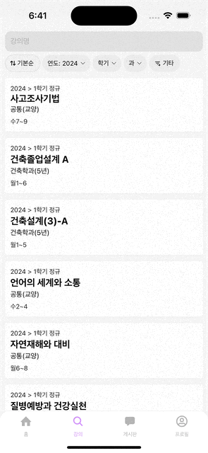

이번 글은 React Native에서 React Query를 통해 구현한 무한 스크롤에 대한 글입니다.

<br />

이번에 프론트엔드를 개발하면서 많은 양의 데이터를 다루는 상황이 생겼었습니다.
해당 데이터들을 한번에 다 불러와 렌더링하는 방법은 성능 측면에서 좋지 않은 방법이라 생각했고, 저는 무한 스크롤을 사용하기로 결정했습니다.

# 무한 스크롤



무한 스크롤이란 모든 데이터를 한번에 불러오지 않고 위와 같이 스크롤해서 특정 지점에 도달했을때 데이터를 추가로 불러오는 기능입니다.
일반적으로 보여줄 데이터의 끝을 예상할 수 없을 때 사용하는데요.
무한 스크롤을 구현하기 위해서는 데이터를 가져올 API에서 페이지네이션(Pagination)을 지원할 수 있어야 합니다.

## 무한 스크롤의 원리

무한 스크롤은 단순히 리스트의 끝에 도달 시 다음 페이지의 데이터를 가져와 렌더링하는 방식으로 구현합니다.
이런 간단한 원리와 달리, React에서 무한 스크롤은 구현 방식이 생각보다 복잡합니다.
하지만 React Native에서는 `FlatList`의 `onEndReached`와 `onEndReachedThreshold`를 통해 쉽게 구현할 수 있습니다.

# FlatList

`FlatList`는 React Native에서 많은 양의 데이터를 리스트로 보여줄때 사용하는 컴포넌트입니다.
비슷한 컴포넌트로 `ScrollView`가 있는데, `ScrollView`는 데이터의 양이 많지 않고 고정적인 경우에 사용합니다.

```ts title="VirtualizedList.d.ts" showLineNumbers {4-5}
interface VirtualizedListWithoutRenderItemProps<ItemT> extends ScrollViewProps {
  data?: any | undefined
  keyExtractor?: ((item: ItemT, index: number) => string) | undefined
  onEndReached?: ((info: { distanceFromEnd: number }) => void) | null | undefined
  onEndReachedThreshold?: number | null | undefined
}
```

`FlatList`의 `onEndReached`는 화면에 보여지는 리스트의 끝에 도달했을 때 실행되는 이벤트 리스너입니다.
그리고 `onEndReachedThreshold`는 어느 정도 끝에 도달해야 `onEndReached`를 호출할 지 정해주는 프로퍼티입니다.
예를 들어 `onEndReachedThreshold`가 0.5이라면 리스트의 끝으로부터 절반에 도달하면 `onEndReached`를 호출합니다.

<br />

이를 이용해서 다음과 같이 무한 스크롤을 구현할 수 있습니다.

```tsx title="LectureScreen.tsx" showLineNumbers
const LectureScreen = () => {
  const [lectures, setLectures] = useState<Lecture[]>([])
  const [index, setIndex] = useState(0)
  const [isFetching, setIsFetching] = useState(false)

  const onEndReachedHandler = () => {
    // 다음 페이지의 데이터를 가져와 상태들을 업데이트하는 작업
  }

  return (
    <FlatList
      data={lectures}
      renderItem={({ item }) => <Lecture lecture={item} />}
      keyExtractor={(item) => item.id}
      onEndReached={onEndReachedHandler}
      onEndReachedThreshold={0.4}
      ListFooterComponent={isFetching ? <ActivityIndicator /> : <></>}
    />
  )
}
```

`FlatList`가 보여주는 리스트의 끝으로부터 40%에 도달하면 `onEndReachedHandler`가 호출되도록 했습니다.
`onEndReachedHandler`는 페이지 번호인 `index`를 변경하고 다음 페이지의 데이터를 가져와 `lectures`를 변경합니다.
그렇게 되면 `FlatList`가 리렌더링되어 새로 변경된 `lectures`가 리스트에 반영됩니다.
이때, `ListFooterComponent`를 통해 데이터를 가져오는 중이라면 리스트의 하단에 로딩 스피너를 보여주도록 구현했습니다.

<br />

위 방식으로 무한 스크롤을 구현하게 되면 수동으로 페이지 인덱스나 `lectures`나 `index` 등의 상태 변수들을 관리해야 합니다.
이렇게 페칭(Fetching)이 반복적으로 발생하는 상황에서 유용하게 사용할 수 있는 것으로 React Query가 있습니다.

# React Query

React Query는 React에서 서버로부터 상태를 불러오고 캐싱(Caching)하며, 지속적으로 동기화하고 업데이트하는 작업을 도와주는 라이브러리입니다.
다른 API 호출 방식들과 달리 보일러 플레이트(Boiler Plate)를 추상화해 간결한 코드를 지원합니다.

## React Query 설정

React Query를 사용하기 위해서는 페칭과 관련된 캐시나 상태 변수들을 관리하는 `QueryClient`를 `QueryClientProvider`를 통해 애플리케이션에 주입해야 합니다.

```tsx title="App.tsx" showLineNumbers {2, 5, 9}
const App = () => {
  const [queryClient] = useState(() => new QueryClient())

  return (
    <QueryClientProvider client={queryClient}>
      <NavigationContainer>
        <RootNavigator />
      </NavigationContainer>
    </QueryClientProvider>
  )
}
```

`QueryClient`는 루트 컴포넌트에서 고유한 상태 변수로 관리하도록 했습니다.
`useState()` 내에서 콜백(Callback)으로 객체를 생성하면 지연 초기화(Lazy Initialize)로 인해 해당 상태를 최초로 렌더링할때만 객체가 생성됩니다.
게다가 `useState()`의 반환 값으로 주어지는 상태 변경 함수 `Dispatch<SetStateAction<T>>`는 구조 분해 할당을 통해 참조하지 않을 수 있습니다.
이를 통해 `queryClient`의 참조 동일성을 보장받을 수 있도록 했습니다.

## useInfiniteQuery

무한 스크롤을 구현하기 위해 React Query의 `useInfiniteQuery()`를 사용합니다.

```tsx title="LectureScreen.tsx" showLineNumbers
const { data: infiniteLectures, fetchNextPage, hasNextPage, isFetching } = useInfiniteQuery(
  ['searchLectures', request],
  ({ pageParam = 0 }) => searchLectures(request, pageParam, 10),
  {
    getNextPageParam: (lastPage, allPages) =>
      lastPage.length === 0 ? null : allPages.length
  }
)
```

`useInfiniteQuery()`는 가져온 데이터들과 다음 페이지의 데이터들을 가져오는 함수, 다음 페이지의 존재 여부, 로딩 여부 등을 반환합니다.
`useInfiniteQuery()`에 첫번째로 주어지는 인자인 `['searchLectures', request]`는 Query Key로, 이는 내부적으로 캐싱에 사용됩니다.
`string` 타입뿐만 아니라 `unknown[]` 타입도 받을 수 있습니다.
두 번째로 주어지는 인자인 `({ pageParam = 0 }) => getLectures(pageParam)`는 페이지 번호인 `pageParam`을 통해 데이터를 페칭하는 함수입니다.
페칭 된 데이터들은 `useInfiniteQuery()`의 반환 값 중 `data`에 포함됩니다.
마지막으로 주어지는 인자 내의 메서드인 `getNextPageParam()`은 다음 페이지 번호를 결정하는 함수입니다.
`lastPage`는 제일 최근에 가져온 페이지의 데이터들이며 `allPages`는 지금까지의 모든 페이지들입니다.

<br />

구체적인 작동 원리는 다음과 같습니다.
API에서 페이지네이션으로 제공하는 데이터의 페이지가 0부터 n까지라고 했을 때, `pageParam`이 0일때 데이터가 페칭되고 나서 `getNextPageParam()`가 호출되면 `allPages.length`를 반환합니다.
이때, 현재까지 가져온 페이지의 개수는 하나이므로 `getNextPageParam()`가 반환하는 `allPages.length`는 1이며 1이 다음 `pageParam`으로 결정됩니다.
이걸 반복하다 n + 1번째 페칭을 하고 나서 `getNextPageParam()`가 호출되면 `null`을 반환하고 `null`이 다음 `pageParam`이 됩니다.
최종적으로 마지막에 `pageParam`이 null이 되면 페칭이 종료되며 `hasNextPage`가 `false`가 됩니다.

# FlatList with React Query

이제 기존의 `FlatList`에 사용하던 상태 변수들을 `useInfiniteQuery()`로 대체하면 됩니다.

```tsx title="LectureScreen.tsx" showLineNumbers {11-13, 17}
const LecureScreen = () => {
  const { data: infiniteLectures, fetchNextPage, hasNextPage, isFetching } = useInfiniteQuery(
    ['searchLectures', request],
    ({ pageParam = 0 }) => searchLectures(request, pageParam, 10),
    {
      getNextPageParam: (lastPage, allPages) =>
        lastPage.length === 0 ? null : allPages.length
    }
  )

  const onEndReachedHandler = useCallback(() => {
    if (hasNextPage) fetchNextPage()
  }, [hasNextPage])

  return (
    <FlatList
      data={infiniteLectures?.pages.flat()}
      renderItem={({ item }) => <Lecture lecture={item} />}
      keyExtractor={(item) => item.id}
      onEndReached={onEndReachedHandler}
      onEndReachedThreshold={0.4}
      ListFooterComponent={isFetching ? <ActivityIndicator /> : <></>}
    />
  )
}
```

`infiniteLectures?.pages`는 2차원 배열이므로 `flat()`을 통해 중첩된 배열 구조를 평탄화해야 합니다.
그래서 `data?.pages.flat()`을 `FlatList`의 `data`로 전달했습니다.
이제 스크롤을 내릴 때마다 데이터를 계속해서 가져오는 것을 볼 수 있습니다.
