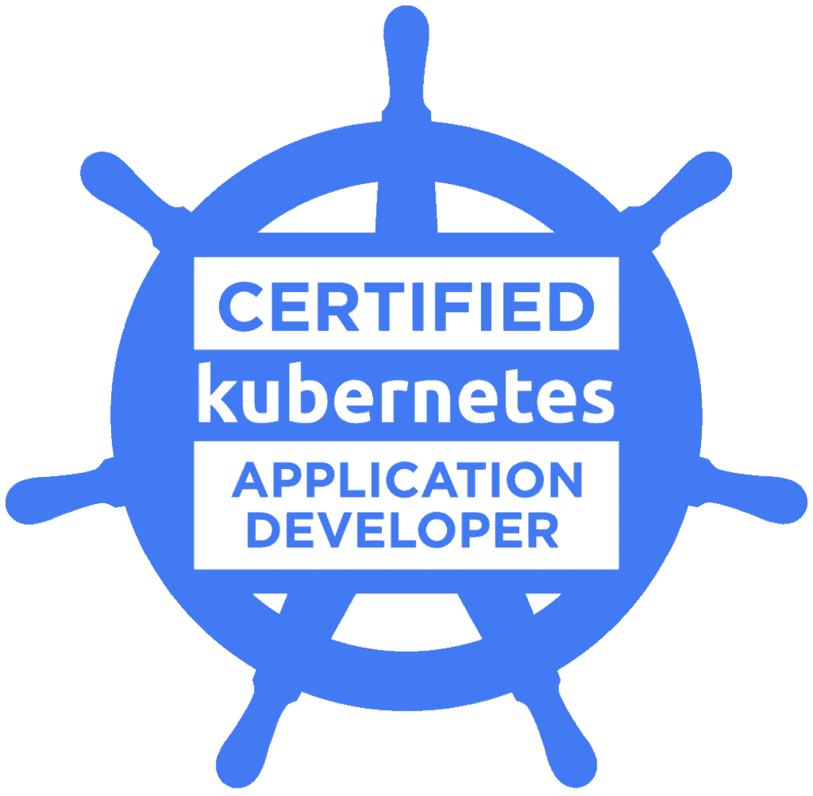
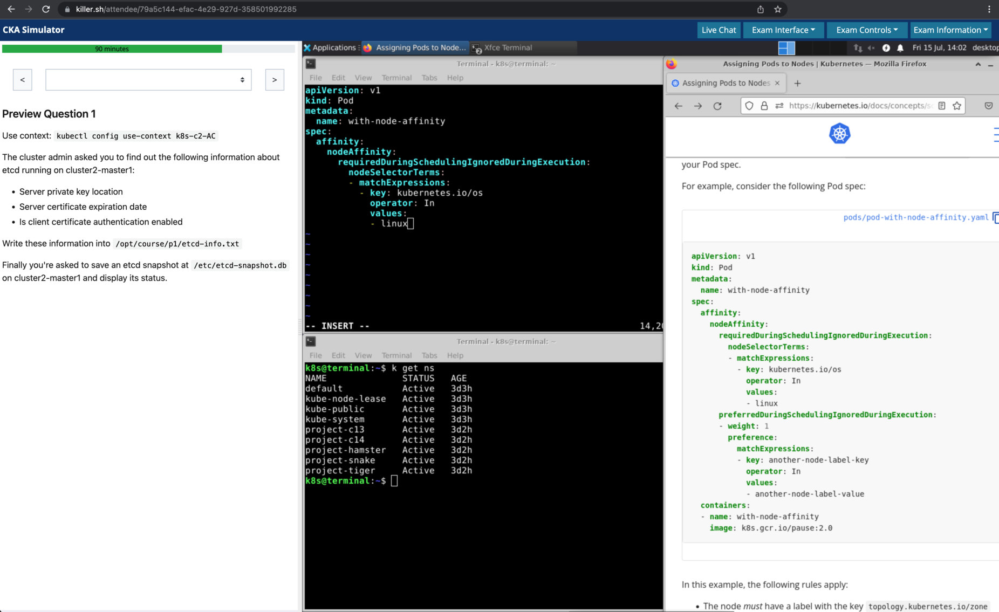
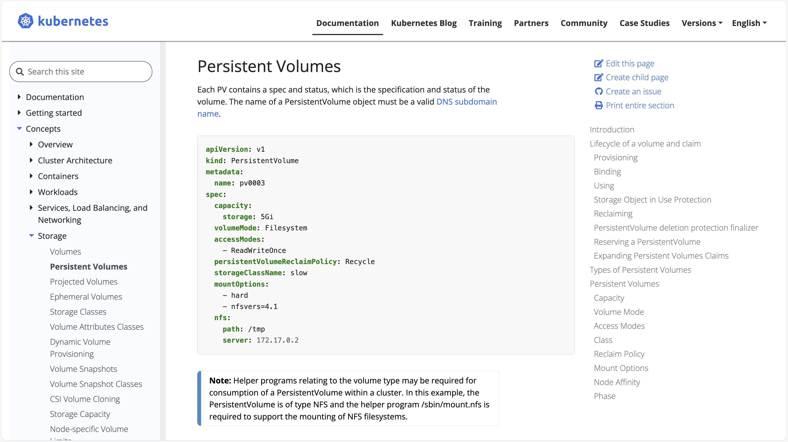
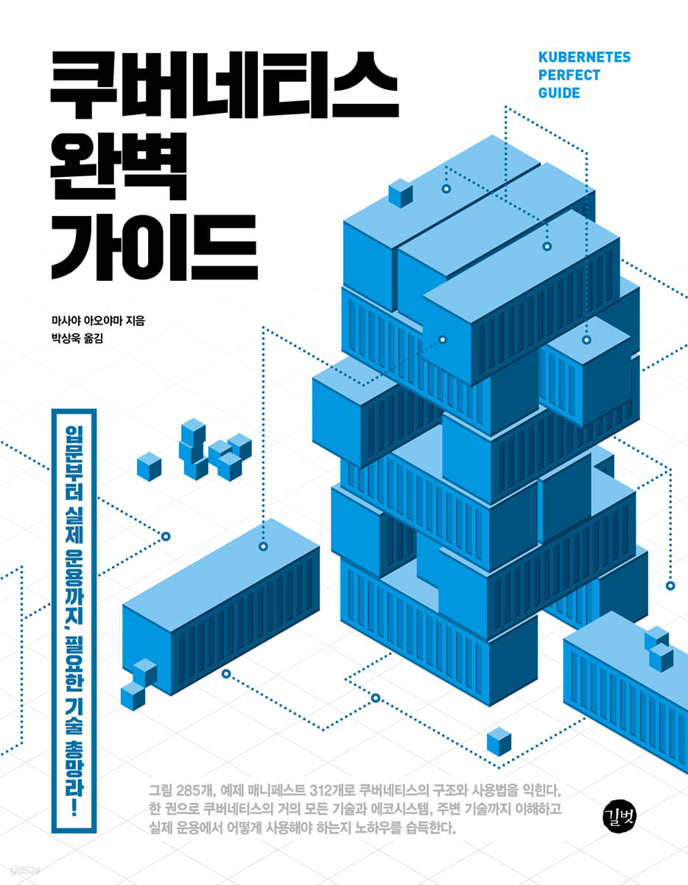
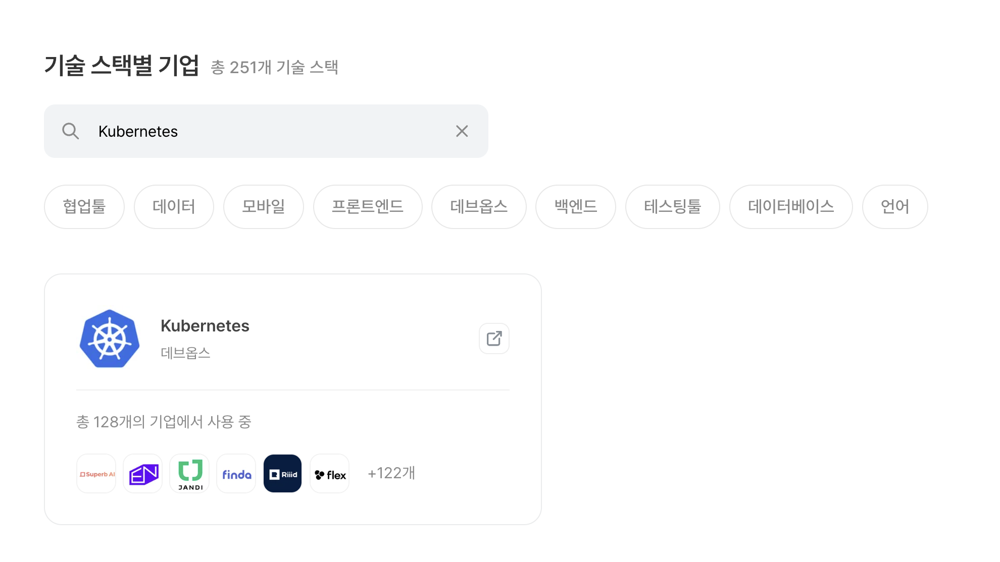
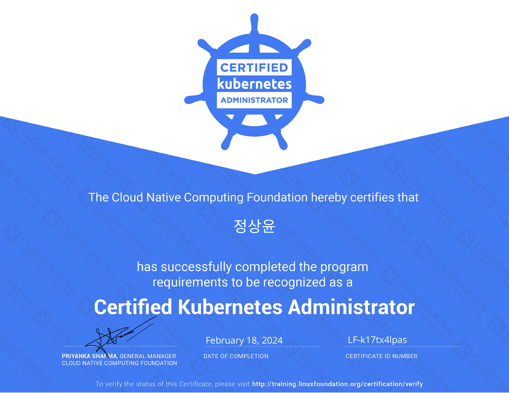

이전에 SW 마에스트로 프로젝트에서 Kubernetes를 사용했었습니다.
저는 SW 마에스트로가 끝나고 프로젝트에서 다뤄본 Kubernetes에 대한 역량을 좀 더 향상시키기 위해 Kubernetes 자격증인 CKA(Certified Kubernetes Administrator)를 도전했습니다.
그 결과, 자격증을 취득한 후기를 공유해 드리려고 합니다.

# CKA

공식 사이트에 따르면 CKA는 'Kubernetes 관리자의 책임을 수행할 수 있는 기술, 지식 및 역량을 보유하고 있음을 보증'하는 자격증이라고 합니다.
CKA 외에도 CKAD(Certified Kubernetes Application Developer), CKS(Certified Kubernetes Security Specialist)가 있습니다.
Kubernetes 자격증들은 모두 Google, Intel, VMWare 등의 기업들이 속해있는 Linux Foundation 산하의 CNCF(Cloud Native Computing Foundation)가 주관합니다.
사실 CNCF가 Kubernetes를 개발하고 관리한다는 것을 생각하면 당연한 사실이긴 합니다.

# 시험 방식

시험은 다른 자격증 시험과 달리 100% 실습 위주로 진행됩니다.
실제로 주어지는 가상 환경에서 커맨드를 통해 문제를 푸는데, 총 17문제이며 문제마다 점수 비중이 다르며 합격 커트라인은 100점 만점에 66점 이상입니다.

또한 Kubernetes 공식 문서를 보면서 시험을 진행할 수 있습니다.
`kubectl`의 명령형 접근법으로는 만들기 힘든 PersistentVolume, StorageClass 등의 오브젝트들을 공식 문서에서 복사한 YAML 형식의 매니페스트를 통해 쉽게 만들 수 있습니다.

  

특별한 점은 시험이 비대면으로 진행되며 모두 다 영어라는 점입니다.
그래서 감독관의 말이나 문제 지문을 해석할 수 있을 정도의 영어는 가능해야 합니다.

# 감독관 검사

시험은 전용 브라우저를 다운받아 진행하며, 본인 확인 등의 감독관의 검사를 진행한 후에 시험을 시작합니다.
저는 Verify Name을 영어로 한 상태에서 한글로 된 주민등록증을 제시해서 어려움을 겪었습니다.
반드시 Verify Name과 제시할 신분증(주민등록증, 운전면허증, 여권 등)의 이름이 일치해야 합니다.
신원 확인 후 맥북을 들고 방을 돌아다니며 방 검사까지 무려 30분의 검사를 끝나고 시험을 시작했었습니다.

# 시험 후기

시간 조절을 위해 어려워 보이는 문제가 있으면 바로 Flag 꽂고 다음 문제로 갔습니다.
어려운 세 문제 정도 빼고는 다 난이도가 쉬운 편이었습니다.

## 인상 깊었던 문제

첫 번째로 인상 깊었던 문제는 ClusterRole을 ClusterRoleBinding이 아닌 RoleBinding으로 Namespace에 종속적이도록 적용하라는 문제였습니다.
보통 ClusterRole과 ClusterRoleBinding만 생각해서 이런 문제는 생각을 아예 못했었습니다.
다행히 문제를 다 풀고 검토 과정에서 뒤늦게 문제를 다시 읽고 수정했었습니다.

  

두 번째는 거의 무조건 나온다고 생각했던 `etcdctl`을 통한 클러스터 백업 및 복구 문제였습니다.
백업까진 문제가 없었는데 클러스터를 복구하려고 `etcdctl snapshot restore`를 진행한 후에 자꾸 ETCD가 Pending 상태로 죽어버리는 문제를 겪었습니다.
그래서 복구는 포기했었습니다.

  

마지막으로는 `NotReady` 상태의 죽은 Node를 복원하는 문제였습니다.
해당 Node에서 Kubelet이 죽은 상태길래 설정 파일 문제로 생각해 설정 파일을 찾고 있었습니다.
근데 혹시나 해서 `service restart kubelet`을 통해 Kubelet을 다시 시작하니 Node도 정상적으로 작동하기 시작했었습니다.
배점이 높은 트러블 슈팅 문제 치고는 의외로 쉽게 풀었어서 기억에 남았던 것 같습니다.

# 공부 방법

SW 마에스트로 연수생 시절에 기본적으로 Kubernetes 개념을 책으로 공부했었습니다.
주로 이 책을 많이 읽었는데, 이 책은 약 800페이지에 Kubernetes의 개념부터 얕게나마 Istio, Helm, Kustomize까지 설명해줍니다.

본격적으로 CKA를 준비한 강의는 Udemy에 있는 이 강의입니다.
무엇보다 이 강의는 실습 문제와 실습 환경을 제공해주는 것이 진짜 좋습니다.
한글 자막이 공식적으로 제공해주는 자막이 아니어서 거의 영어 듣기를 해야하는 것이 유일한 단점입니다.

# 마치며

지금까지 CKA 자격증을 취득한 후기를 공유해보았습니다.
우선 자격증이 있으니까 뭔가 공부에 동기 부여가 되는 것이 좋았던 것 같습니다.
SW 마에스트로 연수 과정 중에 자격증을 땄었다면 실제로 AWS EKS(Elastic Kubernetes Service) 환경에서 여러 가지를 시도해보며 경험을 더 많이 쌓았을 것 같아서 이 부분은 좀 후회가 됩니다.
그래도 Kubernetes에 대해 실습 환경에서 자세히 공부할 수 있는 기회여서 좋았다고 생각합니다.
