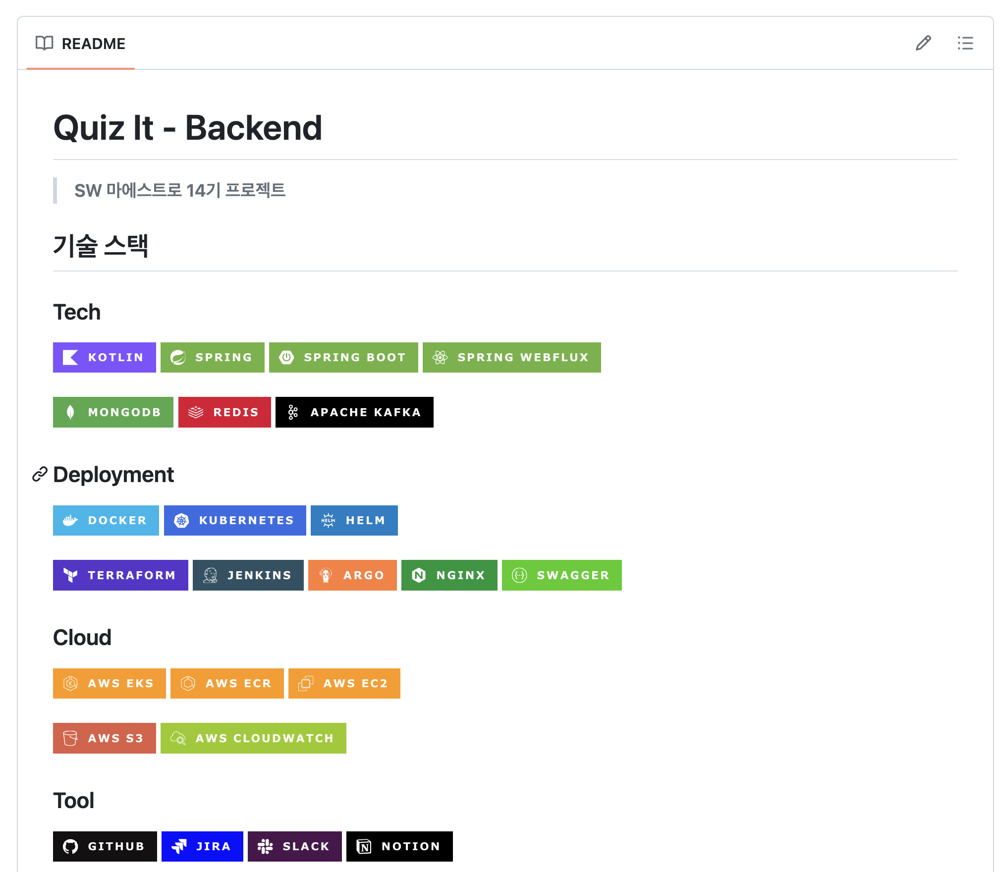
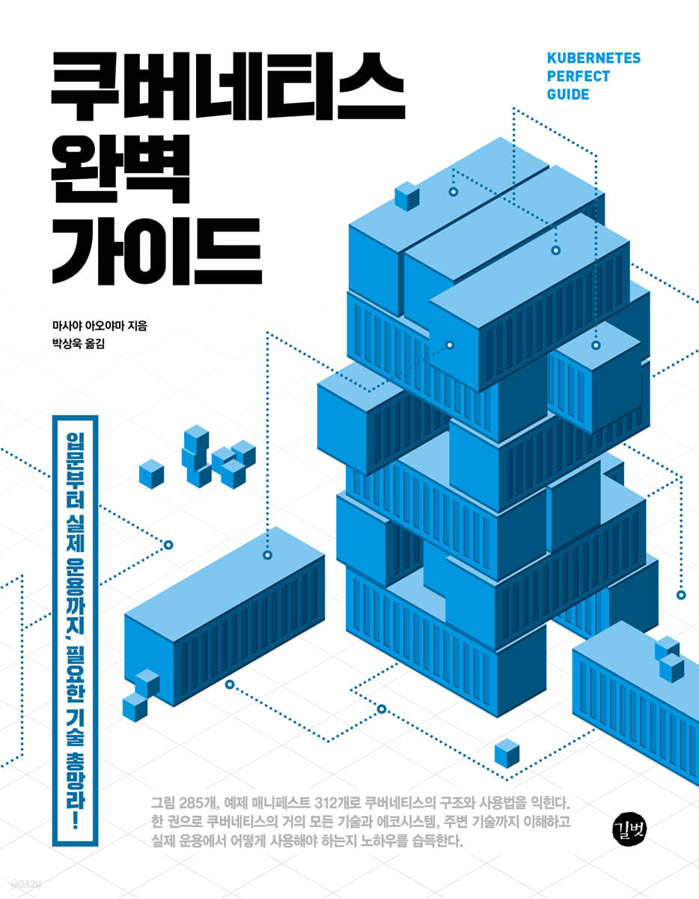
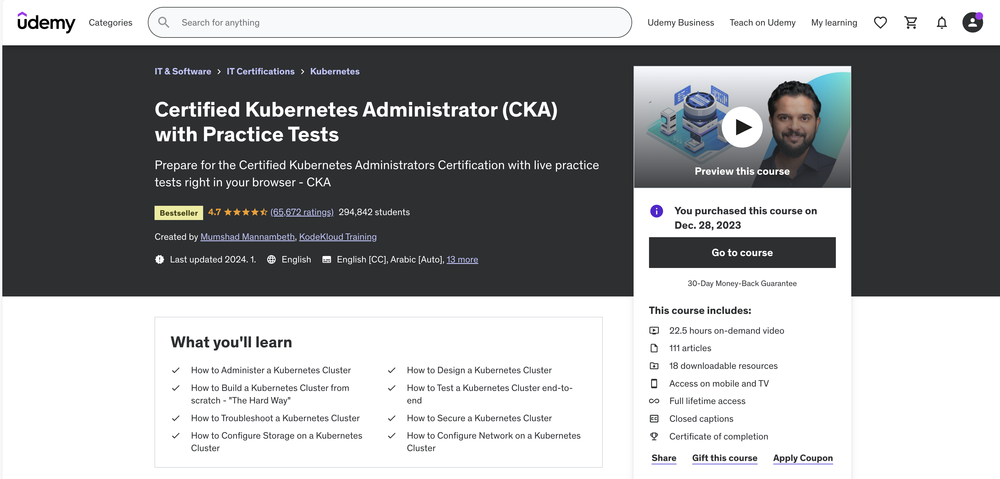
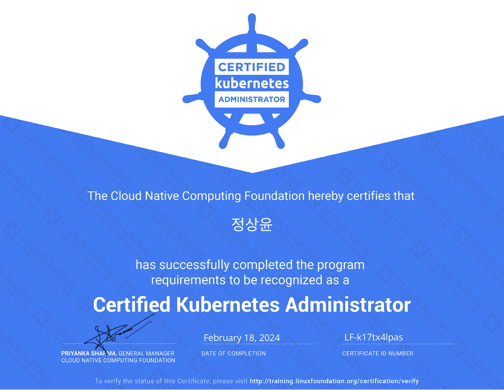

이번 글은 CKA(Certified Kubernetes Administrator) 자격증을 취득한 후기에 대한 글이다.

## CKA

공식 사이트에 따르면 CKA는 '쿠버네티스 관리자의 책임을 수행할 수 있는 기술, 지식 및 역량을 보유하고 있음을 보증'하는 자격증이라고 한다.
CKA 외에도 CKAD(Certified Kubernetes Application Developer), CKS(Certified Kubernetes Security Specialist)가 있다.
쿠버네티스 자격증들은 모두 Google, Intel, VMWare 등의 기업들이 속해있는 Linux Foundation 산하의 CNCF(Cloud Native Computing Foundation)가 주관한다.
사실 CNCF가 쿠버네티스를 개발하고 관리한다는 사실을 생각하면 당연한 것이긴 하다.

## 시험 방식

시험은 다른 자격증 시험과 달리 100% 실습 위주로 진행된다.
실제로 주어지는 가상 환경에서 커맨드를 통해 문제를 푼다.
총 17문제이며 문제마다 점수 비중이 다르며 합격 커트라인은 100점 만점에 66점 이상이다.

또한 쿠버네티스 공식 문서를 보면서 시험을 진행할 수 있다.
`kubectl`만으로 만들기 힘든 PersistentVolume, StorageClass 등의 리소스들을 공식 문서에서 복사한 YAML 형식의 매니페스트를 통해 쉽게 만들 수 있다.

  

특별한 점은 시험이 비대면으로 진행되며 모두 다 영어라는 점이다.
그래서 감독관의 말이나 문제 지문을 해석할 수 있을 정도의 영어는 가능해야한다.

## 감독관 검사

시험은 전용 브라우저를 다운받아 진행하며, 본인 확인 등의 감독관의 검사를 진행한 후에 시험을 시작한다.
나는 이 검사에서 좀 어려움이 많았었다.

  

바로 감독관이 신분증을 확인할때 민증에 있는 '정상윤'과 'Jeong Sangyun'이 다르다고 판단하는 것이었다.
체크카드까지 동원해서 노력해봤지만 감독관은 Verify Name인 'Jeong Sangyun'과 신분증의 이름이 완전히 일치해야 한다고 시험을 시작해주지 않았다.
다행히 감독관의 배려로 Verify Name을 '정상윤'으로 바꾸고 시험을 보게 되었다.
감독관이 "Where is the expiration date on that ID?"라고 묻는 것을 보아 대한민국 신분증을 잘 모르는 것 같아서 친절하게 "Korea government ID card is no expiration."이라고 대답했던 것이 기억난다.
그렇게 맥북을 들고 방을 돌아다니며 방 검사까지 하며 무려 30분의 검사를 끝나고 시험을 시작했다.

## 시험 후기

시간 조절을 위해 어려워 보이는 문제가 있으면 바로 Flag 꽂고 다음 문제로 갔다.
생각보다 문제들 간의 난이도 차이가 심했던 것 같다.

  

제일 짜증났던 것은 공부할때는 생각을 못했던 권한 문제였다.
`sudo -i`를 자꾸 까먹어서 오류가 난 적이 너무 많았었다.
다행히 `grep`, `systemctl` 등의 커맨드들이나 `kubectl`에 관한 커맨드들은 잘 기억하고 있었다.

## 인상깊었던 문제

첫번째로 인상깊었던 문제는 ClusterRole을 ClusterRoleBinding이 아닌 RoleBinding으로 네임스페이스에 종속적이도록 적용하라는 문제였다.
보통 ClusterRole 문제가 나오면 ClusterRoleBinding이 나올거라 생각해서 이런 문제는 생각을 아예 못했다.
다행히 맞추긴 했을 것 같다.
두번째는 `etcdctl`을 통한 클러스터 백업 및 복구 문제였다.
백업까진 문제가 없었는데 복원하려고 `etcdctl snapshot restore`를 진행한 후에 자꾸 ETCD 파드가 Pending 상태로 죽어버렸었다.
그래서 틀렸을 것으로 생각한다.
마지막으로는 `NotReady` 상태의 죽은 Node를 복원하는 문제가 인상깊었다.
해당 노드에서 Kubelet이 죽은 상태였길래 서비스 설정 파일 문제인가 생각해서 설정 파일 찾을 생각에 한숨이 나왔었다.
근데 혹시 몰라서 `service restart kubelet`을 통해 Kubelet을 다시 시작해주니 Node도 정상적으로 돌아왔었다.
트러블 슈팅 문제 치고는 의외로 쉽게 풀었어서 기억에 남았었다.

## 취득한 이유

한때 SW 마에스트로(이하 소마)에서 프로젝트를 진행할때 쿠버네티스를 썼었다.
소마가 끝나고 포트폴리오를 만들다가 내가 쿠버네티스를 어느정도 알고 있다는 것을 면접 외에는 증명할 방법이 없었다.
또한 소마에서 공부한 쿠버네티스 경험과 지식을 이대로 내다버리기엔 아까웠다.

마침 요즘은 어떤 기업이든 쿠버네티스를 사용하고 무엇보다 나는 최종 목표가 서버 개발자에서 데브옵스 엔지니어가 되는 것이었다.
사실 내 최종 목표가 데브옵스 엔지니어라는 점과 상관없이 요즘은 서버 개발자를 지망하는 취업 준비생들 누구나 Spring 등의 기술들은 다 잘한다고 생각한다.
그래서 뭔가 취업할때 나만의 차별점을 만들어내고 싶었고 그 차별점을 인프라 쪽에서 만들어내고 싶은 생각이 있었다.
이런 상황에서 CKA, CKAD 등의 자격증들이 나에게 의미가 있다고 생각해서 자격증을 취득하기로 했었다.

## 공부 방법

소마때 기본적으로 쿠버네티스 개념을 책으로 공부했었다.
주로 이 책을 많이 읽었는데, 이 책은 약 800페이지에 쿠버네티스의 개념부터 얕게나마 Istio, Helm, Kustomize까지 설명해주는 쿠버네티스의 정석 느낌이다.

본격적으로 CKA를 준비한 강의는 Udemy에 있는 이 강의이다.
이 강의는 쿠버네티스 개념과 여러 실습 문제들과 실습 환경을 제공해준다.
무엇보다 이 강의는 실습 문제와 실습 환경을 제공하는 것이 진짜 좋다.
한글 자막이 공식적으로 제공해주는 자막이 아니어서 거의 영어 듣기를 해야하는 것이 유일한 단점이다.

## 취득 후기

우선 자격증이 있으니까 뭔가 공부에 동기 부여가 되는 것이 좋았던 것 같다.
소마때 자격증을 땄었다면 실제로 EKS 환경에서 여러 가지를 시도해보며 경험을 더 많이 쌓았을 것 같아서 이 부분은 좀 후회가 된다.
그래도 쿠버네티스에 대해 실습 환경에서 자세히 공부할 수 있는 기회여서 좋았다.
앞으로는 다시 천천히 백엔드 개발이나 좀 하다가 아직 따지 못한 정보처리기사와 CKAD도 취득할 생각이다.