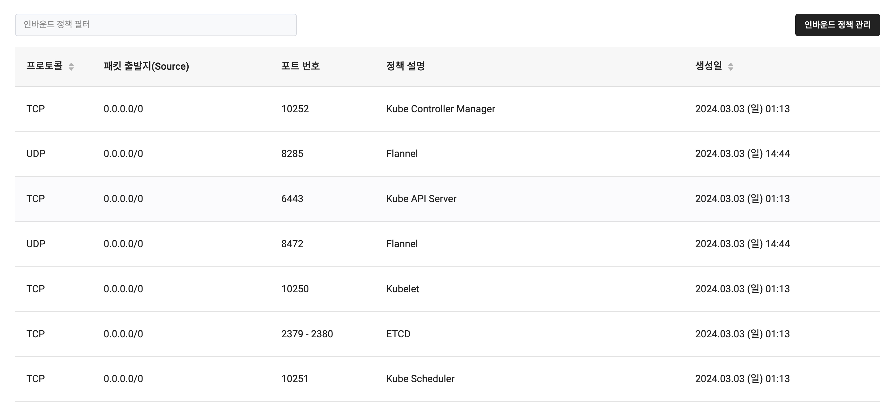

이번 글은 Kubernetes 환경에서 Jenkins를 구축하면서 겪은 네트워크 오류에 대한 글이다.

## 문제 상황

Jenkins를 구축하는 과정에서 발생한 문제이다.
Jenkins의 Init 컨테이너 내에서 Jenkins의 업데이트 센터인 `updates.jenkins.io`에 대해 `UnknownHostException`이 발생했다.
근데 신기하게도 Jenkins가 오류로 인해 재시작을 반복하는 중에 갑자기 `Pod`가 성공적으로 기동되었다.
그러나 여전히 `updates.jenkins.io`의 주소를 못찾아 플러그인을 설치하지 못했었다.

<br/><br/>

나는 이 문제를 DNS 서버의 문제로 생각했었다.

## CoreDNS

클러스터를 Kubeadm으로 구축했기 때문에 내 클러스터에서는 DNS 서버로 CoreDNS를 사용하고 있었다.

```console
> kubectl get pods --selector k8s-app=kube-dns -n kube-system
NAME                                   READY   STATUS    RESTARTS   AGE     IP             NODE
coredns-59c68c8fc8-hmrqr               1/1     Running   0          8d      10.244.1.62    node01
coredns-59c68c8fc8-s2747               1/1     Running   0          8d      10.244.0.6     controlplane
```

위와 같이 CoreDNS는 마스터 노드와 워커 노드 각각에 배치되어 있었다.

```console
> kubectl get service -n kube-system
NAME       TYPE        CLUSTER-IP   EXTERNAL-IP   PORT(S)                  AGE
kube-dns   ClusterIP   10.96.0.10   <none>        53/UDP,53/TCP,9153/TCP   8d
```

CoreDNS의 `Service`인 `kube-dns` 또한 존재하고 있었다.
실제로 CoreDNS가 잘 작동하는지 확인하기 위해서 `Pod` 내에서 `nslookup`을 사용해보기로 했다.

```yaml title="dnsutils.yaml"
apiVersion: v1
kind: Pod
metadata:
  name: dnsutils
  namespace: default
spec:
  containers:
  - name: dnsutils
    image: registry.k8s.io/e2e-test-images/jessie-dnsutils:1.3
    command:
      - sleep
      - "infinity"
    imagePullPolicy: IfNotPresent
  restartPolicy: Always
```

`nslookup`은 Kubernetes 공식 문서에서 DNS 디버깅 방법으로 소개한 `dnsutils`를 사용했다.

```console
> kubectl exec -it dnsutils -- nslookup google.com
Server:		10.244.1.62
Address:	10.244.1.62#53

Name:	google.com
Address: 172.217.161.238
```
```console
> kubectl exec -it dnsutils -- nslookup google.com
;; connection timed out; no servers could be reached

command terminated with exit code 1
```

신기하게도 `nslookup`이 절반은 성공하고 나머지 절반은 실패했었다.
이번엔 CoreDNS의 각 `Pod`에 대해서 DNS 질의를 시도해보기로 했다.

```console
> kubectl exec -it dnsutils -- nslookup google.com 10.244.1.62
Server:		10.244.1.62
Address:	10.244.1.62#53

Name:	google.com
Address: 172.217.161.238
```
```console
> kubectl exec -it dnsutils -- nslookup google.com 10.244.1.6
;; connection timed out; no servers could be reached

command terminated with exit code 1
```

`node01`에 있는 `Pod`에 질의한 경우는 성공했지만 `controlplane`에 있는 `Pod`에 질의한 경우는 실패한 것을 볼 수 있다.

```console
> kubectl get pods -o wide
NAME       READY   STATUS    RESTARTS   AGE   IP           NODE           NOMINATED NODE   READINESS GATES
dnsutils   1/1     Running   0          23s   10.244.0.7   controlplane   <none>           <none>
```
정확하게 확인해보기 위해 `dnsutil`이 `controlplane`에 배치된 경우도 시도해보았다.

```console
> kubectl exec -it dnsutils -- nslookup google.com 10.244.1.62
;; connection timed out; no servers could be reached

command terminated with exit code 1
```
```console
> kubectl exec -it dnsutils -- nslookup google.com 10.244.0.6
Server:		10.244.0.6
Address:	10.244.0.6#53

Non-authoritative answer:
Name:	google.com
Address: 172.217.25.174
```

이번엔 반대로 `node01`에 있는 `Pod`에 질의한 경우가 실패하고 `controlplane`에 있는 `Pod`에 질의한 경우가 성공한 것을 보았다.
이로써 CoreDNS 문제가 아닌 네트워크 문제인 것을 확인했었다.

## 노드 간 네트워크

노드 사이의 네트워크 문제라 하기에는 이미 워커 노드의 `kubelet`이 마스터 노드의 `kube-apiserver`와 잘 통신하고 있었다.

```console
> kubectl get pods -n kube-flannel
NAME                    READY   STATUS    RESTARTS   AGE
kube-flannel-ds-4zd94   1/1     Running   0          8d
kube-flannel-ds-b6l6f   1/1     Running   0          8d
```

또한 CNI(Container Network Interface) Plugin인 Flannel 또한 잘 기동된 것을 확인했다.

## 파드 간 네트워크

그렇다면 VM 간 네트워크가 아닌 `Pod` 사이의 네트워크가 문제라고 생각할 수 있다.
그래서 CNI에 대해 찾아보다가 내 Flannel 설정에 문제가 있었다는 것을 확인했다.

## Flannel

Flannel은 VXLAN를 사용하여 패킷을 캡슐화해 서로 다른 `Node`에 있는 `Pod` 간 통신이 되도록 해주는 CNI Plugin이다.
이때까지 몰랐던 점은 Flannel이 사용하는 특별한 포트 번호가 있다는 것이었다.
Flannel은 `UDP` 프로토콜에서 8285, 8472 포트를 사용한다.
결국 인바운드 규칙에서 Flannel이 사용하는 포트들이 거부되는 것이 문제의 원인이었다.



Flannel이 사용하는 포트들을 인바운드 규칙에 추가헀다.

```console
> kubectl exec -it dnsutils -- nslookup google.com 10.244.1.62
Server:		10.244.1.62
Address:	10.244.1.62#53

Non-authoritative answer:
Name:	google.com
Address: 172.217.25.174
```
```console
> kubectl exec -it dnsutils -- nslookup google.com 10.244.0.6
Server:		10.244.0.6
Address:	10.244.0.6#53

Non-authoritative answer:
Name:	google.com
Address: 172.217.25.174
```

정상적으로 다른 `Node`의 CoreDNS와 통신이 되는 것을 볼 수 있다.
