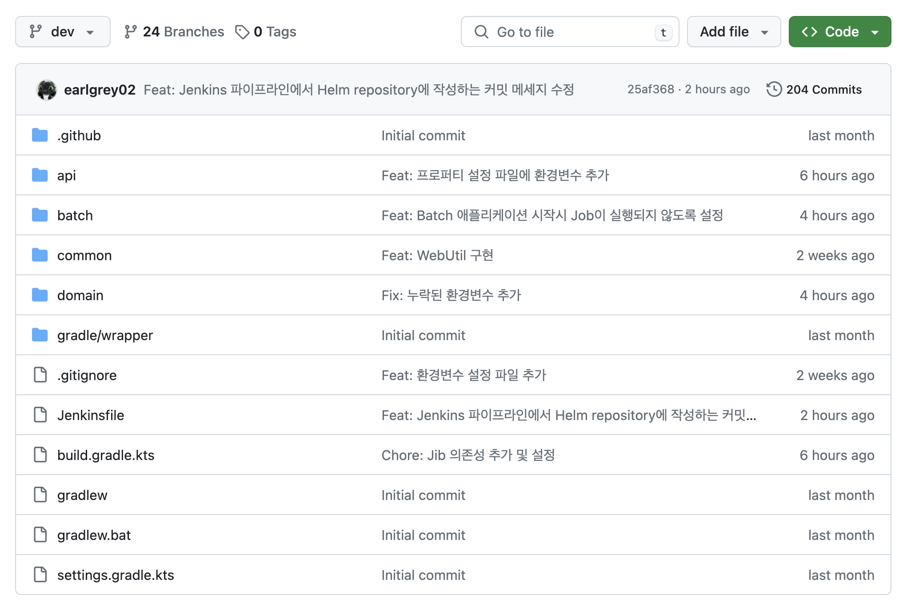
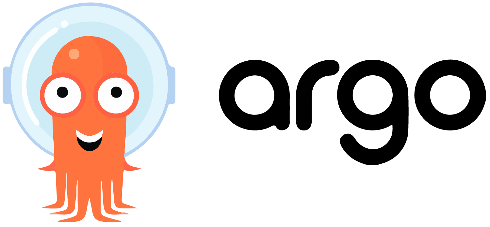
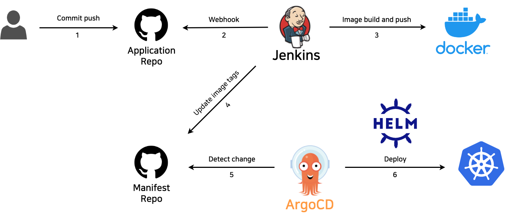

이번 글은 Kubernetes 환경에서 GitOps 기반 CI(Continuous Integration) / CD(Continuous Delivery/Deployment) 파이프라인을 구축한 과정을 담은 글이다.

## GitOps

GitOps란 DevOps의 일종으로 배포와 운영에 관련된 모든 요소들을 Git을 통해 코드 형태로 관리하는 것을 말한다.
Kubernetes에서 GitOps는 클러스터에 Manifest들을 Git에서 관리하고 Git으로 Manifest들을 가져와 배포하는 일련의 과정이다.

<br/><br/>

GitOps는 코드로 인프라를 관리할 수 있는 IaC(Infrastructure as Code), Git을 통한 버전 관리 등의 장점을 가지고 있다.

## 환경

```console
> kubectl get nodes
NAME           STATUS   ROLES           AGE    VERSION
controlplane   Ready    control-plane   8d     v1.28.2
node01         Ready    <none>          5d7h   v1.28.2
```

현재 클러스터는 마스터 노드 하나와 워커 노드 하나로 구성되어 있다.
또한 Managed Kubernetes가 아닌 자체 구축한 클러스터이므로 Load Balancer나 Block Storage 등의 서비스는 이용할 수 없는 상황에서 GitOps를 구축할 것이다.

<br/><br/>

CI / CD 도구로는 Jenkins와 ArgoCD를 사용한다.



참고로 배포할 애플리케이션은 멀티 모듈 아키텍처로 구성되어 있다.

## Jenkins


Jenkins는 Java로 구현한 오픈 소스 CI / CD 도구이다.
GitOps에서는 Jenkins를 CI 파이프라인을 구성하는데까지만 사용할 것이다.

<br/><br/>

Jenkins는 애플리케이션을 테스트하고 이미지로 빌드해 컨테이너 레지스트리에 배포하는 역할을 수행할 것이다.
여기까지는 일반적인 Jenkins의 CI 파이프라인이라고 할 수 있다.
하지만 GitOps에서는 추가로 Jenkins가 Kubernetes의 Manifest들을 저장한 GitHub Repository의 이미지 태그들을 수정한다.
이렇게 하는 이유는 GitOps에서 인프라는 Git에서 코드 형태로 관리되기 때문이다.
여기까지가 GitOps에서 Jenkins의 역할이다.

## ArgoCD



ArgoCD는 GitOps 기반 오픈 소스 CD 도구이다.
ArgoCD는 Git으로 관리되는 Manifest들을 클러스터에 배포하는 역할을 수행할 것이다.

## Helm


추가로 Helm이라는 Kubernetes 전용 패키지 관리 도구를 사용할 것이다.
Helm에서는 하나의 패키지를 차트(Chart)라고 부른다.

<br/><br/>

차트와 차트에 주입할 값들(`values.yaml`)만 있으면 언제든지 여러 리소스들을 한번에 배포할 수 있다.
즉, Helm을 통해 Manifest 관리를 더욱 유연하게 할 수 있다.
GitOps에서 Helm은 주로 Git에서 관리되는 코드들을 패키징하는 역할을 한다.
난 패키징 외에도 Jenkins나 ArgoCD를 클러스터 내에 손쉽게 구축하기 위해 Helm을 사용하기로 했다.

<br/><br/>

최종 아키텍처는 다음과 같다.


