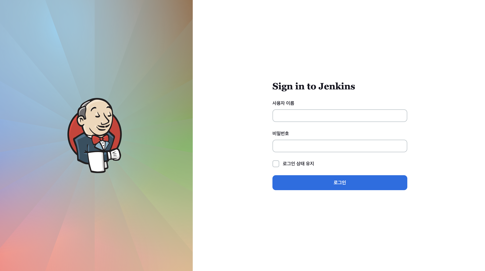
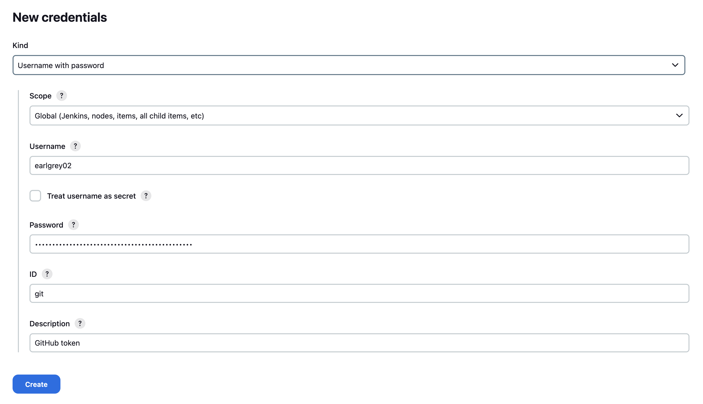
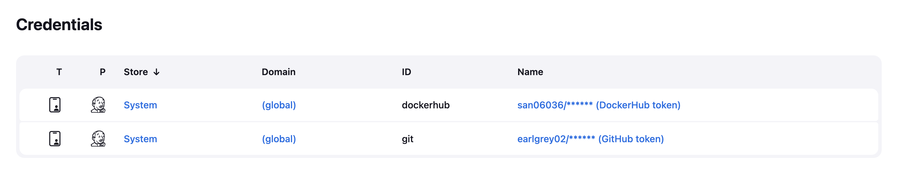
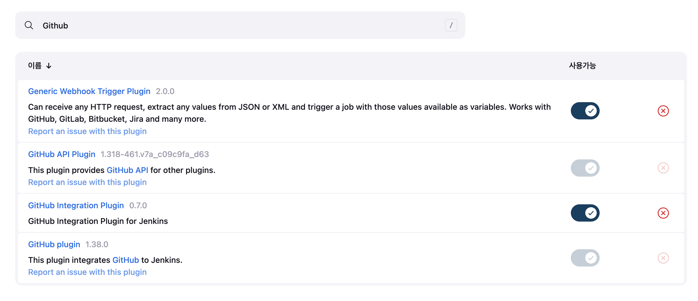
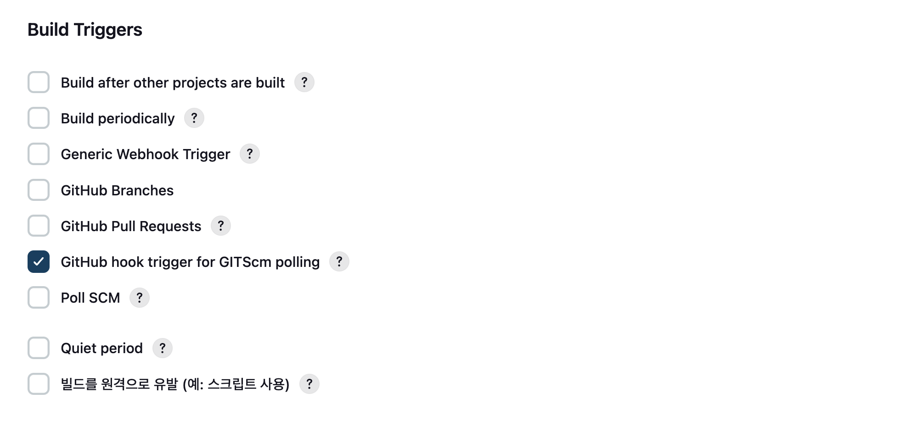
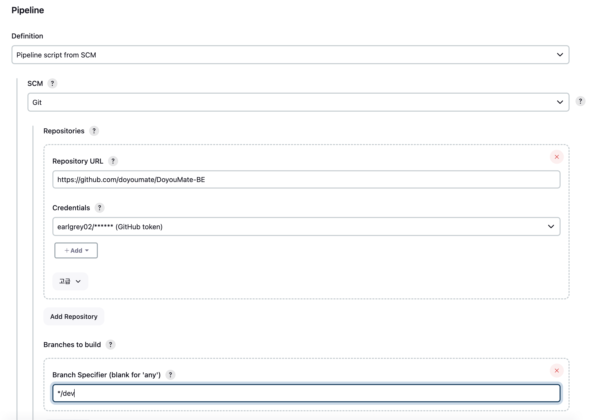
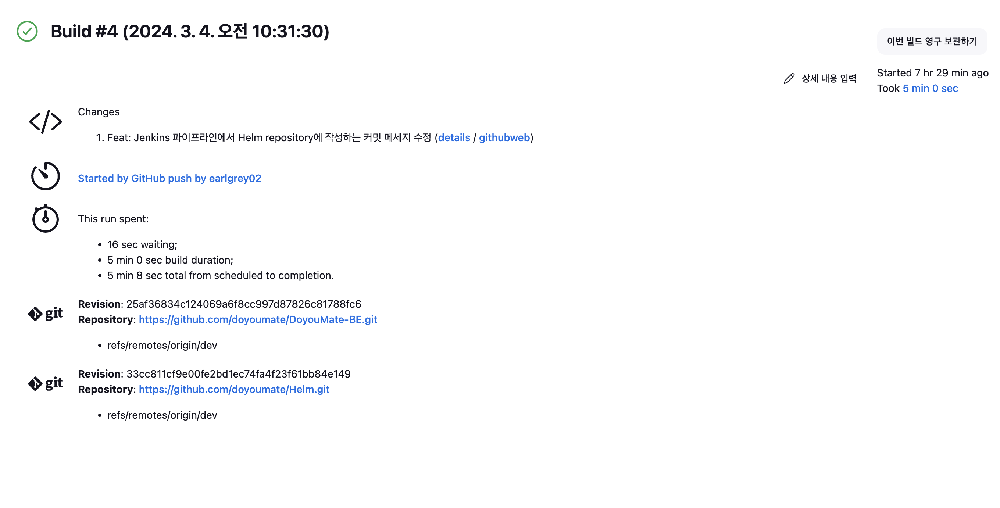
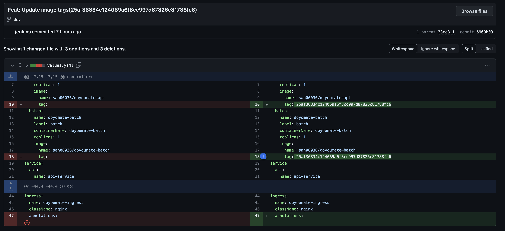

이번 글은 <a href="http://localhost:3000/post/8" target="_blank">이전 글</a>에 이어서 Kubernetes 환경에서 GitOps 기반 CI(Continuous Integration) / CD(Continuous Delivery/Deployment) 파이프라인을 구축한 과정을 담은 글이다.

## Jenkins 구축

우선 Jenkins를 클러스터 내에 구축해야한다.
Jenkins와 관련된 `Pod`, `Service`, `Ingress` 등을 수동으로 배포하지 않고 Helm을 통해 한번에 배포할 것이다.

```console
> helm repo add jenkins https://charts.jenkins.io
"jenkins" has been added to your repositories
> helm repo update
Hang tight while we grab the latest from your chart repositories...
...Successfully got an update from the "jenkinsci" chart repository
...Successfully got an update from the "jenkins" chart repository
Update Complete. ⎈Happy Helming!⎈
```

Jenkins 차트를 가져오기 위해 Helm Repository를 추가한다.

```console
> helm show values jenkins/jenkins > jenkins-values.yaml
```

그 다음, Jenkins 차트에 설정할 `jenkins-values.yaml`을 가져온다.

```yaml title="jenkins-values.yaml"
contoller:
  runAsUser: 0
  containerSecurityContext:
    runAsUser: 0
  jenkinsUriPrefix: /jenkins
  ingress:
    enabled: true
    ingressClassName: nginx
    path: "/jenkins"
    pathType: Prefix
persistence:
  existingClaim: jenkins-pvc
```

`jenkins-values.yaml`에서 위 부분만 값을 수정한다.
`Pod`를 Root 권한으로 실행할 것이며 이미 존재하는 `PersistenceVolumeClaim`을 사용할 것이다.
또한 `/jenkins`를 Prefix로 가지는 `Ingress`를 생성할 것이다.
`Ingress`는 사전에 설치한 `NodePort` 타입의 Nginx Ingress Controller에 설정된다.

```yaml title="jenkins-volume.yaml"
apiVersion: v1
kind: PersistentVolumeClaim
metadata:
  name: jenkins-pvc
  namespace: jenkins
spec:
  accessModes:
    - ReadWriteOnce
  resources:
    requests:
      storage: 20Gi
---
apiVersion: v1
kind: PersistentVolume
metadata:
  name: jenkins-pv
spec:
  capacity:
    storage: 20Gi
  volumeMode: Filesystem
  accessModes:
  - ReadWriteOnce
  persistentVolumeReclaimPolicy: Retain
  hostPath:
    path: /var/jenkins
```

Managed Kubernetes가 아니므로 Block Storage를 프로비저닝할 Storage Class를 만들기는 어렵다.
그래서 `hostPath` 타입의 `PersistenceVolume`과 `PersistenceVolumeClaim`을 정의했다.

```console
> helm install jenkins jenkins/jenkins -f jenkins-values.yaml -n jenkins
NAME: jenkins
LAST DEPLOYED: Tue Mar  5 01:52:04 2024
NAMESPACE: jenkins
STATUS: deployed
REVISION: 1
NOTES:
1. Get your 'admin' user password by running:
  kubectl exec --namespace jenkins -it svc/jenkins -c jenkins -- /bin/cat /run/secrets/additional/chart-admin-password && echo
2. Get the Jenkins URL to visit by running these commands in the same shell:
  echo http://127.0.0.1:8080/jenkins
  kubectl --namespace jenkins port-forward svc/jenkins 8080:8080

3. Login with the password from step 1 and the username: admin
4. Configure security realm and authorization strategy
5. Use Jenkins Configuration as Code by specifying configScripts in your values.yaml file, see documentation: http://127.0.0.1:8080/jenkins/configuration-as-code and examples: https://github.com/jenkinsci/configuration-as-code-plugin/tree/master/demos

For more information on running Jenkins on Kubernetes, visit:
https://cloud.google.com/solutions/jenkins-on-container-engine

For more information about Jenkins Configuration as Code, visit:
https://jenkins.io/projects/jcasc/


NOTE: Consider using a custom image with pre-installed plugins
```

`jenkins-values.yaml`을 통해 Jenkins 차트를 배포한다.

```console
> kubectl get all -n jenkins
NAME            READY   STATUS    RESTARTS   AGE
pod/jenkins-0   2/2     Running   0          12h

NAME                    TYPE        CLUSTER-IP      EXTERNAL-IP   PORT(S)     AGE
service/jenkins         ClusterIP   10.101.229.50   <none>        8080/TCP    12h
service/jenkins-agent   ClusterIP   10.106.246.55   <none>        50000/TCP   12h

NAME                       READY   AGE
statefulset.apps/jenkins   1/1     12h
```
```console
> kubectl get ingresses -n jenkins
NAME      CLASS   HOSTS   ADDRESS        PORTS   AGE
jenkins   nginx   *       172.16.1.101   80      12h
```

위와 같이 Jenkins와 관련된 리소스들이 생성된 것을 볼 수 있다.

## Jenkins 접속

사전에 `NodePort` 타입의 Nginx Ingress Controller를 설치했기 때문에 `<NodeIP>:<NodePort>/jenkins`를 통해 Jenkins에 접속할 수 있다.



위와 같이 접속이 잘되면 성공이다.

```console
kubectl exec --namespace default -it svc/jenkins -c jenkins -- /bin/cat /run/secrets/additional/chart-admin-password && echo
```

사용자 이름은 기본적으로 `admin`이고 패스워드는 위 커맨드를 통해 확인할 수 있다.

## Credential 설정

Jenkins에서는 GitHub나 Docker에 접근하는 경우가 있는데 이때 사용하는 자격 증명이 필요하므로 따로 설정을 해줘야한다.



위와 같이 `username`에는 계정 이름을, `password`에는 발급 받은 토큰을 입력한 후 Credential을 생성한다.



같은 방식으로 GitHub와 Docker 모두 Credential을 생성해준다.

## GitHub Plugin 설치



GitHub의 Webhook을 이용하기 위한 Plugin들을 설치한다.

## Pipeline 생성

이제 본격적으로 CI / CD 파이프라인을 구성할 차례이다.



Build Trigger로 GitHub Hook Trigger를 선택한다.



그 다음 Repository URL, GitHub Credential, 브랜치를 설정한다.
이렇게되면 Pipeline Script로 Repository 내부에 있는 `Jenkinsfile`을 사용하게 된다.

## Jib 설정

이전에 SW 마에스트로(이하 소마)에서 GitOps를 구축할때는 이미지 빌드 및 배포에 Root 권한 없이 이미지를 빌드할 수 있는 Kaniko를 사용했었다.
하지만 이번에는 좀 더 간단하게 Jib를 통해서 Docker나 Kaniko 없이 이미지를 빌드해서 컨테이너 레지스트리에 배포하는 방식을 사용할 것이다.
Jib를 사용하기 위해 간단한 Jib 설정이 필요하다.

```kotlin title="build.gradle.kts"
plugins {
    ...
    id("com.google.cloud.tools.jib") version "3.3.1"
}

subprojects {
    apply {
        ...
        plugin("com.google.cloud.tools.jib")
    }
}
```

위와 같이 Jib Plugin을 모든 하위 모듈들에 적용했다.

```kotlin title="build.gradle.kts"
tasks {
    jib {
        from {
            image = "openjdk:17-oracle"
        }
        to {
            image = "san06036/doyoumate-api"
        }
    }
}
```

그 다음, 모듈 내부에서 Jib 설정을 추가했다.
Jib를 통해 이미지를 빌드하고 컨테이너 레지스트리(DockerHub)에 배포하는 커맨드는 다음과 같다.

```console
./gradlew :api:jib -Djib.to.tags=<Tag> -Djib.to.auth.username=<Docker Username> -Djib.to.auth.password=<Docker Token>
```

## Manifest Repo 생성

Jenkins가 이미지를 배포한 후에 이미지 태그를 수정할 Manifest Repo가 있어야한다.
향후 Manifest Repo의 차트는 ArgoCD에서 Helm으로 클러스터에 배포하는데 사용하게 된다.

```console
helm create doyoumate
```
```console
/doyoumate > ls
Chart.yaml  charts  templates  values.yaml
```

Helm을 통해 차트를 생성하면 위와 같은 디렉토리가 생기게 된다.
`templates`에 `Deployment`, `Service`, `Ingress` 등에 대한 Manifest들을 작성할 것이다.
`values.yaml`에는 `templates` 내의 Manifest들에 설정될 값들을 정의하면 된다.


```yaml title="values.yaml"
env: dev
controller:
  api:
    name: doyoumate-api
    label: api
    containerName: doyoumate-api
    replicas: 1
    image:
      name: san06036/doyoumate-api
      tag: 25af36834c124069a6f8cc997d87826c81788fc6
  batch:
    name: doyomate-batch
    label: batch
    containerName: doyoumate-batch
    replicas: 1
    image:
      name: san06036/doyoumate-batch
      tag: 25af36834c124069a6f8cc997d87826c81788fc6
service:
  api:
    name: api-service
  batch:
    name: batch-service
  mongodb:
    name: mongodb-service
  redis:
    name: redis-service
db:
  mongodb:
    name: doyoumate-mongodb
    replicas: 1
    label: mongodb
    storage:
      name: mongodb-storage
      accessMode: ReadWriteOnce
      request: 1Gi
  redis:
    name: doyoumate-redis
    replicas: 1
    label: redis
    cpuLimit: 0.1
    configMap:
      name: redis-config
ingress:
  name: doyoumate-ingress
  className: nginx
  annotations:
```
```yaml title="deployment.yaml"
apiVersion: apps/v1
kind: Deployment
metadata:
  name: {{ .Values.controller.api.name }}
spec:
  selector:
    matchLabels:
      app: {{ .Values.controller.api.label }}
  replicas: {{ .Values.controller.api.replicas }}
  template:
    metadata:
      labels:
        app: {{ .Values.controller.api.label }}
    spec:
      containers:
      - name: {{ .Values.controller.api.containerName }}
        image: {{ .Values.controller.api.image.name }}:{{ .Values.controller.api.image.tag }}
        imagePullPolicy: Always
        ports:
        - containerPort: 8080
        env:
        - name: SPRING_PROFILES_ACTIVE
          value: {{ .Values.env }}
        envFrom:
        - secretRef:
            name: doyoumate-{{ .Values.env }}
      imagePullSecrets:
      - name: docker-secret
```

위와 같이 `values.yaml`에 있는 값은 Manifest에서 `{{ .Values.<Key> }}` 형태로 참조할 수 있다.
이런 식으로 차트를 구성하면 이미지가 변경될 때 간단하게 `values.yaml`에 있는 이미지 태그들만 변경하면 된다.

## Pipeline Script

이제 모든 준비가 끝났으니 `Jenkinsfile`을 작성할 차례이다.

```groovy
pipeline {
    agent {
        kubernetes {
            yaml(
                '''
                apiVersion: v1
                kind: Pod
                spec:
                  serviceAccountName: jenkins
                  containers:
                  - name: yq
                    image: mikefarah/yq
                    tty: true
                    command: ['sleep']
                    args: ['infinity']
                '''
            )
        }
    }
}
```

우선 Manifest Repo 내의 이미지 태그를 변경하기 위해 YAML 내에서 값을 조작할 수 있는 `yq`를 사용할 것이다.
`yq` 컨테이너는 Jenkins Agent Pod에 포함된다.

```groovy
stage('Git clone') {
    steps {
        git(
            url: 'https://github.com/doyoumate/DoyouMate-BE.git',
            branch: 'dev',
            credentialsId: 'git'
        )
        script {
            env.tag = sh(script: 'git rev-parse HEAD', returnStdout: true).trim()
        }
    }
}
```

첫 스테이지는 Application Repo를 가져와 이미지 태그를 Commit Id로 정의하는 스테이지이다.

```groovy
stage('Build and deploy image') {
    steps {
        script {
            withCredentials([usernamePassword(credentialsId: 'dockerhub', usernameVariable: 'username', passwordVariable: 'password')]) {
                sh('./gradlew :api:jib -Djib.to.tags=$tag -Djib.to.auth.username=$username -Djib.to.auth.password=$password')
                sh('./gradlew :batch:jib -Djib.to.tags=$tag -Djib.to.auth.username=$username -Djib.to.auth.password=$password')
            }
        }
    }
}
```

두번째 스테이지는 Jib를 통해 이미지를 빌드하고 레지스트리에 배포하는 스테이지이다.
`tag`는 첫번째 스테이지에서 정의한 Commit Id다.

```groovy
stage('Edit manifests') {
    steps {
        container('yq') {
            script {
                dir('helm') {
                    git(
                        url: 'https://github.com/doyoumate/Helm.git',
                        branch: 'dev',
                        credentialsId: 'git'
                    )
                    sh("yq e -i -P '.controller.api.image.tag = \"$tag\"' values.yaml")
                    sh("yq e -i -P '.controller.batch.image.tag = \"$tag\"' values.yaml")
                }
            }
        }

        script {
            dir('helm') {
                withCredentials([gitUsernamePassword(credentialsId: 'git')]) {
                    sh('git config --global user.email "<>"')
                    sh('git config --global user.name "jenkins"')
                    sh('git add .')
                    sh('git commit -m "Feat: Update image tags($tag)"')
                    sh('git push origin dev')
                }
            }
        }
    }
}
```

마지막 스테이지는 Manifest Repository의 이미지 태그를 수정하고 Commit, Push를 하는 스테이지이다.
이 스테이지가 사실상 GitOps에서만 볼 수 있는 특별한 스테이지라 생각한다.

<br/><br/>

전체 파이프라인은 다음과 같다.

```groovy title="Jenkinsfile"
pipeline {
    agent {
        kubernetes {
            yaml(
                '''
                apiVersion: v1
                kind: Pod
                spec:
                  serviceAccountName: jenkins
                  containers:
                  - name: yq
                    image: mikefarah/yq
                    tty: true
                    command: ['sleep']
                    args: ['infinity']
                '''
            )
        }
    }

    stages {
        stage('Git clone') {
            steps {
                git(
                    url: 'https://github.com/doyoumate/DoyouMate-BE.git',
                    branch: 'dev',
                    credentialsId: 'git'
                )
                script {
                    env.tag = sh(script: 'git rev-parse HEAD', returnStdout: true).trim()
                }
            }
        }

//         stage('Test and create document') {
//             steps {
//                 sh 'mkdir ./api/src/main/resources/static'
//                 sh 'mkdir ./api/src/main/resources/static/docs'
//
//                 sh './gradlew test'
//             }
//         }

        stage('Build and deploy image') {
            steps {
                script {
                    withCredentials([usernamePassword(credentialsId: 'dockerhub', usernameVariable: 'username', passwordVariable: 'password')]) {
                        sh('./gradlew :api:jib -Djib.to.tags=$tag -Djib.to.auth.username=$username -Djib.to.auth.password=$password')
                        sh('./gradlew :batch:jib -Djib.to.tags=$tag -Djib.to.auth.username=$username -Djib.to.auth.password=$password')
                    }
                }
            }
        }

        stage('Edit manifests') {
            steps {
                container('yq') {
                    script {
                        dir('helm') {
                            git(
                                url: 'https://github.com/doyoumate/Helm.git',
                                branch: 'dev',
                                credentialsId: 'git'
                            )
                            sh("yq e -i -P '.controller.api.image.tag = \"$tag\"' values.yaml")
                            sh("yq e -i -P '.controller.batch.image.tag = \"$tag\"' values.yaml")
                        }
                    }
                }

                script {
                    dir('helm') {
                        withCredentials([gitUsernamePassword(credentialsId: 'git')]) {
                            sh('git config --global user.email "<>"')
                            sh('git config --global user.name "jenkins"')
                            sh('git add .')
                            sh('git commit -m "Feat: Update image tags($tag)"')
                            sh('git push origin dev')
                        }
                    }
                }
            }
        }
    }
}
```

Jenkins가 테스트를 돌리면 VM의 메모리를 초과해 워커 노드가 계속해서 죽었다.
그래서 임시적으로 테스트는 주석 처리 해놓았다.

## 결과 확인



실제로 Application Repo의 `dev` 브랜치에 Push하면 위와 같이 정의한 파이프라인대로 Job이 수행된다.



Jenkins가 Manifest Repo에서 이미지 태그를 업데이트하는 것까지도 확인 할 수 있다.

<br/><br/>

다음 글에서는 ArgoCD를 통해 Jenkins가 이미지 태그를 업데이트한 후에 자동으로 배포하는 파이프라인을 구현할 것이다.
